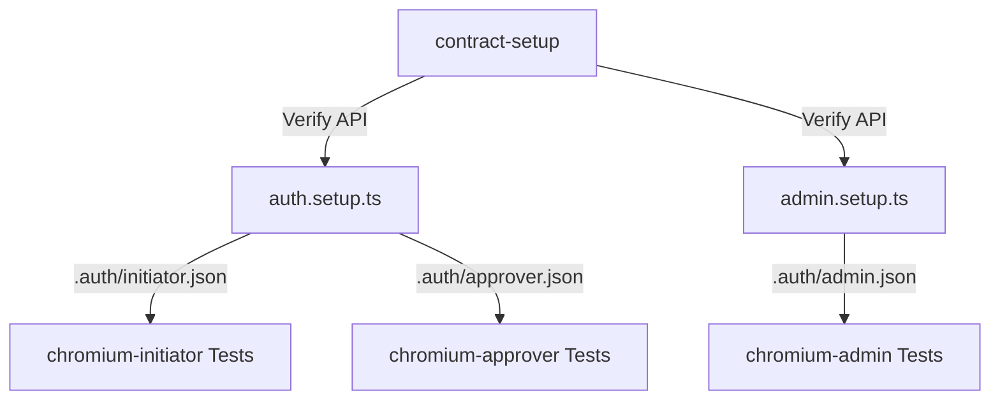

# 🎭 Automation Playwright Nexus Framework

<p align="center">
  
  
  
  
</p>

An enterprise-grade, end-to-end test automation framework built with **Playwright**, **TypeScript**, and the **Page Object Model (POM)** pattern for testing the core Administration Portal.

---

## 📌 Table of Contents

- [✨ Key Features](#-key-features)
- [⚡ Quick Start](#-quick-start)
  - [Prerequisites](#prerequisites)
  - [Installation](#installation)
  - [Environment Setup](#environment-setup)
- [⚙️ Configuration](#️-configuration)
- [🚀 Running Tests](#-running-tests)
  - [CLI Execution Commands](#cli-execution-commands)
  - [Multi-Role & Project Execution](#multi-role--project-execution)
- [🔐 Authentication Architecture](#-authentication-architecture)
- [📁 Project Structure](#-project-structure)
- [📊 Test Reports & Debugging](#-test-reports--debugging)
- [🛠️ Best Practices & Guidelines](#️-best-practices--guidelines)
- [📄 License](#-license)

---

## ✨ Key Features

| Feature | Description |
| :--- | :--- |
| **Page Object Model (POM)** | Modular, maintainable separation of UI selectors, actions, and test specs written in TypeScript. |
| **TypeScript First** | Full static typing, autocomplete, and strict type safety across all tests & helpers. |
| **Multi-Role Authentication** | Automated login state generation for **Initiator**, **Admin**, and **Approver** roles (`.auth/*.json`). |
| **API Contract Validation** | Pre-test API setup (`contract-setup`) ensuring system availability before executing UI suites. |
| **Cross-Browser Testing** | Out-of-the-box support for **Chromium**, **Firefox**, and **WebKit (Safari)**. |
| **Data Factory & Schemas** | Dynamic realistic test data generation (`realisticDataFactory.ts`) and schema validation via `zod`. |
| **Comprehensive Reporting** | Interactive Playwright HTML reports, Allure test analytics, and custom HTML summary builder (`generate-report.ts`). |
| **Robust Error Recovery** | Automatic screenshot capture on failure, structured logging (`logger.ts`), and smart wait mechanisms. |

---

## ⚡ Quick Start

### Prerequisites

Before cloning and running tests, ensure you have the following installed locally:

- [Node.js](https://nodejs.org/) v18.0.0 or higher
- [npm](https://www.npmjs.com/) v8.0.0 or higher
- [Git](https://git-scm.com/)

### Installation

1. **Clone the Repository**
   ```bash
   git clone https://github.com/Jagadeesh-Budda/automation-playwright-nexus.git
   cd automation-playwright-nexus
   ```

2. **Install Dependencies**
   ```bash
   npm install
   ```

3. **Install Playwright Browsers**
   ```bash
   npx playwright install
   ```

### Environment Setup

Create a `.env` file in the project root directory by copying `.env.example`:

```bash
cp .env.example .env
```

Configure your target application URL and login credentials in `.env`:

```env
# Application Under Test
BASE_URL=http://srv1161541.hstgr.cloud:8051

# User Role Credentials
INITIATOR_USERNAME=initiator_user
INITIATOR_PASSWORD=initiator_password
APPROVER_USERNAME=approver_user
APPROVER_PASSWORD=approver_password
ADMIN_USERNAME=admin_user
ADMIN_PASSWORD=admin_password

# Execution Settings
LOG_LEVEL=INFO
HEADLESS=true
```

> [!NOTE]
> `.env` is ignored by Git to prevent committing sensitive credentials.

---

## ⚙️ Configuration

The framework uses [`playwright.config.ts`](file:///e:/PlaywrightAutomation/ui-automation/playwright.config.ts) for central test configuration:

```typescript
export default defineConfig({
  testDir: './tests',
  timeout: 60 * 1000,
  expect: { timeout: 10000 },
  workers: 1,
  reporter: [
    ['html', { outputFolder: 'results/html-report', open: 'never' }],
    ['list'],
    ['allure-playwright', { detail: true }]
  ],
  use: {
    baseURL: process.env.BASE_URL,
    trace: 'retain-on-failure',
    screenshot: 'only-on-failure',
    video: 'on'
  }
});
```

---

## 🚀 Running Tests

### CLI Execution Commands

Run tests using the pre-configured `npm` scripts:

| Command | Action |
| :--- | :--- |
| `npm test` | Run all test specifications headless |
| `npm run test:headed` | Run tests with browser window visible |
| `npm run test:chromium` | Run tests against Chrome browser |
| `npm run test:debug` | Launch tests in **Playwright Inspector** mode |
| `npm run report` | Open the generated Playwright HTML report |
| `npm run generate:report` | Generate custom HTML summary report |
| `npm run clean` | Purge past screenshots and test output results |

### Multi-Role & Project Execution

Execute specific role profiles or targeted test suites:

```bash
# Run Initiator user tests
npx playwright test --project=chromium-initiator

# Run Admin user tests
npx playwright test --project=chromium-admin

# Run Approver user tests
npx playwright test --project=chromium-approver

# Run a specific test suite file
npx playwright test tests/Registration/base/login.spec.ts

# Run tests under a specific directory
npx playwright test tests/Admin/
```

---

## 🔐 Authentication Architecture

The framework leverages Playwright's **Storage State** pattern to execute fast, authenticated test suites without repeating UI login steps for every spec:



> [!TIP]
> If login tokens or user sessions expire, clear cached authentication states and re-run setup:
> ```bash
> rm -rf .auth/
> npx playwright test --project=setup
> ```

---

## 📁 Project Structure

```
ui-automation/
├── .auth/                  # Generated authentication session states (*.json)
├── .env                    # Local environment variables
├── .env.example            # Environment variables template
├── config/                 # Project environment configurations
├── constants/              # Global constants and element locators
├── fixtures/               # Extended test fixtures
│   ├── Admin/              # Admin module test fixtures
│   ├── Registration/       # Registration module test fixtures
│   ├── base/               # Base fixture setup
│   └── generalActions/     # Action helper fixtures
├── helpers/                # Framework extensions & helpers
├── pages/                  # Page Object Model (POM) classes
│   ├── Admin/              # Admin page objects
│   ├── Registration/       # Registration page objects
│   ├── base/               # Base page class
│   └── components/         # Reusable UI widgets & modal dialogs
├── services/               # API service helpers & request handlers
├── tests/                  # Test specification suites
│   ├── api/                # API contract setup and tests
│   ├── Admin/              # Admin module spec files
│   ├── Registration/       # Registration module spec files
│   ├── admin.setup.ts      # Admin auth setup script
│   ├── auth.setup.ts       # Initiator & Approver auth setup script
│   └── quality_test.spec.ts# Sanity verification test suite
├── utils/                  # Utility functions & helpers
│   ├── config.ts           # Config reader and parser
│   ├── dataFactory.ts      # Basic test data generator
│   ├── errorHandler.ts     # Global error handling framework
│   ├── logger.ts           # Multi-level logging utility
│   ├── realisticDataFactory.ts # Detailed mock data factory
│   ├── retryHelper.ts      # Flaky action retrier
│   ├── smartWaitHelper.ts  # State-based wait helper
│   ├── testDataManager.ts  # Test state & data manager
│   └── testData.json       # Static mock datasets
├── generate-report.ts      # Custom HTML report generator script
├── playwright.config.ts    # Main Playwright test configuration
├── package.json            # Package dependencies & scripts
└── tsconfig.json           # TypeScript configuration
```

---

## 📊 Test Reports & Debugging

### Playwright HTML Report

View detailed interactive execution traces, step logs, and screenshots:

```bash
npm run report
```

### Allure Reporting

Generate rich analytical test reports:

```bash
npx allure serve allure-results
```

### Step-by-step Debugging

Step through tests with the interactive Playwright Inspector tool:

```bash
npm run test:debug
```

> [!IMPORTANT]
> VS Code users can also debug directly using the official **Playwright Test for VS Code** extension by placing breakpoints in `.spec.ts` files.

---

## 🛠️ Best Practices & Guidelines

1. **Page Object Pattern**: Keep selector logic inside `pages/`, avoiding raw locator strings in `tests/`.
2. **Explicit Waits**: Utilize `smartWaitHelper.ts` and Playwright auto-waiting instead of fixed `page.waitForTimeout()`.
3. **Data Isolation**: Generate dynamic test datasets via `realisticDataFactory.ts` to keep test runs independent and reproducible.
4. **Role Separation**: Leverage pre-saved `.auth` states to test role-specific workflows efficiently.

---

## 📄 License

This repository is proprietary software for **Automation Playwright Nexus**. All rights reserved.

<p align="center">
  <sub>Built with ❤️ using Playwright & TypeScript</sub>
</p>
