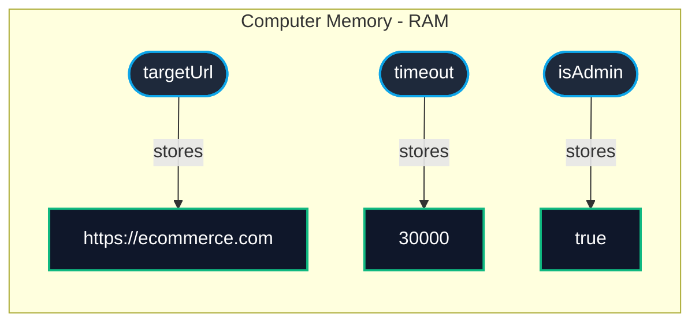

# 0.1: Variables & Data Types

Welcome to the **Automation Nexus Bridge Course**. If you are coming from a non-engineering background (such as manual testing or an entirely different industry), you are in exactly the right place.

Before you can automate a browser to click a button, you must understand how computers store and reference data. In modern web automation, that language is **JavaScript** (and its strongly-typed big brother, **TypeScript**).

In this lesson, we will cover how to store data in memory, why certain older practices are dangerous, and how to verify your data is exactly what you expect.

---

## Learning Objectives

By the end of this lesson, you will be able to:
- Declare variables and types.

## 1. What is a Variable?

Imagine you are managing a massive physical warehouse. When shipments arrive, you put them in a box. But you have thousands of boxes. How do you find a specific box later? **You put a label on it.**

In programming, the computer's memory (RAM) is the warehouse. The data (like a username or a timeout setting) is the item inside the box. **A variable is just the label you stick on the box.**

When we write code, we tell the computer: *"Hey, create a box, label it `targetUrl`, and put the string 'https://ecommerce.com' inside it."*

### Visualizing Memory



> [!NOTE]
> **💡 Key Takeaway**  
> A variable is simply a label pointing to a location in memory where your actual data is stored.

---

## 2. The Death of `var`

Historically, JavaScript used the `var` keyword to create variables. 

```javascript
// The Old Way (Do not use this!)
var targetUrl = 'https://ecommerce.com';
```

In modern automation (ES6+), **we never use the `var` keyword.** `var` introduces chaotic, unpredictable rules about where that "label" can be seen by the rest of your code (this is called "scope"). Using `var` is a fast track to writing flaky tests that pass today and fail tomorrow.

Instead, modern JavaScript gives us two specific keywords: `const` and `let`.

---

## 3. The Golden Rule: Default to `const`

The `const` keyword stands for "constant". When you stick a `const` label on a box, you are telling the computer: **"This label is permanent. Never let anyone move this label to a different box."**

### Why is this important?
In test automation, predictability is everything. If you define a base URL, you don't want a typo somewhere deep in your code to accidentally change that URL to a completely different website. `const` prevents reassignment, acting as a safety net.

```javascript
// ✅ Correct: This URL will never change during execution.
let BASE_URL = 'https://staging.enterprise.com';

// ❌ Error: TypeError: Assignment to constant variable.
BASE_URL = 'https://prod.enterprise.com'; 
```

**The Golden Rule:** Always default to using `const`.

---

## 4. When to use `let`

Sometimes, you *need* the value inside the box to change. For example, if you are counting how many times a test has retried, that number must go up (0, 1, 2...).

For this, we use the `let` keyword. `let` tells the computer: *"I am labeling this box, but I am allowed to peel the label off and stick it on a different box later."*

```javascript
// We start at attempt 0
let retryCount = 0;

const MAX_RETRIES = 3;

// A loop that runs while retryCount is less than 3
while (retryCount < MAX_RETRIES) {
  console.log('Attempt number: ' + retryCount);
  
  // This is a reassignment! We take the old value, add 1, and reassign it.
  // This is perfectly legal because we used 'let'.
  retryCount = retryCount + 1; 
}
```

---
## 5. Interactive Challenge: Fixing an Assignment Error

Below is a live code editor. The code currently crashes with a `TypeError` because the developer broke the rule of `const`. 

**Your Task:** Fix the code so that the `currentTestStatus` can be successfully updated to "Passed".

<CodeEditor
  moduleId="01-js-ts-variables"
  taskIndex={0}
  placeholder={`const testName = "Login Suite";\nconst currentTestStatus = "Running";\n\n// We finished the test, time to update the status!\ncurrentTestStatus = "Passed";\n\nconsole.log(testName + " is now " + currentTestStatus);`}
/>

*(Hint: Only one of those variables actually needs to change its value. Change its keyword!)*

---

## 6. Primitives: The Basic Data Types

JavaScript categorizes data into **Primitives** (passed by actual value) and **Objects** (passed by reference). We will cover Objects later; for now, let's focus on Primitives.

Primitives are the raw materials of your code.
1. **String:** Text wrapped in quotes (`"Submit"`, `'Click Me'`).
2. **Number:** Numeric values (`200`, `5000`). Note: We don't use quotes for numbers.
3. **Boolean:** A simple `true` or `false` (no quotes).
4. **Undefined:** A variable that has been created, but has no value inside its box yet.
5. **Null:** You explicitly opened the box and declared it empty.

```javascript
const timeoutMs = 5000;          // Number
const buttonText = "Login";      // String
const isVisible = false;         // Boolean

let userToken;                   // Undefined (We created the label, but put nothing inside)
const previousError = null;      // Null (We explicitly state there is no error)
```

---

## 7. Strict Equality (`===` vs `==`)

A critical rule in automation: **Always use strict equality (`===`).**

When you write a test, you are constantly asking the computer questions: *"Is the button visible?"*, *"Is the text equal to 'Success'?"*

The double equals (`==`) performs something called **"type coercion"**. This means the computer will try to be "helpful" and automatically convert types before comparing them. This is a massive source of bugs!

```javascript
// ❌ Dangerous (Type Coercion)
// The computer sees a Number and a String, converts the String to a Number, and says "Yes, they match!"
console.log(5 == "5");  // Returns: true

// The computer converts 'false' to the number 0. 
console.log(0 == false); // Returns: true
```

### The Solution: Triple Equals
The triple equals (`===`) checks both the **Value** AND the **Data Type**. 

```javascript
// ✅ Safe (Strict Equality)
// A Number is NOT a String. The test fails immediately, exactly as it should.
console.log(5 === "5");  // Returns: false

// A Number is NOT a Boolean.
console.log(0 === false); // Returns: false
```

> [!WARNING]
> Playwright's native assertions (like `expect(value).toBe()`) utilize strict equality under the hood. If your API returns the number `200`, but your test expects the string `"200"`, your test will fail!

---

## 8. Interactive Challenge: Assertion Bugs

The following code simulates a beginner's mistake when reading an API response. The test currently outputs `true`, meaning a dangerous bug slipped through. 

**Your Task:** Update the comparison operators to use Strict Equality so that the console logs `false` for both checks.

<CodeEditor
  moduleId="01-js-ts-variables"
  taskIndex={1}
  placeholder={`// The API returned the string "404"\nconst apiStatusCode = "404";\n\n// Check 1: Did we get a successful 404 number?\nconsole.log(apiStatusCode == 404);\n\n// Check 2: Is an empty string equal to false?\nconst errorMessage = "";\nconsole.log(errorMessage == false);`}
/>

---

## Common Mistakes

- **Hardcoding Waits**: Using `page.waitForTimeout()` instead of waiting for an element's state.
- **Overly Broad Locators**: Using generic CSS selectors like `.button` that might break if multiple buttons are added. Always prefer user-facing attributes like `getByRole`.
- **Ignoring Errors**: Catching errors in try/catch blocks without failing the test or logging the reason.


## Challenge Exercise

**Scenario**: You are writing an automation script for a healthcare portal's login page. Different user roles require different testing paths.

**Task**: Create variables to store the user's role and authentication status. Write a conditional block that verifies authorization based on the user role.

**Success Criteria**:
- Variable `userRole` is correctly typed and assigned.
- Authorization logic correctly differentiates between 'patient' and 'doctor'.

<CodeEditor
  moduleId="01-js-ts-variables"
  taskIndex={2}
  placeholder={`// Challenge: Refactor and correct the code below
// 1. Declare variables using let or const (avoid var)
// 2. Ensure syntax is valid and logic is clean

var status = "active";
console.log("Status: " + status);`}
/>


## Summary

1. Never use `var`.
2. Default to `const`. Only use `let` if the value must be reassigned.
3. Understand your Primitives (Strings, Numbers, Booleans).
4. Always use Strict Equality (`===`) to prevent type coercion bugs.

You now understand the core building blocks of memory in JavaScript! Proceed to the next module to learn how to wrap these blocks of memory into reusable **Functions**.


<Quiz moduleId="01-js-ts-variables" />
