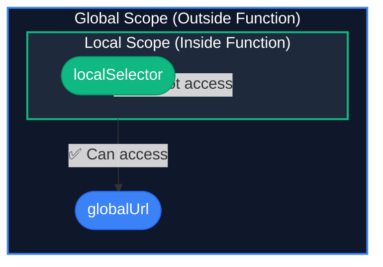

# 0.2: Functions & Scope

In the previous module, we learned how to store raw data in memory using variables. But raw data doesn't *do* anything. 

To execute logic—like clicking a button or evaluating a response—we need **Functions**. In Playwright, tests are not written as a single, massive script running top-to-bottom. They are encapsulated entirely within functions.

Understanding how functions are declared, invoked, and passed around as "Callbacks" is the absolute core mechanism of modern test automation.

---

## Learning Objectives

By the end of this lesson, you will be able to:
- Create functions and scopes.

## 1. What is a Function?

Think of a function like a **recipe** in a kitchen. 

A recipe for "Pancakes" is a set of instructions. Just because the recipe exists in the book doesn't mean pancakes magically appear on your plate. You have to actively go into the kitchen and *execute* the recipe.

In JavaScript, a function is a block of code designed to perform a particular task. It only executes when "something" invokes it (calls it).

### Traditional Functions (The Old Way)
Historically, functions were declared using the `function` keyword.

```javascript
function calculateTimeout(retries) {
  return retries * 1000; // Returns the total milliseconds
}

// We "invoke" or "call" the function by using parentheses ()
const finalTime = calculateTimeout(3); 
console.log(finalTime); // 3000
```

---

## 2. Arrow Functions (The Modern Way)

In modern JavaScript (ES6+), Arrow Functions were introduced. They provide a much cleaner syntax and are mandatory for modern Playwright architecture. **You will use Arrow Functions for almost everything in this course.**

To create an arrow function, we remove the `function` keyword and insert a "fat arrow" `=>` between the parameters and the code block.

```javascript
// Step 1: Create a variable (a label for our box)
// Step 2: Assign an arrow function to that box
const calculateTimeout = (retries) => {
  return retries * 1000;
};
```

### The Implicit Return
If your arrow function is only a single line of code that returns a value, you can delete the curly brackets `{}` and delete the `return` keyword entirely!

```javascript
// This does the exact same thing as above, but in one line!
const getTimeout = (retries) => retries * 1000;
```

---

## 3. Interactive Challenge: Convert to Arrow

Below is a traditional function that greets a user. 

**Your Task:** Rewrite `greetUser` to be an **Arrow Function**. Try to do it using the single-line "Implicit Return" syntax!

<CodeEditor
  moduleId="02-js-ts-functions"
  taskIndex={0}
  placeholder={`// Rewrite this as an Arrow Function\nfunction greetUser(userName) {\n  return "Welcome to the academy, " + userName;\n}\n\n// Do not change this line\nconsole.log(greetUser("Alice"));`}
/>

---

## 4. Lexical Scope (Visibility)

"Scope" determines the visibility of variables. If you put a box inside a locked room, people outside the room cannot see it.

Variables declared inside a function's curly brackets `{}` cannot be seen from the outside. This is called **Local Scope**. Variables declared outside any function are in the **Global Scope**.



> [!NOTE]
> **💡 Key Takeaway**  
> Functions can see data outside of themselves, but the outside world cannot see inside a function. This prevents tests from accidentally leaking data to each other!

```javascript
const globalUrl = 'https://app.com'; // Global Scope: Everyone can see this

const myTest = () => {
  const localSelector = '#submit-btn'; // Local Scope: Locked inside this function
  console.log("Navigating to: " + globalUrl); // ✅ Works perfectly!
};

// ❌ Error! The global area cannot look INSIDE the myTest function.
console.log(localSelector); 
```

This concept is why Playwright uses "Fixtures". It passes variables safely into the local scope of your test function so they don't leak into other parallel tests.

---

## 5. The Core Secret: Callbacks

This is the most important concept in this lesson.

In JavaScript, a function is just a value. Just like a String or a Number, **you can pass a function as an argument into another function.** 

A function passed as an argument is called a **Callback**.

Imagine you tell a chef: *"Here is a potato. I also want you to take this specific 'Mashing Recipe' and apply it to the potato."* You passed the recipe (a function) into the chef (another function).

### Why do we care?
This is exactly how a Playwright test is structured!

Playwright has a built-in function called `test()`. It requires two arguments:
1. A String (The name of your test)
2. A Callback Function (The actual steps of your test)

```javascript
import { test, expect } from '@playwright/test';

// 1. We define our callback function
const testLogic = () => {
  console.log("Navigating to page...");
  console.log("Clicking the button...");
};

// 2. We pass our function into the Playwright 'test' runner
test("Verify Homepage loads", testLogic);
```

### The Standard Inline Syntax

Developers rarely write the callback separately. We usually define the callback function *inline*, directly inside the parentheses of the `test()` function.

```javascript
import { test, expect } from '@playwright/test';

// Notice the () => { ... } sitting right inside the test arguments!
test("Verify Homepage loads", () => {
  console.log("Navigating to page...");
  console.log("Clicking the button...");
});
```

If you ever see a function wrapped inside another function, you are looking at a Callback. Playwright's `test.beforeEach()`, `test.describe()`, and `page.evaluate()` all rely heavily on callbacks.

---

## 6. Interactive Challenge: Write a Callback

The code below has a `runAutomation` function that takes two arguments: a string, and a callback function.

**Your Task:** Call `runAutomation`. Pass it the string `"Login Sequence"`, and pass it an **inline arrow function** that logs `"Executing steps..."` to the console.

<CodeEditor
  moduleId="02-js-ts-functions"
  taskIndex={1}
  placeholder={`const runAutomation = (sequenceName, actionCallback) => {\n  console.log("Starting: " + sequenceName);\n  actionCallback(); // We invoke the callback you passed in!\n  console.log("Finished!");\n};\n\n// WRITE YOUR CODE BELOW THIS LINE:\n// Call runAutomation( ... )\n`}
/>

---

## Common Mistakes

- **Hardcoding Waits**: Using `page.waitForTimeout()` instead of waiting for an element's state.
- **Overly Broad Locators**: Using generic CSS selectors like `.button` that might break if multiple buttons are added. Always prefer user-facing attributes like `getByRole`.
- **Ignoring Errors**: Catching errors in try/catch blocks without failing the test or logging the reason.


## Challenge Exercise

**Scenario**: A banking application calculates late payment fees. Your automation needs to verify this calculation across multiple data sets.

**Task**: Write a reusable function `calculateLateFee` that takes a balance and a days-late integer, returning the final payment due. 

**Success Criteria**:
- Function is strongly typed using TypeScript.
- Correctly returns a numeric value for the payment.

<CodeEditor
  moduleId="02-js-ts-functions"
  taskIndex={2}
  placeholder={`// Challenge: Refactor and correct the code below
// 1. Declare variables using let or const (avoid var)
// 2. Ensure syntax is valid and logic is clean

var status = "active";
console.log("Status: " + status);`}
/>


## Summary

1. Functions are recipes; they don't run until invoked.
2. We exclusively use **Arrow Functions** (`=>`).
3. Variables declared inside a function (`Local Scope`) cannot be seen outside of it.
4. Passing a function as an argument is called a **Callback**, which is the fundamental syntax of a Playwright test.

Proceed to the next module to learn how to organize massive amounts of data using Objects and Arrays!


<Quiz moduleId="02-js-ts-functions" />
