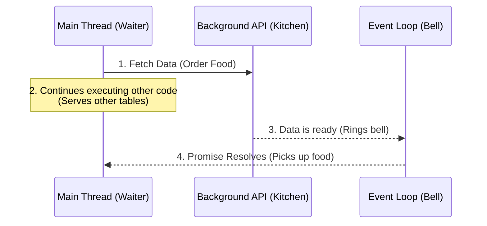
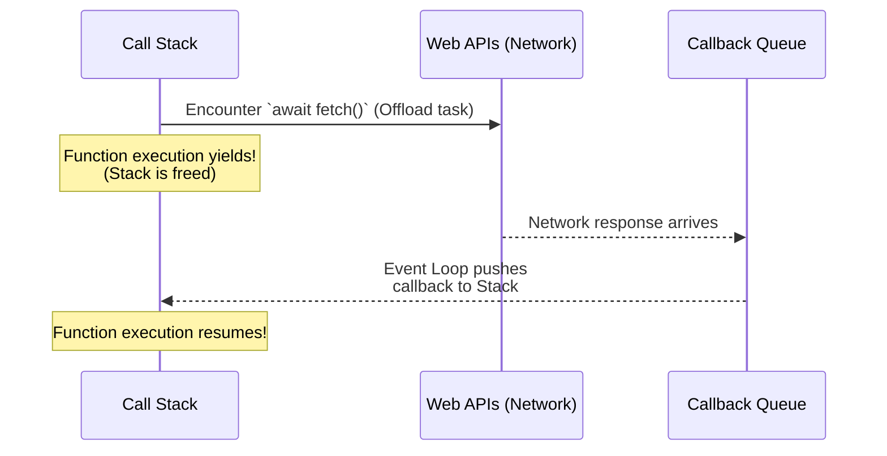

# 0.5: Async/Await & Promises


> [!CAUTION]
> This is the single most important module in this bridge course. If you do not understand Asynchrony, you cannot write UI automation. Every single click, navigation, assertion, and API call in Playwright is asynchronous.

JavaScript is a **single-threaded** language. It can only execute one line of code at a time. 

So, how does it handle a network request that takes 5 seconds to load, without freezing the entire browser and stopping all other code?

---

## Learning Objectives

By the end of this lesson, you will be able to:
- Use async and await.

## 1. The Restaurant Analogy (The Event Loop)

Imagine a restaurant with only **One Waiter** (JavaScript's single thread).

If the waiter takes your order, walks to the kitchen, and **stands there staring at the chef for 20 minutes** until your food is done... all the other customers in the restaurant will get angry and leave. That is "Synchronous" blocking behavior.

Instead, the waiter hands the ticket to the kitchen (a background task), says *"Let me know when this is done"*, and immediately walks back to the dining room to serve the next customer. When the kitchen rings the bell (The **Event Loop**), the waiter goes back to pick up the food. 

This is **Asynchronous** behavior.

When JavaScript encounters an asynchronous operation (like fetching data or waiting for a Playwright element to appear), it offloads that task to the background APIs and continues executing the next line of code *immediately*.



---

## 2. Promises

A **Promise** is the "ticket" the kitchen gave the waiter. It is an object representing the *eventual* completion (or failure) of an asynchronous operation.

A Promise has 3 states:
1. **Pending:** The task is running in the background (The food is cooking).
2. **Fulfilled (Resolved):** The task completed successfully (The food is ready).
3. **Rejected:** The task failed (e.g., a 404 error, a timeout, or the kitchen caught on fire).

```javascript
const fetchServerStatus = () => {
  // This returns a "ticket" that promises to deliver a result eventually
  return new Promise((resolve, reject) => {
    // Simulating a 2-second network call
    setTimeout(() => {
      resolve("Server is UP"); // We fulfill the promise
    }, 2000);
  });
};
```

---

## 3. Async / Await

In the past, developers had to use messy `.then()` callbacks to wait for a Promise to resolve, leading to deeply nested "Callback Hell."

ES2017 introduced `async` and `await`, allowing us to write asynchronous code that *looks* and *reads* like top-to-bottom synchronous code.

- **`async`**: Put this in front of a function to declare that it contains asynchronous operations.
- **`await`**: Put this in front of a Promise. It **pauses** the execution of that specific function until the Promise resolves.



> [!NOTE]
> **?? Key Takeaway**  
> Using `await` pauses your function's execution until the background task completes, preventing Playwright from interacting with elements before they are actually ready.

```javascript
const runHealthCheck = async () => {
  console.log("Pinging server..."); // 1. Executes instantly
  
  // 2. The function PAUSES here. The main thread is freed up!
  // The waiter goes to serve other tables.
  const status = await fetchServerStatus(); 
  
  // 3. This line runs 2 seconds later, only AFTER the await resolves.
  console.log(status); 
};

runHealthCheck();
```

---

## 4. The Fatal Flaw in Automation

What happens if you forget the `await` keyword in Playwright? 

The waiter drops off the ticket and instantly moves on, without waiting for the food!

```javascript
import { test, expect } from '@playwright/test';

test('Broken Flow', async ({ page }) => {
  // ? Missing await!
  // Playwright starts the click, but JS instantly moves to the next line!
  page.click('#submit-btn'); 
  
  // The script looks for the success banner BEFORE the click finishes!
  // THE TEST FAILS RANDOMLY.
  await expect(page.locator('.success')).toBeVisible(); 
});
```
**Forgetting `await` is the #1 cause of flaky, unpredictable tests.** 

---

## 5. Interactive Challenge: Fix the Flaky Script

Below is a simulated automation script. The developer forgot the `await` keywords, causing the assertions to run before the data is fetched.

**Your Task:** Add the `await` keywords to the necessary function calls so that the console logs print in the correct chronological order: "Fetching..." -> "Data Loaded" -> "Asserting...".

<CodeEditor
  moduleId="05-js-ts-async"
  taskIndex={0}
  placeholder={`// 1. Await the simulateNetworkCall()\n// 2. Run the suite to verify it works\n\nconst simulateNetworkCall = () => new Promise(res => setTimeout(() => res("Data Loaded"), 1500));\n\nconst runAutomation = async () => {\n  console.log("Fetching...");\n  \n  // BUG: The developer forgot to pause execution here!\n  const result = simulateNetworkCall();\n  console.log(result);\n  \n  console.log("Asserting...");\n};\n\nrunAutomation();`}
/>

---

## 6. Promise.all()

Sometimes you want to run multiple asynchronous operations concurrently, rather than waiting for them one by one. `Promise.all()` takes an array of Promises and waits for *all* of them to resolve simultaneously.

This is critical in Playwright to prevent Race Conditions. For example, clicking a button that triggers a download or a network response. If you wait for the response *after* you click, you might miss it if the server is too fast!

```javascript
import { test, expect } from '@playwright/test';

test('Parallel execution', async ({ page }) => {
  // We wait for BOTH the click to happen AND the response to return, simultaneously.
  const [response] = await Promise.all([
    page.waitForResponse('**/api/data'),
    page.click('#fetch-data-btn') // The action that triggers the response
  ]);
});
```

## Common Mistakes

- **Hardcoding Waits**: Using `page.waitForTimeout()` instead of waiting for an element's state.
- **Overly Broad Locators**: Using generic CSS selectors like `.button` that might break if multiple buttons are added. Always prefer user-facing attributes like `getByRole`.
- **Ignoring Errors**: Catching errors in try/catch blocks without failing the test or logging the reason.


## Challenge Exercise

**Scenario**: During a test setup, you need to fetch a valid authentication token from a secure mock API before navigating to the dashboard.

**Task**: Write an async function that fetches the token and handles potential network failures.

**Success Criteria**:
- Uses `async` and `await`.
- Implements a `try/catch` block to handle authorization rejections gracefully.

<CodeEditor
  moduleId="05-js-ts-async"
  taskIndex={1}
  placeholder={`// Challenge: Fetch data from three distinct services concurrently using Promise.all()
// Do NOT fetch them sequentially (which is slow!).
// FIX THE SEQUENTIAL CODE BELOW:

const fetchUsers = () => Promise.resolve(['Alice', 'Bob']);
const fetchConfig = () => Promise.resolve({ timeout: 5000 });
const fetchStatus = () => Promise.resolve('System OK');

const loadDashboard = async () => {
  // BUG: These run sequentially! Refactor to run in parallel using Promise.all:
  const users = await fetchUsers();
  const config = await fetchConfig();
  const status = await fetchStatus();
  
  return { users, config, status };
};`}
/>


## Summary
1. The **Event Loop** allows single-threaded JS to run background tasks.
2. A **Promise** is a ticket representing eventual completion.
3. Use **`await`** to pause the function until the Promise resolves.
4. **Never forget your `await` in Playwright**, or your tests will flake.


<Quiz moduleId="05-js-ts-async" />
