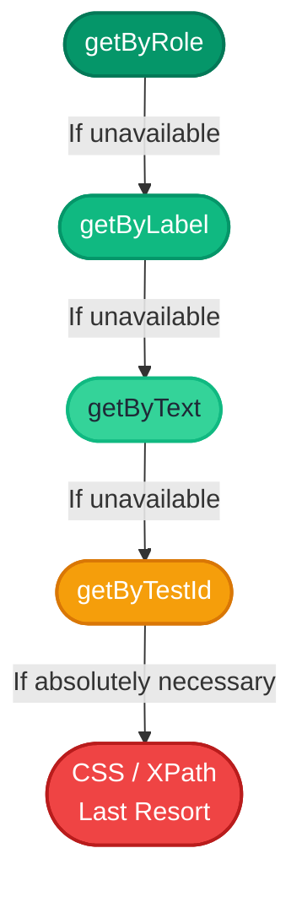


# 2.1: getByRole & Friends


## Learning Objectives

By the end of this lesson, you will be able to:
- Complete 2.1: getByRole & Friends

## The Locator Priority Ladder

When you need to find an element, Playwright offers many options. But they are not all equal. 

To see why, look at this comparison:

```typescript
// ❌ Bad: Fragile CSS selector. Will break if the design changes.
await page.locator('div > div:nth-child(3) button').click();

// ✅ Better: Semantic locator. Survives UI changes.
await page.getByRole('button', { name: 'Submit' }).click();
```

Playwright strongly recommends a specific "priority ladder" to make your tests resilient to UI changes:

1. **`getByRole`** (🥇 Always try this first)
2. **`getByLabel`** (🥈 For form fields)
3. **`getByText`** (🥉 For non-interactive text)
4. **`getByTestId`** (🔌 Escape hatch)



> [!NOTE]
> **💡 Key Takeaway**  
> Always prioritize user-facing semantic locators like `getByRole`. Only fall back to test IDs or CSS/XPath as a last resort.

Let's explore each one.

### 1. `getByRole` (The Gold Standard)

```typescript
import { test, expect } from '@playwright/test';

// Click a submit button
await page.getByRole('button', { name: 'Submit' }).click();

// Verify a heading exists
await expect(page.getByRole('heading', { name: 'Welcome' })).toBeVisible();
```

`getByRole` forces you to think about accessibility. If your users and screen readers can find it, Playwright can find it. If Playwright can't find it with `getByRole`, your app might have an accessibility bug!

### 2. `getByLabel` (For Forms)

When a user looks at a form, they read the label ("Email Address") and type into the box next to it. Playwright does the exact same thing.

```typescript
// Finds the <input> connected to the "Email" label
await page.getByLabel('Email').fill('admin@example.com');
await page.getByLabel('Password').fill('secret123');
```

This works perfectly as long as the HTML `<label>` is properly linked to the `<input>` using the `for` attribute or by wrapping the input.

### 3. `getByText` (For Static Content)

Sometimes there is no role or label. You just want to find a paragraph of text.

```typescript
// Find exact text
await page.getByText('Your order has been shipped', { exact: true }).toBeVisible();

// Find partial text (the default)
await page.getByText('has been shipped').toBeVisible();
```

### 4. `getByTestId` (The Escape Hatch)

What if an element is completely dynamic, has no label, no semantic role, and the text changes constantly?

You can ask the developers (or add it yourself) to put a `data-testid` attribute on the HTML element.

```html
<!-- In the application code -->
<div data-testid="user-avatar-menu">...</div>
```

```typescript
// In your test
await page.getByTestId('user-avatar-menu').click();
```

This is the most "stable" locator because `data-testid` is meant only for testing. However, it's considered an escape hatch because it doesn't test how a real user finds the element.

## Exercise

Write a test that navigates to a login page and uses:
1. `getByRole` to find the main `heading`.
2. `getByLabel` to fill out the email and password fields.
3. `getByRole` to click the submit `button`.

**Constraints:**
- ❌ Do NOT use `page.locator()`. You must strictly use the semantic locators listed above.

<CodeEditor
  moduleId="15-getbyrole"
  taskIndex={0}
/>

---

## Summary

| What You Learned | Why It Matters |
|---|---|
| Core Principle | Ensures stability and scalability in the framework |
| Best Practice | Prevents technical debt and flaky test runs |
| Anti-Pattern Avoidance | Saves hours of debugging time in the future |

> [!TIP]
> **Next Step:** Review your implementation and proceed to the next module.

---

## Common Mistakes

> [!WARNING]
> **Mistake 1: Brittle Implementation**  
> **Wrong:** Tightly coupling test data with page interactions.  
> **Correct:** Abstracting data and logic appropriately.  
> **Why:** Prevents tests from breaking when minor details change.

> [!WARNING]
> **Mistake 2: Missing Synchronization**  
> **Wrong:** Relying on implicit speeds or hardcoded sleeps.  
> **Correct:** Using web-first assertions for synchronization.  
> **Why:** Guarantees deterministic execution regardless of environment speed.

---

## Challenge Exercise

You have learned the core pattern. Now apply it under pressure.

**Scenario:** A new requirement demands a robust automation script for this workflow.

**Your Task:** Implement the solution based on the principles discussed above.

**Constraints:**
- ❌ Do not use deprecated APIs
- ✅ Follow the architecture best practices
- ✅ All assertions must be web-first

<CodeEditor
  moduleId="15-getbyrole"
  taskIndex={1}
  placeholder={`import { test, expect } from '@playwright/test';

test('role selector challenge', async ({ page }) => {
  await page.goto('https://portal.example.com');

  // BUG: Refactor these brittle CSS locators to use semantic getByRole locators
  await page.locator('#email-input-field').fill('admin@portal.com');
  await page.locator('.submit-btn-primary').click();

  // Assert dashboard is visible using role
  await expect(page.locator('#dashboard-h1-header')).toBeVisible();
});`}
/>
<details>
<summary>🔑 Reveal Solution (try first!)</summary>

```typescript
// Reference implementation
// Always prioritize web-first assertions and resilient locators.
```

**Explanation:**
- **Architecture:** The solution decouples data from logic and relies on robust selectors.

</details>

<Quiz moduleId="15-getbyrole" />
