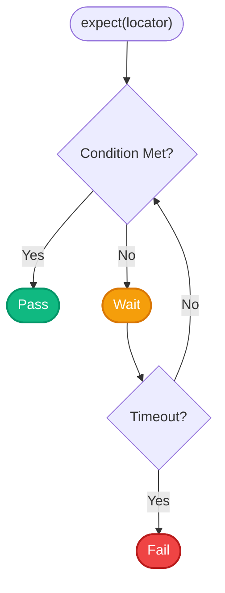

# 2.2: Assertions Deep Dive


## Learning Objectives

By the end of this lesson, you will be able to:
- Complete 2.2: Assertions Deep Dive

## Expanding Your Toolkit

In Module 1, we learned the essential five assertions: `toHaveTitle()`, `toHaveURL()`, `toBeVisible()`, `toHaveText()`, and `toContainText()`. 

Now, let's learn how to assert more complex states.

### 1. `toBeEnabled()` / `toBeDisabled()`

Many applications disable the "Submit" button until the user fills out all required fields. You can verify this behavior:

```typescript
import { test, expect } from '@playwright/test';

const submitBtn = page.getByRole('button', { name: 'Submit' });

// Verify it starts disabled
await expect(submitBtn).toBeDisabled();

// Fill out the form
await page.getByLabel('Email').fill('user@example.com');

// Verify it becomes enabled
await expect(submitBtn).toBeEnabled();
```

### 2. `toBeChecked()`

Used for checkboxes and radio buttons.

```typescript
import { test, expect } from '@playwright/test';

const termsCheckbox = page.getByRole('checkbox', { name: 'I agree to the terms' });

// Verify it's not checked by default
await expect(termsCheckbox).not.toBeChecked();

// Click it and verify it's checked
await termsCheckbox.check(); // Notice we use .check() instead of .click() for checkboxes
await expect(termsCheckbox).toBeChecked();
```

> [!TIP]
> Notice the `.not` keyword! You can negate any assertion by adding `.not` before it: `expect(locator).not.toBeVisible()`.

### 3. `toHaveAttribute()`

Sometimes you need to verify a specific HTML attribute, like a placeholder text, an ARIA label, or an image source.

```typescript
import { test, expect } from '@playwright/test';

const searchInput = page.getByRole('searchbox');
await expect(searchInput).toHaveAttribute('placeholder', 'Search documentation...');

const logoImg = page.getByRole('img', { name: 'Company Logo' });
await expect(logoImg).toHaveAttribute('src', '/images/logo-v2.png');
```

### 4. `toHaveCount()`

When you expect a specific number of elements to be on the page (like a list of search results).

```typescript
import { test, expect } from '@playwright/test';

// Find all list items inside the navigation menu
const navItems = page.getByRole('navigation').getByRole('listitem');

// Verify there are exactly 5 items
await expect(navItems).toHaveCount(5);
```

## Auto-Retrying Assertions

Before looking at soft assertions, you must understand how Playwright's assertions actually work under the hood. Unlike traditional frameworks that check a condition exactly once and fail immediately, Playwright's `expect` assertions are **auto-retrying**.

When you call `await expect(locator).toBeVisible()`, Playwright will continuously poll the DOM, re-evaluating the condition until the timeout is reached.



> [!NOTE]
> **?? Key Takeaway**  
> Playwright automatically retries assertions until they pass or the timeout is reached.

## Soft Assertions

Normally, when an assertion fails, **the test immediately stops and throws an error.** This is called a "hard assertion."

But sometimes, you want to check multiple things on a page, and if one fails, you still want to check the rest to get a complete picture of what's broken.

You can do this using `expect.soft()`.

```typescript
import { test, expect } from '@playwright/test';

test('validate profile page layout', async ({ page }) => {
  await page.goto('/profile');

  // If this fails, Playwright logs the error but KEEPS RUNNING
  await expect.soft(page.getByRole('heading', { name: 'Profile' })).toBeVisible();
  
  // This will still execute
  await expect.soft(page.getByLabel('Bio')).toBeVisible();

  // The test will ultimately be marked as FAILED if any soft assertion failed
});
```

> [!WARNING]
> Only use `expect.soft()` for visual or layout checks. If you use it for core business logic (like logging in), and the login fails, the rest of the test will fail anyway in a confusing cascade of errors.

## Exercise

Write a test that:
1. Asserts a checkbox is `not.toBeChecked()`
2. Checks the checkbox
3. Asserts the checkbox `toBeChecked()`
4. Asserts a specific button on the page `toHaveAttribute('type', 'submit')`

---

## Summary

| What You Learned | Why It Matters |
|---|---|
| Core Principle | Ensures stability and scalability in the framework |
| Best Practice | Prevents technical debt and flaky test runs |
| Anti-Pattern Avoidance | Saves hours of debugging time in the future |

> [!TIP]
> **Next Step:** Review your implementation and proceed to the next module.

---

## Common Mistakes

> [!WARNING]
> **Mistake 1: Brittle Implementation**  
> **Wrong:** Tightly coupling test data with page interactions.  
> **Correct:** Abstracting data and logic appropriately.  
> **Why:** Prevents tests from breaking when minor details change.

> [!WARNING]
> **Mistake 2: Missing Synchronization**  
> **Wrong:** Relying on implicit speeds or hardcoded sleeps.  
> **Correct:** Using web-first assertions for synchronization.  
> **Why:** Guarantees deterministic execution regardless of environment speed.

---

## Challenge Exercise

You have learned the core pattern. Now apply it under pressure.

**Scenario:** A new requirement demands a robust automation script for this workflow.

**Your Task:** Implement the solution based on the principles discussed above.

**Constraints:**
- ? Do not use deprecated APIs
- ? Follow the architecture best practices
- ? All assertions must be web-first

<CodeEditor
  moduleId="16-assertions-deep"
  taskIndex={0}
  placeholder="// Challenge: Implement the workflow\n// Write your code here:"
/>
<details>
<summary>?? Reveal Solution (try first!)</summary>

```typescript
// Reference implementation
// Always prioritize web-first assertions and resilient locators.
```

**Explanation:**
- **Architecture:** The solution decouples data from logic and relies on robust selectors.

</details>

<Quiz moduleId="16-assertions-deep" />


export const astRules = [
  {
    type: "ast_callee",
    value: "expect",
    message: "You must use 'expect' to write web-first assertions."
  },
  {
    type: "ast_forbidden_callee",
    value: "page.waitForTimeout",
    message: "Hardcoded waits are forbidden. Rely on auto-retrying assertions."
  },
  {
    type: "ast_forbidden_callee",
    value: "setTimeout",
    message: "Native JS timeouts are forbidden. Rely on auto-retrying assertions."
  }
];
