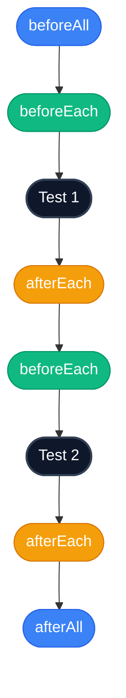


# 3.3: Before/After Hooks


## Learning Objectives

By the end of this lesson, you will be able to:
- Complete 3.3: Before/After Hooks

## The Repetition Problem

Look at these two tests inside a `describe` block. Notice anything annoying?

```typescript
import { test, expect } from '@playwright/test';

test.describe('Dashboard Settings', () => {

  test('user can update profile picture', async ({ page }) => {
    // Repeated Setup
    await page.goto('/login');
    await page.getByLabel('Email').fill('admin@example.com');
    await page.getByLabel('Password').fill('secret123');
    await page.getByRole('button', { name: 'Sign In' }).click();
    await page.getByRole('link', { name: 'Settings' }).click();

    // Actual test logic
    await page.getByLabel('Upload Avatar').setInputFiles('avatar.png');
    await expect(page.getByText('Avatar updated')).toBeVisible();
  });

  test('user can change timezone', async ({ page }) => {
    // Repeated Setup
    await page.goto('/login');
    await page.getByLabel('Email').fill('admin@example.com');
    await page.getByLabel('Password').fill('secret123');
    await page.getByRole('button', { name: 'Sign In' }).click();
    await page.getByRole('link', { name: 'Settings' }).click();

    // Actual test logic
    await page.getByLabel('Timezone').selectOption('UTC');
    await expect(page.getByText('Timezone saved')).toBeVisible();
  });

});
```

The first 5 lines of every test are exactly the same! If the login URL changes to `/auth/login`, you have to update it in every single test.

## The Solution: `test.beforeEach`

A "hook" is a block of code that Playwright runs automatically at a specific time.

`test.beforeEach()` runs **before every single test** in its scope. 

Let's refactor the code above:

```typescript
import { test, expect } from '@playwright/test';

test.describe('Dashboard Settings', () => {

  // This runs automatically before EACH test below it
  test.beforeEach(async ({ page }) => {
    await page.goto('/login');
    await page.getByLabel('Email').fill('admin@example.com');
    await page.getByLabel('Password').fill('secret123');
    await page.getByRole('button', { name: 'Sign In' }).click();
    await page.getByRole('link', { name: 'Settings' }).click();
  });

  test('user can update profile picture', async ({ page }) => {
    // Playwright already logged in and navigated to Settings!
    await page.getByLabel('Upload Avatar').setInputFiles('avatar.png');
    await expect(page.getByText('Avatar updated')).toBeVisible();
  });

  test('user can change timezone', async ({ page }) => {
    // Playwright logged in and navigated to Settings again from scratch!
    await page.getByLabel('Timezone').selectOption('UTC');
    await expect(page.getByText('Timezone saved')).toBeVisible();
  });

});
```

This is much cleaner. The tests now only contain the logic they actually care about.

## Other Hooks

Playwright provides four main hooks:

1. `test.beforeEach()` — Runs before *each* test. (Most common)
2. `test.afterEach()` — Runs after *each* test. (Used for cleanup)
3. `test.beforeAll()` — Runs *once* before all tests in the file. (Dangerous for beginners, as it shares state)
4. `test.afterAll()` — Runs *once* after all tests in the file.



> [!NOTE]
> **💡 Key Takeaway**  
> `beforeEach` runs again from scratch for every single test in the block, ensuring each test starts with a completely fresh state.

> [!WARNING]
> Avoid `beforeAll` for now. Playwright's core philosophy is that tests should be 100% isolated. If you do something in `beforeAll` that modifies the browser state, it might randomly break subsequent tests. Stick to `beforeEach` to ensure a fresh browser tab every time.

## Exercise

Write a `describe` block called "Search Functionality". 
Add a `beforeEach` hook that navigates to your application's homepage.
Add two tests inside the block that perform different searches.

**Constraints:**
- ❌ Do NOT use `test.beforeAll()` or `test.afterAll()`. You must strictly use `test.beforeEach()` to ensure state isolation.

<CodeEditor
  moduleId="21-before-after"
  taskIndex={0}
/>

---

## Summary

| What You Learned | Why It Matters |
|---|---|
| Core Principle | Ensures stability and scalability in the framework |
| Best Practice | Prevents technical debt and flaky test runs |
| Anti-Pattern Avoidance | Saves hours of debugging time in the future |

> [!TIP]
> **Next Step:** Review your implementation and proceed to the next module.

---

## Common Mistakes

> [!WARNING]
> **Mistake 1: Brittle Implementation**  
> **Wrong:** Tightly coupling test data with page interactions.  
> **Correct:** Abstracting data and logic appropriately.  
> **Why:** Prevents tests from breaking when minor details change.

> [!WARNING]
> **Mistake 2: Missing Synchronization**  
> **Wrong:** Relying on implicit speeds or hardcoded sleeps.  
> **Correct:** Using web-first assertions for synchronization.  
> **Why:** Guarantees deterministic execution regardless of environment speed.

---

## Challenge Exercise

You have learned the core pattern. Now apply it under pressure.

**Scenario:** A new requirement demands a robust automation script for this workflow.

**Your Task:** Implement the solution based on the principles discussed above.

**Constraints:**
- ❌ Do not use deprecated APIs
- ✅ Follow the architecture best practices
- ✅ All assertions must be web-first

<CodeEditor
  moduleId="21-before-after"
  taskIndex={1}
  placeholder={`import { test, expect } from '@playwright/test';

// Challenge: Clean up test duplication using hooks
// Move the page setup and authentication steps into a beforeEach hook.
// FIX THE REPETITIVE CODE BELOW:

test('view profile', async ({ page }) => {
  await page.goto('https://app.com/login');
  await page.getByLabel('User').fill('test');
  await page.getByRole('button', { name: 'Log in' }).click();
  await page.goto('https://app.com/profile');
  await expect(page).toHaveURL(/.*profile/);
});

test('view settings', async ({ page }) => {
  await page.goto('https://app.com/login');
  await page.getByLabel('User').fill('test');
  await page.getByRole('button', { name: 'Log in' }).click();
  await page.goto('https://app.com/settings');
  await expect(page).toHaveURL(/.*settings/);
});`}
/>
<details>
<summary>🔑 Reveal Solution (try first!)</summary>

```typescript
// Reference implementation
// Always prioritize web-first assertions and resilient locators.
```

**Explanation:**
- **Architecture:** The solution decouples data from logic and relies on robust selectors.

</details>

<Quiz moduleId="21-before-after" />
