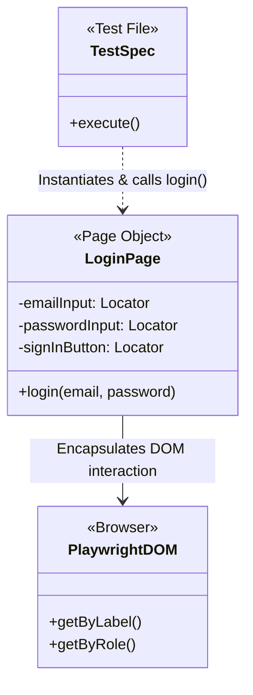


# 4.1: What Are Page Objects?


## Learning Objectives

By the end of this lesson, you will be able to:
- Complete 4.1: What Are Page Objects?

## The Answer to Our Pain

In Module 3, we experienced the nightmare of a redesigned Login page breaking 150 different test files. We realized we needed to centralize the login logic in one place.

The industry-standard solution to this problem is the **Page Object Model (POM)**.

A Page Object is a simple TypeScript class that represents a single page (or a large component) in your application.

It has two jobs:
1. **Store Locators:** It holds all the `getByRole` and `getByLabel` calls as class properties.
2. **Perform Actions:** It holds methods like `login()` or `search()` that interact with those locators.



> [!NOTE]
> **💡 Key Takeaway**  
> Page Objects separate the *what* from the *how*. The test file only knows *what* to do (e.g. log in), while the Page Object encapsulates exactly *how* to locate the elements and interact with the DOM.

## A Basic Page Object

Here is what a complete Page Object for a Login page looks like:

```typescript
// pages/LoginPage.ts
import { Page, Locator } from '@playwright/test';

export class LoginPage {
  
  // 1. Locators stored as properties
  readonly emailInput: Locator;
  readonly passwordInput: Locator;
  readonly signInButton: Locator;

  // 2. The constructor initializes the locators
  constructor(private readonly page: Page) {
    this.emailInput = this.page.getByLabel('Email');
    this.passwordInput = this.page.getByLabel('Password');
    this.signInButton = this.page.getByRole('button', { name: 'Sign In' });
  }

  // 3. Actions stored as methods
  async login(email: string, password: string) {
    await this.emailInput.fill(email);
    await this.passwordInput.fill(password);
    await this.signInButton.click();
  }
}
```

> [!TIP]
> Notice how we use `this.emailInput` instead of `this.page.getByLabel('Email')` inside the `login` method? We locate the elements once in the constructor, and then reuse those locators in our methods.

## How Tests Use Page Objects

Now, let's look at what happens to our messy test files when we use this Page Object.

```typescript
// tests/dashboard.spec.ts
import { test, expect } from '@playwright/test';
import { LoginPage } from '../pages/LoginPage';

test('dashboard loads after login', async ({ page }) => {
  // 1. Create an instance of the Page Object
  const loginPage = new LoginPage(page);

  // 2. Tell the Page Object to do its job
  await page.goto('/login');
  await loginPage.login('admin@example.com', 'secret123');

  // 3. Perform our assertions
  await expect(page.getByRole('heading', { name: 'Dashboard' })).toBeVisible();
});
```

Look at how clean that is! The test file doesn't know *how* the login works. It doesn't know if the email field is found by label or by role. It just says "log me in".

## The Nightmare is Over

Let's revisit our nightmare scenario. 

The developers redesign the Login page. They change the "Email" label to "Email Address".

Instead of updating 150 test files, you open **one file**: `pages/LoginPage.ts`.

You change this:
`this.emailInput = this.page.getByLabel('Email');`

To this:
`this.emailInput = this.page.getByLabel('Email Address');`

You save the file. **All 150 tests instantly pass.** 

That is the power of the Page Object Model.

---

## Common Mistakes

- **Hardcoding Waits**: Using `page.waitForTimeout()` instead of waiting for an element's state.
- **Overly Broad Locators**: Using generic CSS selectors like `.button` that might break if multiple buttons are added. Always prefer user-facing attributes like `getByRole`.
- **Ignoring Errors**: Catching errors in try/catch blocks without failing the test or logging the reason.


## Challenge Exercise

You have learned the core pattern. Now apply it under pressure.

**Scenario:** A new requirement demands a robust automation script for this workflow.

**Your Task:** Implement the solution based on the principles discussed above.

**Constraints:**
- ❌ Do not use deprecated APIs
- ✅ Follow the architecture best practices
- ✅ All assertions must be web-first

<CodeEditor
  moduleId="24-what-are-poms"
  taskIndex={0}
  placeholder="// Challenge: Implement the workflow\n// Write your code here:"
/>
<details>
<summary>🔑 Reveal Solution (try first!)</summary>

```typescript
// Reference implementation
// Always prioritize web-first assertions and resilient locators.
```

**Explanation:**
- **Architecture:** The solution decouples data from logic and relies on robust selectors.

</details>

---

## Summary

| What You Learned | Why It Matters |
|---|---|
| Core Principle | Ensures stability and scalability in the framework |
| Best Practice | Prevents technical debt and flaky test runs |
| Anti-Pattern Avoidance | Saves hours of debugging time in the future |

> [!TIP]
> **Next Step:** Review your implementation and proceed to the next module.

<Quiz moduleId="24-what-are-poms" />


export const astRules = [
  {
    type: "ast_node",
    value: "ClassDeclaration",
    message: "You must declare a class to implement the Page Object Model."
  }
];
