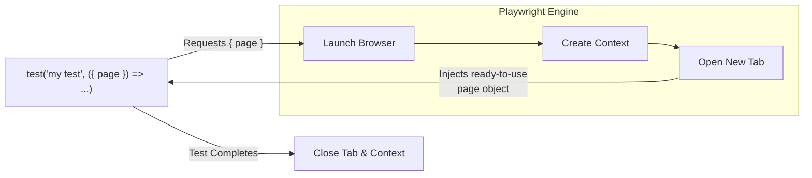

# 5.1: What Are Fixtures?


## Learning Objectives

By the end of this lesson, you will be able to:
- Complete 5.1: What Are Fixtures?

## The Final Duplication

In the last module, Page Objects completely solved our locator duplication problem. When the UI changes, we only update one file.

But look closely at our new, refactored test files:

```typescript
import { test, expect } from '@playwright/test';

// dashboard.spec.ts
test('dashboard loads', async ({ page }) => {
  let loginPage = new LoginPage(page);
  await page.goto('/login');
  await loginPage.login('admin@example.com', 'secret123');
  // ... test logic
});

// settings.spec.ts
test('settings load', async ({ page }) => {
  const loginPage = new LoginPage(page);
  await page.goto('/login');
  await loginPage.login('admin@example.com', 'secret123');
  // ... test logic
});
```

We are still repeating ourselves! We are writing `const loginPage = new LoginPage(page)` and `loginPage.login(...)` in every single test file. 

If our app requires logging in to do anything, wouldn't it be great if Playwright just handed us a browser tab where we were **already logged in**?

## Enter Fixtures

Fixtures are Playwright's **Dependency Injection system**. 

Instead of manually creating objects (like `LoginPage`) inside every test, you simply declare what your test needs in the argument list. Playwright automatically creates it, passes it in, and destroys it after the test finishes.

You've actually been using a fixture since Module 1: `{ page }`.

You never wrote `const page = new Page()`. You just asked for it:

```typescript
import { test, expect } from '@playwright/test';

test('my test', async ({ page }) => { ... })
```

Playwright saw you asking for `page`, so it spun up a browser, created a fresh context, created a blank tab, and handed you the object. When the test ended, Playwright closed the tab for you.



## The Magic of Custom Fixtures

What if we could teach Playwright to do that with our own custom pages?

Instead of this:
```typescript
import { test, expect } from '@playwright/test';

// ? Without custom fixtures
test('admin can upload data', async ({ page }) => {
  const loginPage = new LoginPage(page);
  await page.goto('/login');
  await loginPage.login('admin', 'secret');
  
  const uploadPage = new UploadPage(page);
  await uploadPage.uploadFile('data.csv');
});
```

We could write this:
```typescript
import { test, expect } from '@playwright/test';

// ? With custom fixtures
test('admin can upload data', async ({ uploadPage }) => {
  await uploadPage.uploadFile('data.csv');
});
```

Wait, where did the login go?

Playwright handles it automatically behind the scenes! By asking for `{ uploadPage }`, Playwright knows it needs to create an `UploadPage`. But it also knows that to get to the `UploadPage`, the user must be logged in. So Playwright automatically logs in, navigates to the upload screen, hands you the ready-to-use `uploadPage` object, and your test begins.

> [!TIP]
> Don't worry about *how* Playwright creates `uploadPage` yet. We'll build it ourselves in the next lesson.

This is the holy grail of UI automation. Your tests contain zero boilerplate. They only contain the exact business logic you are trying to verify.

In the next lesson, we will build this exact fixture.

---

## Common Mistakes

- **Hardcoding Waits**: Using `page.waitForTimeout()` instead of waiting for an element's state.
- **Overly Broad Locators**: Using generic CSS selectors like `.button` that might break if multiple buttons are added. Always prefer user-facing attributes like `getByRole`.
- **Ignoring Errors**: Catching errors in try/catch blocks without failing the test or logging the reason.


## Challenge Exercise

You have learned the core pattern. Now apply it under pressure.

**Scenario:** A new requirement demands a robust automation script for this workflow.

**Your Task:** Implement the solution based on the principles discussed above.

**Constraints:**
- ? Do not use deprecated APIs
- ? Follow the architecture best practices
- ? All assertions must be web-first

<CodeEditor
  moduleId="29-what-are-fixtures"
  taskIndex={0}
  placeholder="// Challenge: Implement the workflow\n// Write your code here:"
/>
<details>
<summary>?? Reveal Solution (try first!)</summary>

```typescript
// Reference implementation
// Always prioritize web-first assertions and resilient locators.
```

**Explanation:**
- **Architecture:** The solution decouples data from logic and relies on robust selectors.

</details>

---

## Summary

| What You Learned | Why It Matters |
|---|---|
| Core Principle | Ensures stability and scalability in the framework |
| Best Practice | Prevents technical debt and flaky test runs |
| Anti-Pattern Avoidance | Saves hours of debugging time in the future |

> [!TIP]
> **Next Step:** Review your implementation and proceed to the next module.

<Quiz moduleId="29-what-are-fixtures" />


export const astRules = [
  {
    type: "ast_callee",
    value: "test.extend",
    message: "You must use test.extend to declare a custom fixture."
  }
];
