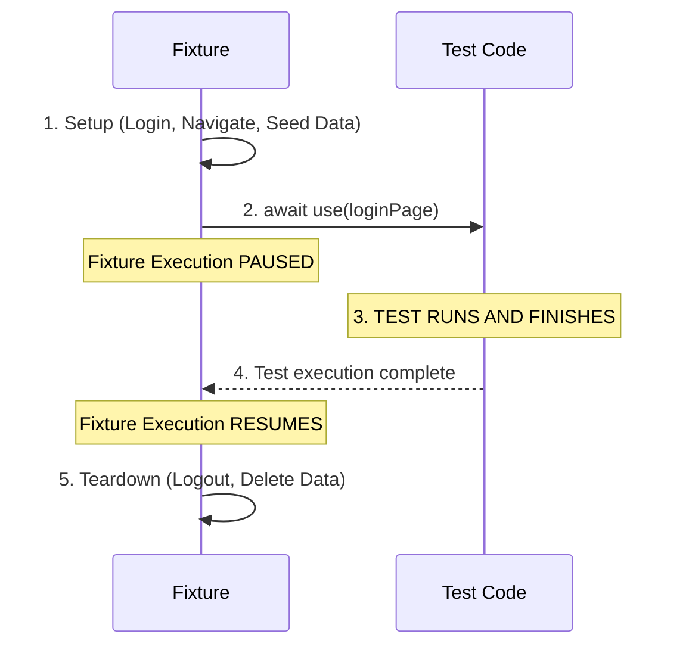


# 5.2: Creating Custom Fixtures


## Learning Objectives

By the end of this lesson, you will be able to:
- Complete 5.2: Creating Custom Fixtures

## Extending the Base Test

To teach Playwright about your custom Page Objects, you use `test.extend()`. 

We create a file called `fixtures.ts` to hold our setup. First, we define a TypeScript type containing the names of our fixtures. Then, we write the logic for them.

<CodeExplainer preset="custom-fixture-ts" />

## The Magic of the `use` Callback

The `use` callback is the most important concept in fixtures.

When a test asks for `{ loginPage }`, Playwright runs your fixture code from the top down. 

When it hits `await use(loginPage)`, **Playwright pauses the fixture and goes to run your actual test code.** It hands your test the `loginPage` object you passed into `use()`.

When your test finishes (or if it fails!), Playwright comes back to the fixture and runs whatever code is *after* the `use` statement. This makes fixtures perfect for cleaning up test data.

**The Timeline:**


> [!NOTE]
> **💡 Key Takeaway**  
> A fixture runs until `await use(...)`, hands control to the test, and then resumes afterward for cleanup.

## Using the Fixture in a Test

Now that we created `fixtures.ts`, we must import `test` from our new file instead of from `@playwright/test`.

```typescript
// tests/login.spec.ts

// ❌ OLD WAY: import { test, expect } from '@playwright/test';
// ✅ NEW WAY: Import our extended test!
import { test, expect } from '../fixtures';

test('admin can see dashboard', async ({ loginPage }) => {
  // Notice we didn't have to write "new LoginPage(page)"!
  // And we didn't have to write "await page.goto('/login')"!
  
  await loginPage.login('admin', 'secret123');
  await expect(loginPage.page.getByText('Welcome Admin')).toBeVisible();
});
```

We just eliminated the setup boilerplate from our test file!

## Exercise

Write a fixture for a `SearchPage` (from the previous module's exercise). 
The fixture should instantiate the `SearchPage`, navigate to the homepage, and yield the object to the test.

<Quiz moduleId="30-custom-fixtures" />


## Common Mistakes

- **Hardcoding Waits**: Using `page.waitForTimeout()` instead of waiting for an element's state.
- **Overly Broad Locators**: Using generic CSS selectors like `.button` that might break if multiple buttons are added. Always prefer user-facing attributes like `getByRole`.
- **Ignoring Errors**: Catching errors in try/catch blocks without failing the test or logging the reason.


## Summary

We learned how to encapsulate test setup logic using custom fixtures. By extending the base `test` object, you can automatically inject initialized page objects or test data directly into your test functions, making them cleaner.


export const astRules = [
  {
    type: "ast_callee",
    value: "test.extend",
    message: "You must use test.extend to declare a custom fixture."
  }
];
