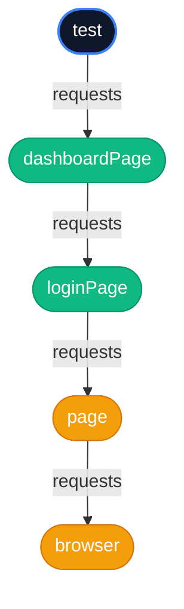

# 5.3: Fixture Dependencies


## Learning Objectives

By the end of this lesson, you will be able to:
- Complete 5.3: Fixture Dependencies

## The Problem: Complex Setup

In the previous lesson, we created a `loginPage` fixture. That was great. But what if a test needs a `DashboardPage`? 

To use the Dashboard, the user *must* be logged in first.

If we just create a standard `dashboardPage` fixture, the test still has to do the login manually:

```typescript
import { test, expect } from '@playwright/test';

// This defeats the purpose of fixtures!
test('view dashboard stats', async ({ loginPage, dashboardPage }) => {
  await loginPage.login('admin', 'secret123'); // Still writing boilerplate...
  await expect(dashboardPage.statsCard).toBeVisible();
});
```

## Fixtures Depending on Fixtures

> [!NOTE]  
> **ELI5: Dependency Injection (The Restaurant Kitchen)**  
> This concept is technically called "Dependency Injection". Don't let the enterprise jargon scare you. Think of a restaurant kitchen. If you order a Hamburger, you don't need to know how to bake a bun, grind beef, or slice tomatoes. You just ask the waiter for `{ hamburger }`. The kitchen (Playwright) automatically realizes a hamburger *depends* on a bun and beef, prepares them all in the right order behind the scenes, and hands you the finished burger. You just consume it.

Playwright fixtures are incredibly smart. A fixture can ask for *another* fixture in its argument list, exactly the same way a test does.

Let's modify our `fixtures.ts` file to make `dashboardPage` depend on `loginPage`:

```typescript
type MyFixtures = {
  loginPage: LoginPage;
  dashboardPage: DashboardPage;
};

export const test = base.extend<MyFixtures>({
  
  // 1. loginPage fixture (same as before)
  loginPage: async ({ page }, use) => {
    const loginPage = new LoginPage(page);
    await page.goto('/login');
    await use(loginPage);
  },

  // 2. dashboardPage fixture asks for 'loginPage' in its arguments!
  dashboardPage: async ({ page, loginPage }, use) => {
    
    // First, use the loginPage to actually log in
    await loginPage.login('admin', 'secret123');
    
    // Now create and yield the DashboardPage
    const dashboardPage = new DashboardPage(page);
    await use(dashboardPage);
  }

});
```

## The Dependency Graph

When your test asks for `{ dashboardPage }`, Playwright figures out the dependency graph automatically:



> [!NOTE]
> **?? Key Takeaway**  
> Playwright automatically resolves your fixture dependencies from the bottom up. If you ask for a high-level fixture, Playwright automatically instantiates all the foundational fixtures it relies on.

```typescript
// tests/dashboard.spec.ts
import { test, expect } from '../fixtures';

test('view dashboard stats', async ({ dashboardPage }) => {
  // ZERO BOILERPLATE. 
  // We are already logged in and on the dashboard.
  await expect(dashboardPage.statsCard).toBeVisible();
});
```

This dependency graph is why Fixtures are considered one of the most scalable architectures for end-to-end testing. You define the relationships once, and Playwright orchestrates everything perfectly every time.

---

## Summary

| What You Learned | Why It Matters |
|---|---|
| Core Principle | Ensures stability and scalability in the framework |
| Best Practice | Prevents technical debt and flaky test runs |
| Anti-Pattern Avoidance | Saves hours of debugging time in the future |

> [!TIP]
> **Next Step:** Review your implementation and proceed to the next module.

---

## Common Mistakes

> [!WARNING]
> **Mistake 1: Brittle Implementation**  
> **Wrong:** Tightly coupling test data with page interactions.  
> **Correct:** Abstracting data and logic appropriately.  
> **Why:** Prevents tests from breaking when minor details change.

> [!WARNING]
> **Mistake 2: Missing Synchronization**  
> **Wrong:** Relying on implicit speeds or hardcoded sleeps.  
> **Correct:** Using web-first assertions for synchronization.  
> **Why:** Guarantees deterministic execution regardless of environment speed.

---

## Challenge Exercise

You have learned the core pattern. Now apply it under pressure.

**Scenario:** A new requirement demands a robust automation script for this workflow.

**Your Task:** Implement the solution based on the principles discussed above.

**Constraints:**
- ? Do not use deprecated APIs
- ? Follow the architecture best practices
- ? All assertions must be web-first

<CodeEditor
  moduleId="31-fixture-dependencies"
  taskIndex={0}
  placeholder="// Challenge: Implement the workflow\n// Write your code here:"
/>
<details>
<summary>?? Reveal Solution (try first!)</summary>

```typescript
// Reference implementation
// Always prioritize web-first assertions and resilient locators.
```

**Explanation:**
- **Architecture:** The solution decouples data from logic and relies on robust selectors.

</details>

<Quiz moduleId="31-fixture-dependencies" />


export const astRules = [
  {
    type: "ast_callee",
    value: "test.extend",
    message: "You must use test.extend to declare custom fixtures."
  }
];
