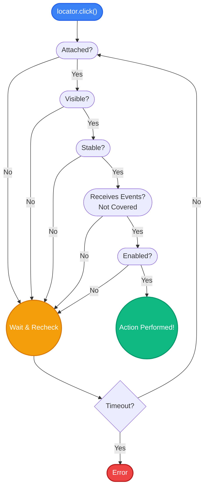

# 7.1: Auto Waiting & Actionability

import { ChapterHeader } from '@/components/ChapterHeader';

<ChapterHeader
  objective="Understand Playwright's built-in actionability checks and why you never need to manually wait for clicks."
  time="10 mins"
  type="Concept"
/>

## Learning Objectives
- Define the 5 criteria Playwright checks before clicking
- Eliminate flaky, hardcoded sleep commands from your codebase
- Understand how Playwright automatically handles UI animations and loading states

## The Flakiness Problem

In older automation frameworks (like early Selenium), a test might look like this:

```typescript
// Old, flaky automation
await button.click(); 

// Wait for the modal to animate open
await sleep(2000); 

await modalInput.fill('data');
```

Why did engineers write `sleep(2000)`? Because if they tried to fill the input while the modal was still fading in, the test would crash with an `ElementNotInteractable` error. 

This is called **flakiness**. If the computer is slow that day and the modal takes 3 seconds to animate, the test fails.

## Playwright's Auto-Waiting

Playwright solves this entirely. In Playwright, you almost *never* write `sleep` or manual waits.

When you tell Playwright to click a button:

```typescript
await page.getByRole('button', { name: 'Submit' }).click();
```

Playwright does not immediately click the screen. Instead, it performs an **Actionability Check**. It rapidly checks a checklist under the hood:

1. **Attached:** Is the button in the DOM?
2. **Visible:** Is it actually visible (not `display: none` or opacity 0)?
3. **Stable:** Has it stopped animating/moving?
4. **Receives Events:** Is it covered by another element (like a loading spinner overlay)?
5. **Enabled:** Is it not `disabled`?

Playwright will sit there and patiently re-check this list over and over again, for up to 30 seconds. The exact millisecond all 5 checks pass, Playwright clicks the button.



> [!NOTE]
> **💡 Key Takeaway**  
> Playwright does not click immediately. It waits until the element is attached, visible, stable, clickable, and enabled.

## Trust the Framework

Because of auto-waiting, you don't need to overthink synchronization for standard clicks and typing.

```typescript
// Playwright automatically waits for the button to appear, 
// waits for it to stop moving, waits for the loading overlay 
// to disappear, and THEN clicks it.
await page.getByRole('button', { name: 'Save Profile' }).click();
```

If a test fails with a Timeout error, it means one of the Actionability checks never passed. Playwright will even tell you which one failed in the error message (e.g., "waiting for element to be visible").

> [!WARNING]
> Never use `await page.waitForTimeout(5000)` (the Playwright version of `sleep`) to fix a flaky test! It masks the real problem and makes your test suite agonizingly slow. Let Playwright's auto-waiting do its job.

---

## Practice Exercise

<CodeEditor
  moduleId="36-auto-waiting"
  taskIndex={0}
  placeholder={`// Practice: The button takes 3 seconds to appear.\n// Write the code to click it. Do NOT write any sleeps!\n\n`}
/>

---

## Common Mistakes

- **Hardcoding Waits**: Using `page.waitForTimeout()` instead of waiting for an element's state.
- **Overly Broad Locators**: Using generic CSS selectors like `.button` that might break if multiple buttons are added. Always prefer user-facing attributes like `getByRole`.
- **Ignoring Errors**: Catching errors in try/catch blocks without failing the test or logging the reason.


## Challenge Exercise

You have learned the core pattern. Now apply it under pressure.

**Scenario:** You have a custom toggle switch. It animates for 2 seconds before it can be clicked.

**Your Task:** Write the code to toggle the switch. 

**Constraints:**
- ❌ You may NOT use `page.waitForTimeout`
- ✅ You MUST rely entirely on Playwright's auto-waiting mechanism

<CodeEditor
  moduleId="36-auto-waiting"
  taskIndex={1}
  placeholder={`import { test, expect } from '@playwright/test';

test('auto-waiting challenge', async ({ page }) => {
  await page.goto('https://slow-app.com');

  // BUG: The button takes 8 seconds to become attached and enabled.
  // Rely on Playwright's auto-waiting action instead of a hardcoded delay!
  await page.waitForTimeout(8000);
  await page.getByRole('button', { name: 'Confirm' }).click();
});`}
/>

<details>
<summary>🔑 Reveal Solution (try first!)</summary>

```typescript
import { test } from '@playwright/test';

test('toggle switch', async ({ page }) => {
  await page.goto('/settings');
  
  // Playwright automatically waits for the 2-second animation to finish!
  await page.getByRole('switch', { name: 'Dark Mode' }).click();
});
```

</details>

---

## Summary

| What You Learned | Why It Matters |
|---|---|
| Actionability Checks | Playwright verifies visibility, stability, and events before acting |
| Auto-waiting | Replaces flaky manual timeouts with intelligent DOM polling |
| Trust the Framework | If a click fails, investigate the DOM state, don't just add a sleep |

> [!TIP]
> **Next Step:** Proceed to Assertions vs Waits to see how assertions have their own auto-waiting.

<Quiz moduleId="36-auto-waiting" />
