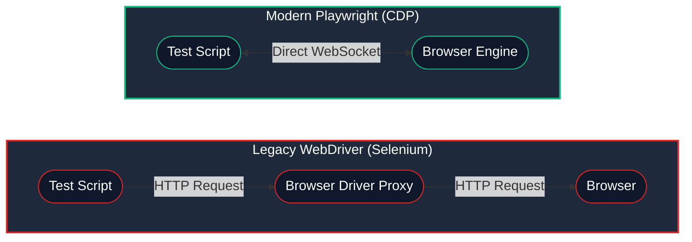
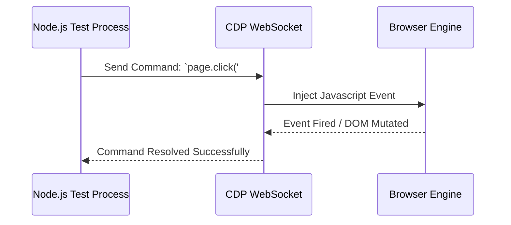

# 8.10: Browser Engine & Network Mechanics

import { ChapterHeader } from '@/components/ChapterHeader';

<ChapterHeader
  objective="Master this critical concept to build robust, scalable Playwright automation."
  time="15 mins"
  type="Concept"
/>

## Learning Objectives
- Understand the core architectural patterns
- Identify and avoid common anti-patterns
- Implement production-grade automation scripts


## The Illusion of Visibility: DOM Hydration

In traditional web architecture, when an HTML element appeared on the screen, it was instantly interactive. This is no longer true in the era of Single Page Applications (SPAs) built with React, Angular, Vue, and Svelte.

These modern frameworks utilize a process called **Hydration**:

1. **The Server-Side Render (SSR):** The server sends pre-compiled raw HTML. The user sees the UI instantly.
2. **The JavaScript Payload:** The browser begins downloading massive JavaScript bundles (React.js, Webpack chunks) in the background.
3. **The Hydration Phase:** Once downloaded, the JavaScript engine traverses the DOM tree and attaches event listeners (`onClick`, `onChange`) to the static HTML nodes.

### Why this breaks Automation
If Playwright issues a `click()` command during Step 1 or Step 2, the button is **Attached**, **Visible**, and **Stable**. The click successfully fires. However, because the framework hasn't attached the `onClick` listener yet, the click vanishes into the void.

**The Symptom:** Your test clicked the "Save" button, but the modal didn't close. The test fails 5 seconds later with a timeout.

### The Professional Solution

Do **not** use `page.waitForTimeout()`. This is an amateur anti-pattern that bloats execution time.

Instead, wait for the network to reach an idle state, proving that the JS bundles have finished downloading and hydration is complete:

```typescript
// ✅ Wait until there are no more than 0 network connections for at least 500 ms.
await page.waitForLoadState('networkidle');

// Alternatively, wait for an element that ONLY appears after hydration:
await page.waitForSelector('.react-fully-loaded-indicator', { state: 'attached' });
```

---

## Network Interception: Playwright's True Superpower

The difference between a junior QA and a Senior SDET is how they handle backend dependencies. A junior will wait 15 seconds for a complex SQL query to return dashboard widgets. A Senior will intercept the network request and reply instantly with mock data.

This process is powered by the **Chrome DevTools Protocol (CDP)**, allowing Playwright to act as a Man-In-The-Middle (MITM) proxy for the browser.

### CDP vs Legacy WebDriver

Playwright's speed comes from its architecture. Legacy tools use an HTTP proxy to translate commands. Playwright uses a direct WebSocket connection via CDP.



### Browser Engine Execution



> [!NOTE]
> **💡 Key Takeaway**  
> Bypassing the HTTP proxy layer allows Playwright to achieve bi-directional, real-time communication with the browser engine. This is what makes features like `route.fulfill()` instantly intercept network traffic.

### 1. `route.fulfill()` — The Instant Mock

Isolate your frontend from backend instability by mocking responses:

```typescript
import { test, expect } from '@playwright/test';

test('Dashboard renders massive datasets cleanly', async ({ page }) => {
  // 1. Intercept the heavy API call
  await page.route('**/api/v2/analytics/summary', async route => {
    // 2. Fulfill instantly with fake data
    await route.fulfill({
      status: 200,
      contentType: 'application/json',
      body: JSON.stringify({
        totalRevenue: 5000000,
        activeUsers: 12500,
        churnRate: '1.2%'
      })
    });
  });

  // 3. Load the page (Hydrates and receives fake data in ~200ms)
  await page.goto('/dashboard');
  
  // 4. Assert the UI rendered the mocked data
  await expect(page.getByText('$5,000,000')).toBeVisible();
});
```

### 2. `route.fetch()` — The Proxy Pattern

Sometimes you want the real data from the server, but you just want to tweak one specific field (e.g., forcing a user's role from "Guest" to "Admin").

```typescript
import { test, expect } from '@playwright/test';

test('Forces Admin View via Proxy Interception', async ({ page }) => {
  await page.route('**/api/users/me', async route => {
    // 1. Fetch the REAL response from the real server
    const response = await route.fetch();
    const json = await response.json();
    
    // 2. Mutate the response payload
    json.role = 'SuperAdmin';
    json.permissions.push('DELETE_ORG');

    // 3. Fulfill the route with the mutated data
    await route.fulfill({
      response, // Inherits original headers/status
      json      // Overrides the body
    });
  });

  await page.goto('/profile');
  await expect(page.getByRole('button', { name: 'Delete Organization' })).toBeVisible();
});
```

### 3. `route.abort()` — Simulating Catastrophic Failures

How does your UI handle a CDN outage where the CSS files don't load? Or an Analytics tracker blocking the main thread?

```typescript
// Block all images from loading to speed up test execution!
await page.route('**/*.{png,jpg,jpeg,gif,svg}', route => route.abort('blockedbyclient'));

// Simulate an analytics tracker timing out
await page.route('**/google-analytics/**', route => route.abort('timedout'));
```

---

## Mocking GraphQL Endpoints

REST APIs are easy to mock because every resource has a unique URL (`/api/users`, `/api/orders`). 

GraphQL is notoriously difficult to mock because **every** request goes to the exact same URL (`/graphql`). You must inspect the POST body to determine which query to mock.

```typescript
import { test, expect } from '@playwright/test';

test('Mocking specific GraphQL Queries', async ({ page }) => {
  await page.route('**/graphql', async route => {
    const request = route.request();
    const postData = JSON.parse(request.postData() || '{}');

    // Check the GraphQL Operation Name
    if (postData.operationName === 'GetUserSettings') {
      await route.fulfill({
        json: { data: { userSettings: { theme: 'dark', notifications: false } } }
      });
    } else {
      // If it's not the query we care about, let it hit the real server
      await route.continue();
    }
  });
});
```

## CORS Headers in Mocked Responses

A common pitfall when mocking APIs is triggering Cross-Origin Resource Sharing (CORS) errors in the browser. If your mocked response lacks the correct headers, the browser's security model will reject the payload before your frontend code can read it.

```typescript
// ✅ Ensuring mocked responses bypass CORS restrictions
await route.fulfill({
  status: 200,
  headers: {
    'Access-Control-Allow-Origin': '*',
    'Content-Type': 'application/json'
  },
  body: JSON.stringify({ success: true })
});
```

By mastering Network Interception and understanding DOM Hydration, you stop writing brittle "End-to-End" tests and start writing resilient, lightning-fast "Frontend" tests that run in milliseconds instead of minutes.

<CodeEditor
  moduleId="49-browser-network-mechanics"
  taskIndex={0}
  placeholder="// Task: Write a page.route() block that intercepts a GraphQL query named 'GetBillingDetails', fetches the real response using route.fetch(), modifies the 'isPaid' flag to true, and fulfills the route."
/>
---

## Common Mistakes

- **Hardcoding Waits**: Using `page.waitForTimeout()` instead of waiting for an element's state.
- **Overly Broad Locators**: Using generic CSS selectors like `.button` that might break if multiple buttons are added. Always prefer user-facing attributes like `getByRole`.
- **Ignoring Errors**: Catching errors in try/catch blocks without failing the test or logging the reason.


## Challenge Exercise

You have learned the core pattern. Now apply it under pressure.

**Scenario:** A new requirement demands a robust automation script for this workflow.

**Your Task:** Implement the solution based on the principles discussed above.

**Constraints:**
- ❌ Do not use deprecated APIs
- ✅ Follow the architecture best practices
- ✅ All assertions must be web-first

<CodeEditor
  moduleId="49-browser-network-mechanics"
  taskIndex={1}
  placeholder={`// Challenge: Intercept and mock API request payloads
// Intercept a GET request to '**/api/v1/profile' and fulfill with a mocked user object.
// FIX the incorrect routing syntax below:

// Write page.route() interceptor below:`}
/>
---

## Summary

| What You Learned | Why It Matters |
|---|---|
| Core Principle | Ensures stability and scalability in the framework |
| Best Practice | Prevents technical debt and flaky test runs |
| Anti-Pattern Avoidance | Saves hours of debugging time in the future |

> [!TIP]
> **Next Step:** Review your implementation and proceed to the next module.

<Quiz moduleId="browser-network-mechanics" />

