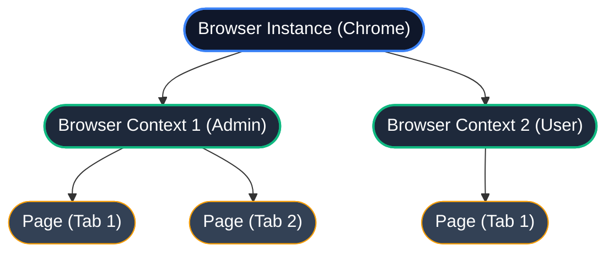

# 9.1: Browser Context & State

## Learning Objectives

By the end of this lesson, you will be able to:
- Master Browser Context vs Browser Instance

## The Browser Hierarchy

Understanding how Playwright manages the browser is fundamental to writing reliable tests. There are three levels:



> [!NOTE]
> **?? Key Takeaway**  
> Think of the Browser as the Chrome application itself, a Context as a private/incognito window (separate cookies, storage), and a Page as an individual tab inside that window.

## What is a Browser Context?

A **Browser Context** is an isolated browser environment with its own:
- Cookies
- Local storage
- Session storage
- Cache
- Authentication state

Two contexts running at the same time are **completely invisible to each other**, even though they share the same browser process.

## Context vs Browser: Side-by-Side

| Feature | Browser Instance | Browser Context |
|---------|-----------------|-----------------|
| Speed to create | Slow (3-5 seconds) | Fast (milliseconds) |
| Isolation | No isolation | Fully isolated |
| Memory | Shared | Separate |
| Cookies | Shared | Separate per context |
| Best for | Long-lived reuse | Per-test isolation |

## Creating and Using Contexts

```typescript
import { chromium } from '@playwright/test';

const browser = await chromium.launch();

// Create two completely isolated sessions
const adminContext = await browser.newContext();
const reviewerContext = await browser.newContext();

// Each context gets its own page
const adminPage = await adminContext.newPage();
const reviewerPage = await reviewerContext.newPage();

// These two sessions are completely independent!
await adminPage.goto('https://dms.example.com/admin');
await reviewerPage.goto('https://dms.example.com/reviewer');

// Clean up
await adminContext.close();
await reviewerContext.close();
await browser.close();
```

## The Power of Saved Auth State

Instead of logging in at the start of every single test (which is slow and wasteful), you can **save the authentication state** once and reuse it across hundreds of tests.

```typescript
// Step 1: Login once and save the session
// (Run this in your global setup script)
const browser = await chromium.launch();
const context = await browser.newContext();
const page = await context.newPage();

await page.goto('https://dms.example.com/login');
await page.fill('#email', process.env.ADMIN_USER!);
await page.fill('#password', process.env.ADMIN_PASS!);
await page.click('[type="submit"]');

// Save all cookies + localStorage to a file
await context.storageState({ path: '.auth/admin.json' });
await browser.close();
```

```typescript
// Step 2: Reuse the saved state in ALL your tests
// playwright.config.ts
export default defineConfig({
  use: {
    storageState: '.auth/admin.json',  // Every test starts already logged in!
  },
});
```

This single trick can cut your test suite runtime by **30-50%** because you eliminate login overhead from every test.

## Multi-User Testing

The saved auth state pattern is especially powerful for testing workflows that require multiple users:

```typescript
// In playwright.config.ts
projects: [
  {
    name: 'admin-tests',
    use: { storageState: '.auth/admin.json' },
    testMatch: 'tests/admin/**',
  },
  {
    name: 'reviewer-tests',
    use: { storageState: '.auth/reviewer.json' },
    testMatch: 'tests/reviewer/**',
  },
]
```

## Context Options: Fine-Tuning Behavior

```typescript
const context = await browser.newContext({
  // Emulate an iPhone 14 Pro
  ...devices['iPhone 14 Pro'],
  
  // Set a specific timezone
  timezoneId: 'America/New_York',
  
  // Set geolocation
  geolocation: { latitude: 40.7128, longitude: -74.0060 },
  
  // Grant camera/microphone permissions
  permissions: ['camera', 'microphone'],
  
  // Bypass HTTPS certificate errors (staging only!)
  ignoreHTTPSErrors: true,
});
```

<CodeEditor
  moduleId="50-core-context"
  taskIndex={0}
  placeholder="// Task: Create a browser context and save its auth state&#10;const context = await browser.newContext();&#10;const page = await context.newPage();&#10;// ... perform login ...&#10;await context.storageState({ path: '.auth/admin.json' });"
/>
---

## Summary

| What You Learned | Why It Matters |
|---|---|
| Core Principle | Ensures stability and scalability in the framework |
| Best Practice | Prevents technical debt and flaky test runs |
| Anti-Pattern Avoidance | Saves hours of debugging time in the future |

> [!TIP]
> **Next Step:** Review your implementation and proceed to the next module.

---

## Common Mistakes

> [!WARNING]
> **Mistake 1: Brittle Implementation**  
> **Wrong:** Tightly coupling test data with page interactions.  
> **Correct:** Abstracting data and logic appropriately.  
> **Why:** Prevents tests from breaking when minor details change.

> [!WARNING]
> **Mistake 2: Missing Synchronization**  
> **Wrong:** Relying on implicit speeds or hardcoded sleeps.  
> **Correct:** Using web-first assertions for synchronization.  
> **Why:** Guarantees deterministic execution regardless of environment speed.

---

## Challenge Exercise

You have learned the core pattern. Now apply it under pressure.

**Scenario:** A new requirement demands a robust automation script for this workflow.

**Your Task:** Implement the solution based on the principles discussed above.

**Constraints:**
- ? Do not use deprecated APIs
- ? Follow the architecture best practices
- ? All assertions must be web-first

<CodeEditor
  moduleId="50-core-context"
  taskIndex={1}
  placeholder={`import { test, expect } from '@playwright/test';

test('challenge exercise', async ({ page }) => {
  // Challenge: Refactor this code to follow industry best practices
  // 1. Avoid hardcoded sleeps (waitForTimeout)
  // 2. Use web-first assertions (expect().toBeVisible)
  // 3. Ensure all asynchronous calls are properly awaited
  
  page.goto('https://example.com');
  await page.waitForTimeout(2000);
  const element = page.locator('.submit-btn');
  element.click();
});`}
/>
<details>
<summary>?? Reveal Solution (try first!)</summary>

```typescript
// Reference implementation
// Always prioritize web-first assertions and resilient locators.
```

**Explanation:**
- **Architecture:** The solution decouples data from logic and relies on robust selectors.

</details>

<Quiz moduleId="core-context" />

