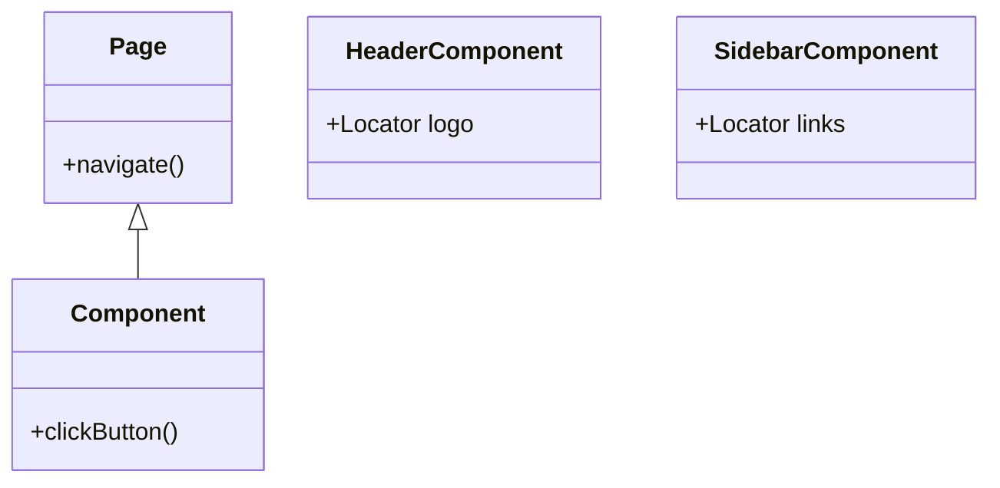
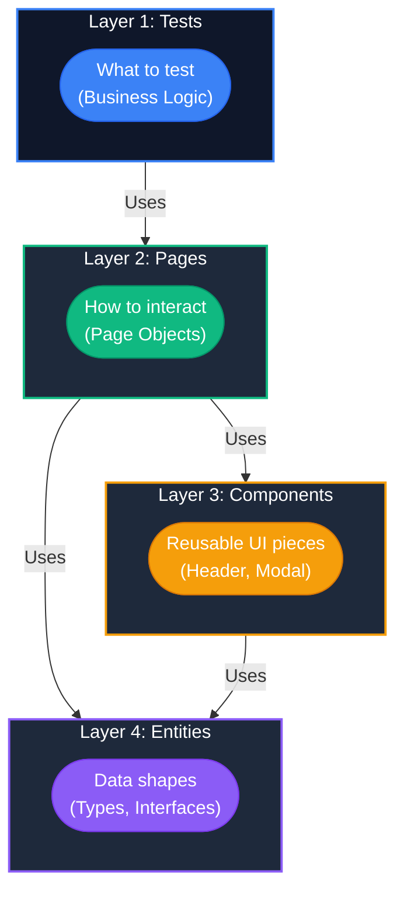

# 12.1: The 4-Layer Separation

### Component vs Page Object


ns | **Type:** Architecture

## Learning Objectives

By the end of this lesson, you will be able to:
- Master the Entity-Component-Page-Test flow

## Why Layered Architecture?

When a test suite grows beyond 20 tests, a flat structure becomes unmanageable. The **4-layer architecture** separates concerns so clearly that any engineer can open the project and instantly know where to find or add any piece of code.

## Layer Diagram



> [!NOTE]
> **?? Key Takeaway**  
> Strict separation of concerns is the secret to scaling test automation. Tests dictate the "what", Pages handle the "how", Components handle shared UI, and Entities handle the shape of the data.

## Layer 1: Tests � "What"

Tests describe **business scenarios** in human-readable language. They should be understandable by a product manager.

```typescript
import { test, expect } from '@playwright/test';

// tests/e-sign/signature-workflow.spec.ts
test.describe('E-Signature Workflow', () => {
  test('reviewer can sign a document with reason', async ({ eSignPage }) => {
    // Arrange
    await eSignPage.openDocument('DOC-2024-001');
    
    // Act
    await eSignPage.signDocument({ 
      reason: 'Approved for clinical use',
      password: process.env.REVIEWER_PASS!
    });
    
    // Assert
    await expect(eSignPage.signatureConfirmation).toBeVisible();
    await expect(eSignPage.auditTrail).toContainText('Signed by');
  });
});
```

**Rules for Layer 1:**
- ? Uses only fixture-provided objects (no `new PageObject()`)
- ? No locators (`page.locator()` is banned here)
- ? No `process.env` access (use fixtures)
- ? Clear Arrange/Act/Assert structure

Without POM, if the Pharma Document Approval workflow changes (e.g., the "Submit for Review" button ID changes from `#submit-btn` to `#approve-workflow`), you would have to update every single test file that interacts with that document workflow.

If you have 50 tests verifying the Document Lifecycle, that's 50 files you have to edit.

### The Page Object Solution

With the Page Object Model, you extract the Document Approval logic into a single `DocumentReviewPage` class. They expose **business-level methods**, not raw Playwright calls.

```typescript
// pages/ESignPage.ts
export class ESignPage {
  readonly signButton = this.page.getByRole('button', { name: 'Sign Document' });
  readonly reasonInput = this.page.getByLabel('Reason for Signing');
  readonly passwordInput = this.page.getByLabel('Password');
  readonly confirmSignButton = this.page.getByRole('button', { name: 'Confirm Signature' });
  readonly signatureConfirmation = this.page.getByRole('alert', { name: 'Document Signed' });
  readonly auditTrail = this.page.getByRole('region', { name: 'Audit Trail' });

  constructor(readonly page: Page) {}

  async openDocument(docId: string) {
    await this.page.goto(`/documents/${docId}`);
  }

  async signDocument(options: { reason: string; password: string }) {
    await this.signButton.click();
    await this.reasonInput.fill(options.reason);
    await this.passwordInput.fill(options.password);
    await this.confirmSignButton.click();
  }
}
```

## Layer 3: Components � Shared UI Pieces

Components are used inside Page Objects when the same UI element appears on multiple pages.

```typescript
import { test, expect } from '@playwright/test';

// components/Modal.ts
export class Modal {
  constructor(private readonly page: Page) {}
  
  private get dialog() { return this.page.getByRole('dialog'); }
  
  readonly title = this.dialog.getByRole('heading');
  readonly confirmButton = this.dialog.getByRole('button', { name: /confirm|yes|ok/i });
  readonly cancelButton = this.dialog.getByRole('button', { name: /cancel|no/i });
  readonly closeButton = this.dialog.getByRole('button', { name: 'Close' });

  async waitForTitle(title: string) {
    await expect(this.title).toContainText(title);
  }

  async confirm() {
    await this.confirmButton.click();
    await expect(this.dialog).toBeHidden();
  }
}
```

```typescript
// Used in a Page Object:
// pages/DocumentPage.ts
export class DocumentPage {
  readonly modal = new Modal(this.page);
  
  async deleteDocument(docId: string) {
    await this.getActionButton(docId, 'Delete').click();
    await this.modal.waitForTitle('Confirm Deletion');
    await this.modal.confirm();
  }
}
```

## Layer 4: Entities � Data Types

```typescript
// entities/Document.ts
export interface Document {
  id: string;
  title: string;
  status: 'Draft' | 'Pending Review' | 'Approved' | 'Rejected';
  uploadedBy: string;
  uploadedAt: Date;
  fileSize: number;
  version: string;
}

export interface SignatureEvent {
  documentId: string;
  signedBy: string;
  reason: string;
  timestamp: Date;
  ipAddress: string;
}
```

## The Data Flow

```
Test (What)
  +-- calls ? Page Object (How)
                +-- uses ? Component (Shared UI)
                +-- uses ? Entity types (Data Shape)
```


> [!NOTE]
> **Retention Layer:**
> * **Key Idea:** Component Objects isolate shared UI elements (like grids or navbars) across multiple Page Objects.
> * **Common Mistake:** Duplicating the "Sidebar" locators across 10 different POM classes.
> * **Enterprise Application:** Building reusable, modular interaction libraries for enterprise design systems.

<CodeEditor
  moduleId="58-arch-layers"
  taskIndex={0}
  placeholder="// Task: A developer has created a 'Modal.ts' helper class that handles&#10;// confirm/cancel dialog interactions shared across multiple pages.&#10;// In which layer of the 4-layer architecture should this file live?&#10;// Write your answer as a comment explaining WHY it belongs there."
/>

<details>
<summary>?? Reveal Solution (try first!)</summary>

```
// Answer: Layer 3 � components/Modal.ts
// WHY: Modal is a reusable UI element shared across multiple pages.
// It belongs in the Components layer, not in Pages (too specific)
// or Entities (not a data shape).
```

</details>

---

## Summary

| What You Learned | Why It Matters |
|---|---|
| Core Principle | Ensures stability and scalability in the framework |
| Best Practice | Prevents technical debt and flaky test runs |
| Anti-Pattern Avoidance | Saves hours of debugging time in the future |

> [!TIP]
> **Next Step:** Review your implementation and proceed to the next module.

---

## Common Mistakes

> [!WARNING]
> **Mistake 1: Brittle Implementation**  
> **Wrong:** Tightly coupling test data with page interactions.  
> **Correct:** Abstracting data and logic appropriately.  
> **Why:** Prevents tests from breaking when minor details change.

> [!WARNING]
> **Mistake 2: Missing Synchronization**  
> **Wrong:** Relying on implicit speeds or hardcoded sleeps.  
> **Correct:** Using web-first assertions for synchronization.  
> **Why:** Guarantees deterministic execution regardless of environment speed.

---

## Challenge Exercise

You have learned the core pattern. Now apply it under pressure.

**Scenario:** A new requirement demands a robust automation script for this workflow.

**Your Task:** Implement the solution based on the principles discussed above.

**Constraints:**
- ? Do not use deprecated APIs
- ? Follow the architecture best practices
- ? All assertions must be web-first

<CodeEditor
  moduleId="58-arch-layers"
  taskIndex={1}
  placeholder={`import { test, expect } from '@playwright/test';

test('challenge exercise', async ({ page }) => {
  // Challenge: Refactor this code to follow industry best practices
  // 1. Avoid hardcoded sleeps (waitForTimeout)
  // 2. Use web-first assertions (expect().toBeVisible)
  // 3. Ensure all asynchronous calls are properly awaited
  
  page.goto('https://example.com');
  await page.waitForTimeout(2000);
  const element = page.locator('.submit-btn');
  element.click();
});`}
/>
<Quiz moduleId="arch-layers" />


export const astRules = [
  {
    type: "ast_forbidden_callee",
    value: "page.waitForTimeout",
    message: "Use auto-retrying assertions or web-first locators instead of hardcoded waits."
  }
];
