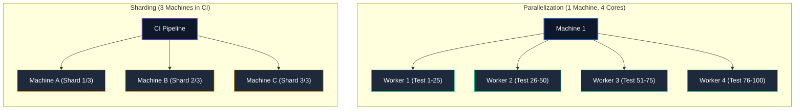

# 14.1: Parallelization & Sharding

### State Pollution Avoidance



> [!NOTE]
> **💡 Key Takeaway**  
> Parallelization distributes tests across local CPU cores (workers) on a single machine. Sharding distributes tests across entirely separate machines in the cloud for massive horizontal scaling.
## Learning Objectives

By the end of this lesson, you will be able to:
- Master worker-based execution

## Why Parallel Execution?

Running 100 tests sequentially (one after another) might take 20 minutes. Running them in parallel across 4 workers can cut that to 5 minutes. At scale, this is the difference between a CI pipeline that gives fast feedback and one that blocks your team for half an hour.

## How Playwright Parallelizes Tests

Playwright distributes tests across **workers** — isolated Node.js processes, each with their own browser instance.

```
Worker 1 (Chromium) → runs tests/admin/*.spec.ts
Worker 2 (Chromium) → runs tests/reviewer/*.spec.ts
Worker 3 (Firefox)  → runs tests/smoke/*.spec.ts
Worker 4 (WebKit)   → runs tests/e-sign/*.spec.ts
```

Each worker is completely isolated — separate browser, separate cookies, separate memory.

## Configuring Workers

```typescript
// playwright.config.ts
export default defineConfig({
  // Use all available CPU cores (default)
  workers: undefined,

  // Use exactly 4 workers
  workers: 4,

  // Use 50% of available CPU cores (good for CI)
  workers: '50%',

  // Disable parallelism (serial execution)
  workers: 1,
  
  // Run tests fully in parallel (no serial within a file)
  fullyParallel: true,
});
```

## Parallelism Levels

| Setting | Behavior |
|---------|----------|
| `fullyParallel: false` (default) | Tests within a file run serially; files run in parallel |
| `fullyParallel: true` | Every individual test runs in its own worker |

## Writing Parallel-Safe Tests

Tests that run in parallel **must be independent**. If Test A creates data that Test B depends on, you'll get flaky failures.

### ❌ Not parallel-safe: Shared test data
```typescript
import { test, expect } from '@playwright/test';

// File 1 creates a document with a known ID
test('create document', async ({ documentPage }) => {
  await documentPage.createWithId('FIXED-DOC-001', 'Test Document');
});

// File 2 assumes that document exists
test('view document', async ({ documentPage }) => {
  // FAILS if File 1 hasn't run yet!
  await documentPage.navigateTo('FIXED-DOC-001');
});
```

### ✅ Parallel-safe: Each test creates its own data
```typescript
import { test, expect } from '@playwright/test';

test('view a document', async ({ documentPage }) => {
  // Create fresh data in this test — no dependency on other tests
  const docId = await documentPage.createDocument({ 
    title: `Test-${Date.now()}-${Math.random().toString(36).slice(2)}` 
  });
  await documentPage.navigateTo(docId);
  await expect(documentPage.title).toBeVisible();
});
```

## Data Isolation Strategies

| Strategy | How | Best For |
|----------|-----|----------|
| **Unique IDs** | Append `Date.now()` or UUID to names | Documents, users, records |
| **API cleanup** | Delete created data in fixture teardown | Persistent resources |
| **Database transactions** | Wrap test in transaction, rollback after | Database-heavy suites |
| **Tenant isolation** | Each worker gets a unique tenant/org | Multi-tenant applications |

```typescript
// Fixture with automatic cleanup
documentPage: async ({ page, request }, use) => {
  const doc = new DocumentPage(page);
  const createdIds: string[] = [];

  // Track created documents
  const originalCreate = doc.createDocument.bind(doc);
  doc.createDocument = async (data) => {
    const id = await originalCreate(data);
    createdIds.push(id);
    return id;
  };

  await use(doc);

  // TEARDOWN: Clean up all created documents
  for (const id of createdIds) {
    await request.delete(`/api/documents/${id}`);
  }
},
```

## `test.describe.configure()` — Granular Control

```typescript
import { test, expect } from '@playwright/test';

// Run all tests in this describe block in parallel
test.describe('Document Operations', () => {
  test.describe.configure({ mode: 'parallel' });
  
  test('upload document', async ({ documentPage }) => { /* ... */ });
  test('search documents', async ({ documentPage }) => { /* ... */ });
  test('export documents', async ({ documentPage }) => { /* ... */ });
  test('filter documents', async ({ documentPage }) => { /* ... */ });
});
```

## Forcing Serial Execution When Needed

Sometimes tests MUST run in order (e.g., they test a multi-step workflow):

```typescript
import { test, expect } from '@playwright/test';

test.describe('E-Sign Multi-Step Workflow', () => {
  test.describe.configure({ mode: 'serial' });
  
  // These run in order, in the same worker
  test('step 1: upload document', async ({ uploadPage }) => { /* ... */ });
  test('step 2: submit for review', async ({ documentPage }) => { /* ... */ });
  test('step 3: sign document', async ({ eSignPage }) => { /* ... */ });
  test('step 4: verify audit trail', async ({ auditPage }) => { /* ... */ });
});
```

> [!WARNING]
> If any test in a `serial` block fails, all subsequent tests in that block are **skipped** (since they depend on the failed test's state).

## Using Worker Fixtures for Expensive Shared Resources

```typescript
// fixtures/baseTest.ts
// Worker scope: this DB connection is created ONCE per worker, shared across all tests in that worker
dbConnection: [async ({}, use) => {
  const db = await Database.connect(process.env.DB_URL!);
  await use(db);
  await db.close();
}, { scope: 'worker' }],
```

## Running Tests on Multiple Browsers in Parallel

```typescript
// playwright.config.ts
projects: [
  { name: 'Chrome', use: { ...devices['Desktop Chrome'] } },
  { name: 'Firefox', use: { ...devices['Desktop Firefox'] } },
  { name: 'Safari', use: { ...devices['Desktop Safari'] } },
  { name: 'Mobile Chrome', use: { ...devices['Pixel 5'] } },
  { name: 'Mobile Safari', use: { ...devices['iPhone 13'] } },
],
```

Running on 5 projects simultaneously means each test actually runs 5 times — once per browser. Your entire matrix becomes:
```
100 tests × 5 browsers = 500 test executions
```
With 10 workers, this completes in the time it would take to run 50 sequential tests.

## Project Dependencies

Control execution order between projects using `dependencies`:

```typescript
projects: [
  {
    name: 'setup',
    testMatch: /global\.setup\.ts/,
  },
  {
    name: 'chromium',
    use: { ...devices['Desktop Chrome'] },
    dependencies: ['setup'],  // Won't start until 'setup' completes
  },
  {
    name: 'firefox',
    use: { ...devices['Desktop Firefox'] },
    dependencies: ['setup'],
  },
],
```

## Sharding for CI: Splitting Across Machines

When your suite grows too large for one CI machine, split it across multiple:

```bash
# Machine 1: Run the first third of tests
npx playwright test --shard=1/3

# Machine 2: Run the second third
npx playwright test --shard=2/3

# Machine 3: Run the last third
npx playwright test --shard=3/3
```

### GitHub Actions matrix example

```yaml
jobs:
  test:
    strategy:
      matrix:
        shard: [1/4, 2/4, 3/4, 4/4]
    steps:
      - uses: actions/checkout@v4
      - run: npm ci
      - run: npx playwright install --with-deps
      - run: npx playwright test --shard=${{ matrix.shard }}
      - uses: actions/upload-artifact@v4
        if: always()
        with:
          name: test-results-${{ matrix.shard }}
          path: test-results/
```

### Merging shard reports

```bash
# After all shards complete, merge the blob reports
npx playwright merge-reports --reporter=html ./all-blob-reports
```

## Tag-Based Test Filtering

Run subsets of tests using `--grep`:

```bash
# Run only tests tagged @smoke
npx playwright test --grep @smoke

# Run everything EXCEPT @flaky tests
npx playwright test --grep-invert @flaky

# Run only @regression tests on Chrome
npx playwright test --grep @regression --project=Chrome
```

Tag your tests in the code:

```typescript
import { test, expect } from '@playwright/test';

test('upload document @smoke @critical', async ({ documentPage }) => {
  // ...
});

test('export CSV @regression', async ({ documentPage }) => {
  // ...
});
```

## Retry Strategy

```typescript
// playwright.config.ts
export default defineConfig({
  // Retry failed tests: 2 times in CI, 0 locally
  retries: process.env.CI ? 2 : 0,
  
  // Only capture traces on first retry (saves disk space)
  use: {
    trace: 'on-first-retry',
    video: 'retain-on-failure',
  },
});
```

Per-project retries:
```typescript
projects: [
  {
    name: 'smoke',
    retries: 0,  // Smoke tests should never need retries
  },
  {
    name: 'e2e',
    retries: 2,  // E2E tests get retries for stability
  },
],
```


> [!NOTE]
> **Retention Layer:**
> * **Key Idea:** Shared data state breaks parallel execution; you must isolate data or run serially.
> * **Common Mistake:** Concurrently modifying the same database row in parallel tests, causing race conditions.
> * **Enterprise Application:** Safely scaling execution from 1 worker to 10 workers by dynamically pooling users.

<CodeEditor
  moduleId="63-adv-parallel"
  taskIndex={0}
  placeholder="// Task: Configure a GitHub Actions workflow that shards tests across 3 machines.&#10;// Requirements:&#10;//   1. Use a strategy matrix to define 3 shard values&#10;//   2. Each runner should execute one shard of the total&#10;//   3. Use the --shard CLI flag with matrix variable substitution&#10;//&#10;// Write this as YAML comments"
/>

<details>
<summary>🔑 Reveal Solution (try first!)</summary>

```yaml
# strategy:
#   matrix:
#     shard: [1/3, 2/3, 3/3]
# steps:
#   - run: npx playwright test --shard=${{ matrix.shard }}
```

</details>

---

## Summary

| What You Learned | Why It Matters |
|---|---|
| Core Principle | Ensures stability and scalability in the framework |
| Best Practice | Prevents technical debt and flaky test runs |
| Anti-Pattern Avoidance | Saves hours of debugging time in the future |

> [!TIP]
> **Next Step:** Review your implementation and proceed to the next module.

---

## Common Mistakes

> [!WARNING]
> **Mistake 1: Brittle Implementation**  
> **Wrong:** Tightly coupling test data with page interactions.  
> **Correct:** Abstracting data and logic appropriately.  
> **Why:** Prevents tests from breaking when minor details change.

> [!WARNING]
> **Mistake 2: Missing Synchronization**  
> **Wrong:** Relying on implicit speeds or hardcoded sleeps.  
> **Correct:** Using web-first assertions for synchronization.  
> **Why:** Guarantees deterministic execution regardless of environment speed.

---

## Challenge Exercise

You have learned the core pattern. Now apply it under pressure.

**Scenario:** A new requirement demands a robust automation script for this workflow.

**Your Task:** Implement the solution based on the principles discussed above.

**Constraints:**
- ❌ Do not use deprecated APIs
- ✅ Follow the architecture best practices
- ✅ All assertions must be web-first

<CodeEditor
  moduleId="63-adv-parallel"
  taskIndex={1}
  placeholder={`import { test, expect } from '@playwright/test';

test('challenge exercise', async ({ page }) => {
  // Challenge: Refactor this code to follow industry best practices
  // 1. Avoid hardcoded sleeps (waitForTimeout)
  // 2. Use web-first assertions (expect().toBeVisible)
  // 3. Ensure all asynchronous calls are properly awaited
  
  page.goto('https://example.com');
  await page.waitForTimeout(2000);
  const element = page.locator('.submit-btn');
  element.click();
});`}
/>
<Quiz moduleId="adv-parallel" />

