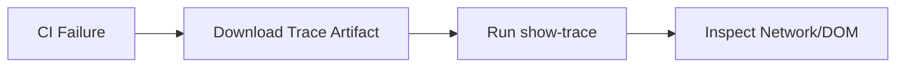

# 14.4: Flaky Retries & Video

### Post-Mortem Debug Flow


ns | **Type:** Advanced

## Learning Objectives

By the end of this lesson, you will be able to:
- Analyze video and traces for flakiness

## What is the Trace Viewer?

The Playwright Trace Viewer is a time-travel debugging tool. It records **every single action** your test performed and lets you scrub through them like a video — seeing the browser state at any point in time.

It shows you:
- A screenshot **before and after** every action
- The exact **DOM element** that was targeted
- All **network requests** made during the test
- The full **console output** and errors
- The **source code line** that triggered each action

## Enabling Traces

```typescript
// playwright.config.ts
use: {
  // Always record a trace (expensive — use for debugging)
  trace: 'on',
  
  // Record only on the first retry (recommended for CI)
  trace: 'on-first-retry',
  
  // Record only when the test fails (good balance)
  trace: 'retain-on-failure',
  
  // Never record (fastest — use for fast smoke tests)
  trace: 'off',
}
```

## Enabling Traces Per Test

```typescript
import { test, expect } from '@playwright/test';

test('debug this complex workflow', async ({ page, context }) => {
  // Start tracing for this test only
  await context.tracing.start({
    screenshots: true,    // Capture screenshots at each action
    snapshots: true,      // Capture DOM snapshots
    sources: true,        // Attach source code
  });
  
  // ... your test code ...
  
  // Save the trace to a file
  await context.tracing.stop({ path: 'trace.zip' });
});
```

## Viewing Traces

```bash
# Open the trace viewer with a specific file
npx playwright show-trace test-results/auth-login-admin/trace.zip

# Open from the HTML report (easier!)
npx playwright show-report
# Then click on any failed test to see its trace
```

## Navigating the Trace Viewer

The Trace Viewer has three main panels:

```
┌──────────────────────────────────────────────────────────┐
│  TIMELINE (top) — Scrub through actions visually        │
│  ████████████████░░░░░░░░░░░░░  ← drag to any moment   │
├───────────────────────┬──────────────────────────────────┤
│  ACTION LIST (left)   │  SCREENSHOT PANEL (right)       │
│  ↳ goto /login        │                                  │
│  ↳ fill #email        │  [Browser screenshot at this     │
│  ↳ fill #password     │   exact moment in time]          │
│  ↳ click Sign In ●    │                                  │
│  ↳ expect heading     │                                  │
├───────────────────────┴──────────────────────────────────┤
│  NETWORK (bottom-left) │  CONSOLE (bottom-right)        │
│  GET /login  200       │  [Network errors, JS errors]   │
│  POST /api/auth  401   │                                  │
└────────────────────────────────────────────────────────┘
```

## Reading a Failing Trace

When a test fails, look for:

1. **The red highlighted action** — this is where the failure occurred
2. **The screenshot at failure** — what did the browser actually look like?
3. **Network requests around the failure** — did an API call fail?
4. **Console errors** — is there a JavaScript error?

**Common trace findings:**

```
Failure: "Element not found: getByRole('button', { name: 'Submit' })"
Trace reveals: The modal never opened because the API call 
               to /api/documents returned 403 Forbidden.
               The test was failing for the WRONG reason!
```

## Trace-Driven Test Improvement

After finding a root cause in the trace, improve your test:

```typescript
import { test, expect } from '@playwright/test';

// Before: Test fails with confusing "element not found" error
test('submit document', async ({ page }) => {
  await page.goto('/documents');
  await page.getByRole('button', { name: 'New' }).click();
  await page.getByRole('button', { name: 'Submit' }).click(); // ← fails here, but why?
});

// After: Added API response validation to catch the REAL failure
test('submit document', async ({ page }) => {
  // Intercept and assert on the API call explicitly
  const responsePromise = page.waitForResponse(
    resp => resp.url().includes('/api/documents') && resp.status() === 200
  );
  
  await page.goto('/documents');
  await page.getByRole('button', { name: 'New' }).click();
  await responsePromise;  // Fails with clear "Expected status 200, got 403" message
  await page.getByRole('button', { name: 'Submit' }).click();
});
```


> [!NOTE]
> **Retention Layer:**
> * **Key Idea:** Traces provide full time-travel debugging capabilities without needing to re-run the test.
> * **Common Mistake:** Adding `console.log`, pausing the test, and re-running 10 times to catch a race condition.
> * **Enterprise Application:** Rapidly investigating 5% flaky CI failures asynchronously using trace artifacts.

<CodeEditor
  moduleId="66-adv-traces"
  taskIndex={0}
  placeholder="// Task: Start a trace recording on a browser context.&#10;// Requirements:&#10;//   1. Enable screenshots capture&#10;//   2. Enable DOM snapshots&#10;//   3. Enable source code mapping&#10;//&#10;// Hint: Use context.tracing.start() with an options object"
/>

<details>
<summary>🔑 Reveal Solution (try first!)</summary>

```typescript
await context.tracing.start({
  screenshots: true,
  snapshots: true,
  sources: true,
});
```

</details>

---

## Summary

| What You Learned | Why It Matters |
|---|---|
| Core Principle | Ensures stability and scalability in the framework |
| Best Practice | Prevents technical debt and flaky test runs |
| Anti-Pattern Avoidance | Saves hours of debugging time in the future |

> [!TIP]
> **Next Step:** Review your implementation and proceed to the next module.

---

## Common Mistakes

> [!WARNING]
> **Mistake 1: Brittle Implementation**  
> **Wrong:** Tightly coupling test data with page interactions.  
> **Correct:** Abstracting data and logic appropriately.  
> **Why:** Prevents tests from breaking when minor details change.

> [!WARNING]
> **Mistake 2: Missing Synchronization**  
> **Wrong:** Relying on implicit speeds or hardcoded sleeps.  
> **Correct:** Using web-first assertions for synchronization.  
> **Why:** Guarantees deterministic execution regardless of environment speed.

---

## Challenge Exercise

You have learned the core pattern. Now apply it under pressure.

**Scenario:** A new requirement demands a robust automation script for this workflow.

**Your Task:** Implement the solution based on the principles discussed above.

**Constraints:**
- ❌ Do not use deprecated APIs
- ✅ Follow the architecture best practices
- ✅ All assertions must be web-first

<CodeEditor
  moduleId="66-adv-traces"
  taskIndex={1}
  placeholder={`# Challenge: Complete the command line task
# Write the correct command below:
`}
/>
<Quiz moduleId="adv-traces" />

