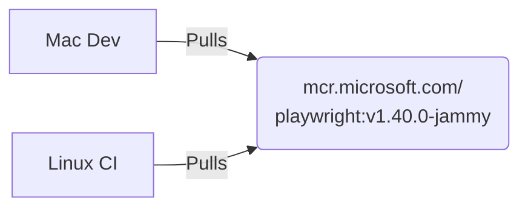

# 16.4: Docker & Containerized Execution

### Container Immutability


ntainerized Execution


## Learning Objectives

By the end of this lesson, you will be able to:
- Use official Playwright Docker images and configure browser caching

## Why Docker for Playwright?

The #1 cause of "works on my machine" failures in Playwright is **browser dependency differences**. Docker solves this by giving every developer and CI runner the exact same browser environment.

## The Official Playwright Docker Image

Microsoft provides official Docker images with all browsers pre-installed:

```bash
# Pull the latest Playwright image
docker pull mcr.microsoft.com/playwright:v1.48.0-noble

# Image variants:
# mcr.microsoft.com/playwright:v1.48.0-noble          ? All browsers + dependencies
# mcr.microsoft.com/playwright:v1.48.0-noble-amd64    ? x86 specific
# mcr.microsoft.com/playwright:v1.48.0-noble-arm64    ? ARM specific (M1/M2 Macs)
```

## Running Tests in Docker (Quick Start)

```bash
# Mount your project and run tests
docker run --rm \
  -v $(pwd):/app \
  -w /app \
  mcr.microsoft.com/playwright:v1.48.0-noble \
  npx playwright test
```

## Dockerfile for Your Project

```dockerfile
# Dockerfile
FROM mcr.microsoft.com/playwright:v1.48.0-noble

WORKDIR /app

# Copy package files first (for better layer caching)
COPY package.json package-lock.json ./

# Install dependencies
RUN npm ci

# Copy the rest of the project
COPY . .

# Run tests
CMD ["npx", "playwright", "test"]
```

### Build and Run

```bash
# Build the image
docker build -t my-playwright-tests .

# Run all tests
docker run --rm my-playwright-tests

# Run specific tests
docker run --rm my-playwright-tests npx playwright test tests/smoke/

# Run with environment variables
docker run --rm \
  -e BASE_URL=https://staging.example.com \
  -e ADMIN_USER=admin@test.com \
  my-playwright-tests
```

## Docker Compose for Complex Setups

When your tests need a backend server:

```yaml
# docker-compose.test.yml
version: '3.8'

services:
  app:
    build: ./backend
    ports:
      - "3000:3000"
    environment:
      - DATABASE_URL=postgres://postgres:password@db:5432/testdb
    depends_on:
      - db

  db:
    image: postgres:16
    environment:
      POSTGRES_PASSWORD: password
      POSTGRES_DB: testdb

  playwright:
    build:
      context: .
      dockerfile: Dockerfile
    depends_on:
      - app
    environment:
      - BASE_URL=http://app:3000
    volumes:
      - ./test-results:/app/test-results
    command: npx playwright test
```

```bash
# Run everything
docker compose -f docker-compose.test.yml up --exit-code-from playwright
```

## Browser Caching in GitHub Actions

Without caching, `npx playwright install` downloads ~400MB of browsers every run:

```yaml
# .github/workflows/test.yml
jobs:
  test:
    runs-on: ubuntu-latest
    steps:
      - uses: actions/checkout@v4
      
      - uses: actions/setup-node@v4
        with:
          node-version: 20
          cache: 'npm'
      
      - run: npm ci
      
      # Cache Playwright browsers
      - name: Cache Playwright browsers
        uses: actions/cache@v4
        id: playwright-cache
        with:
          path: ~/.cache/ms-playwright
          key: playwright-${{ hashFiles('package-lock.json') }}
      
      # Only install if cache missed
      - name: Install Playwright browsers
        if: steps.playwright-cache.outputs.cache-hit != 'true'
        run: npx playwright install --with-deps
      
      # Install OS deps if browsers were cached (deps aren't cached)
      - name: Install OS dependencies
        if: steps.playwright-cache.outputs.cache-hit == 'true'
        run: npx playwright install-deps
      
      - run: npx playwright test
      
      - uses: actions/upload-artifact@v4
        if: always()
        with:
          name: test-results
          path: test-results/
```

## Running in GitHub Actions with Docker

```yaml
jobs:
  test:
    runs-on: ubuntu-latest
    container:
      image: mcr.microsoft.com/playwright:v1.48.0-noble
    steps:
      - uses: actions/checkout@v4
      - run: npm ci
      - run: npx playwright test
      - uses: actions/upload-artifact@v4
        if: always()
        with:
          name: test-results
          path: test-results/
```

> [!TIP]
> Using the container approach skips `npx playwright install` entirely — browsers are already in the Docker image. This saves 2-3 minutes per CI run.

## Linux-Specific Considerations

### Missing System Dependencies

If you see errors like `error while loading shared libraries`:

```bash
# Install all required system dependencies
npx playwright install-deps

# Or install for a specific browser only
npx playwright install-deps chromium
```

### Running Headed in Docker (for Debugging)

```bash
# Use Xvfb (virtual display) for headed mode in Docker
docker run --rm \
  -v $(pwd):/app \
  -w /app \
  mcr.microsoft.com/playwright:v1.48.0-noble \
  xvfb-run npx playwright test --headed
```

## Debugging CI Failures

### Save Traces as Artifacts

```yaml
# playwright.config.ts
use: {
  trace: 'retain-on-failure',
  screenshot: 'only-on-failure',
  video: 'retain-on-failure',
},
```

```yaml
# Upload artifacts for failed tests
- uses: actions/upload-artifact@v4
  if: failure()
  with:
    name: playwright-traces
    path: test-results/
    retention-days: 7
```

### View Traces from CI

```bash
# Download the artifact, then:
npx playwright show-trace test-results/test-name/trace.zip
```

## Performance Tips for Docker/CI

| Tip | Impact |
|-----|--------|
| Cache `~/.cache/ms-playwright` | Save 2-3 min per run |
| Use `--shard` for parallel CI | Linear speedup |
| Set `workers: '50%'` in CI | Prevent OOM on small runners |
| Use `retries: 2` in CI only | Handle transient failures |
| Set `reporter: 'blob'` for shards | Enable report merging |
| Minimize Docker layers | Faster image pulls |

## Production-Ready CI Configuration

```typescript
// playwright.config.ts
import { defineConfig } from '@playwright/test';

export default defineConfig({
  testDir: './tests',
  fullyParallel: true,
  forbidOnly: !!process.env.CI,
  retries: process.env.CI ? 2 : 0,
  workers: process.env.CI ? '50%' : undefined,
  reporter: process.env.CI 
    ? [['blob'], ['github']] 
    : [['html', { open: 'never' }]],
  
  use: {
    baseURL: process.env.BASE_URL || 'http://localhost:3000',
    trace: 'retain-on-failure',
    screenshot: 'only-on-failure',
  },
});
```


> [!NOTE]
> **Retention Layer:**
> * **Key Idea:** Tests must execute in an environment identical to your local machine (Docker provides this).
> * **Common Mistake:** Suffering from the "It works on my machine" syndrome due to missing OS fonts.
> * **Enterprise Application:** Executing strictly controlled, immutable test environments on Alpine/Ubuntu pipelines.

## Challenge Exercise

**Business Context**:
The CI/CD pipeline keeps failing with "Font not found" and rendering inconsistencies because the Linux agents differ from local Mac setups.

**Mission**:
Containerize the entire Playwright execution environment to guarantee absolute consistency across all environments.

**Constraints**:
- Must use the official Microsoft Playwright Docker image.
- Must execute headlessly.

**Deliverables**:
- A `Dockerfile` tailored for test execution.
- A `docker-compose.yml` for easy local triggering.

**Success Criteria**:
- Tests execute flawlessly inside the container.
- Results are mapped back to the host machine volume.

<CodeEditor
  moduleId="101-docker-ci"
  taskIndex={0}
/>


