# 15.1: 21 CFR Part 11 Compliance

## Learning Objectives

By the end of this lesson, you will be able to:
- Master the Intent, Identity, and Integrity triad

## What is E-Sign Compliance?

In pharmaceutical and life sciences companies, electronic signatures (E-Signatures) on documents like SOPs, protocols, and batch records are governed by **21 CFR Part 11** (FDA) and **Annex 11** (EU GMP). These regulations require that:

1. E-signatures are unique to one individual and not reused
2. E-signatures are linked to their documents permanently
3. Any changes to signed documents are detectable
4. An **Audit Trail** records who signed, when, and why
5. Password confirmation is required at the time of signing

## The E-Sign Workflow (Standard)

```mermaid
sequenceDiagram
    participant User as Reviewer
    participant UI as Web Portal
    participant DB as System / Audit Trail
    
    User->>UI: Open Document
    UI->>DB: Fetch Document State
    DB-->>UI: State: Pending Review
    User->>UI: Enter Reason + Password + Comment
    UI->>DB: Submit E-Signature Payload
    
    rect rgb(30, 41, 59)
        note right of DB: 21 CFR Part 11 Validation
        DB->>DB: Verify Password Credentials
        DB->>DB: Check Document Integrity Hash
        DB->>DB: Append Server-Side Timestamp
    end
    
    DB-->>UI: Signature Accepted
    DB->>DB: Lock Audit Trail Record (Immutable)
    UI-->>User: Show Document as 'Approved'
```



> [!NOTE]
> **?? Key Takeaway**  
> Under 21 CFR Part 11, the UI is just a portal. The actual compliance happens deep within the system architecture. This is why your Playwright tests must rigorously verify the Audit Trail (who, what, when, why) to mathematically prove the system is compliant.

## What We Must Test

Testing E-Sign compliance means verifying both the **happy path** and **security boundaries**:

```typescript
import { test, expect } from '@playwright/test';

// HAPPY PATH TESTS:
test('reviewer can sign a document with valid credentials');
test('signing creates an audit trail entry');
test('signed document shows correct signer name and timestamp');
test('document status changes to Approved after signing');

// SECURITY BOUNDARY TESTS:
test('wrong password prevents signing');
test('cannot sign without providing a reason');
test('reason field has a minimum character requirement');
test('signing a document requires the document to be in Pending Review status');
test('already-signed document cannot be re-signed by the same user');
test('signing is rejected if document was modified after opening');

// AUDIT TRAIL TESTS:
test('audit trail records the correct user, timestamp, and reason');
test('audit trail is read-only — no edit or delete');
test('audit trail entries are in chronological order');
```

## 21 CFR Part 11 Compliance Checklist

| Requirement | Test Coverage |
|-------------|--------------|
| Unique identification | Test that two different users create separate audit entries |
| Meaning of signature | Test that `reason` field is mandatory and meaningful |
| Non-repudiation | Test that signed documents cannot be deleted |
| Audit trail completeness | Verify all fields: user, role, timestamp, IP, hash |
| Biometric binding | Test that password re-entry is required even if logged in |
| System security | Test that session timeout logs users out (prevents unattended signing) |

## Writing the Compliance Test Suite

```typescript
// tests/compliance/e-sign-compliance.spec.ts
import { test, expect } from '../../fixtures/baseTest';

test.describe('21 CFR Part 11 - Electronic Signature Compliance', () => {
  
  test.describe('Authentication Requirements', () => {
    test('signing requires password re-entry even when already logged in', 
      async ({ eSignPage }) => {
        await eSignPage.openDocument('DOC-TEST-001');
        await eSignPage.openSignDialog();
        
        // The password field must be present and empty
        await expect(eSignPage.passwordInput).toBeVisible();
        await expect(eSignPage.passwordInput).toHaveValue('');
        
        // Trying to sign without password should fail
        await eSignPage.reasonInput.fill('Test signing');
        await eSignPage.confirmButton.click();
        
        await expect(eSignPage.passwordError).toBeVisible();
        await expect(eSignPage.passwordError).toContainText('Password is required');
    });

    test('signing is rejected with incorrect password', async ({ eSignPage }) => {
      await eSignPage.openDocument('DOC-TEST-001');
      await eSignPage.signDocument({ 
        reason: 'Approved', 
        password: 'WRONG_PASSWORD_123' 
      });
      
      await expect(eSignPage.signatureError).toContainText('Invalid credentials');
      await expect(eSignPage.documentStatus).toContainText('Pending Review');
    });
  });

  test.describe('Audit Trail Requirements', () => {
    test('successful signature creates complete audit trail entry', async ({ eSignPage, auditPage }) => {
      const docId = 'DOC-TEST-002';
      await eSignPage.openDocument(docId);
      
      const signedAt = new Date();
      await eSignPage.signDocument({
        reason: 'All sections reviewed and compliant with SOP-042',
        password: process.env.REVIEWER_PASS!
      });
      
      await auditPage.navigateTo(docId);
      const latestEntry = auditPage.getLatestEntry();
      
      await expect(latestEntry.user).toContainText('reviewer@example.com');
      await expect(latestEntry.action).toContainText('Signed');
      await expect(latestEntry.reason).toContainText('SOP-042');
      
      // Timestamp must be within 60 seconds of when we signed
      const timestamp = await latestEntry.timestamp.textContent();
      const entryTime = new Date(timestamp!);
      expect(Math.abs(entryTime.getTime() - signedAt.getTime())).toBeLessThan(60_000);
    });
  });
});
```

<CodeEditor
  moduleId="72-esign-compliance"
  taskIndex={0}
  placeholder="// Task: Write a test that verifies the e-sign flow REJECTS submission without a password.&#10;// Requirements:&#10;//   1. Open a document&#10;//   2. Open the sign dialog&#10;//   3. Fill in the reason but leave the password empty&#10;//   4. Click confirm&#10;//   5. Assert that a password error message is visible&#10;//&#10;// Use the eSignPage fixture from the architecture"
/>

<details>
<summary>?? Reveal Solution (try first!)</summary>

```typescript
import { test, expect } from '@playwright/test';

test('signing requires password', async ({ eSignPage }) => {
  await eSignPage.openDocument('DOC-001');
  await eSignPage.openSignDialog();
  await eSignPage.reasonInput.fill('Test reason');
  await eSignPage.confirmButton.click();
  await expect(eSignPage.passwordError).toBeVisible();
});
```

</details>

---

## Summary

| What You Learned | Why It Matters |
|---|---|
| Core Principle | Ensures stability and scalability in the framework |
| Best Practice | Prevents technical debt and flaky test runs |
| Anti-Pattern Avoidance | Saves hours of debugging time in the future |

> [!TIP]
> **Next Step:** Review your implementation and proceed to the next module.

---

## Common Mistakes

> [!WARNING]
> **Mistake 1: Brittle Implementation**  
> **Wrong:** Tightly coupling test data with page interactions.  
> **Correct:** Abstracting data and logic appropriately.  
> **Why:** Prevents tests from breaking when minor details change.

> [!WARNING]
> **Mistake 2: Missing Synchronization**  
> **Wrong:** Relying on implicit speeds or hardcoded sleeps.  
> **Correct:** Using web-first assertions for synchronization.  
> **Why:** Guarantees deterministic execution regardless of environment speed.

---

## Challenge Exercise

You have learned the core pattern. Now apply it under pressure.

**Scenario:** A new requirement demands a robust automation script for this workflow.

**Your Task:** Implement the solution based on the principles discussed above.

**Constraints:**
- ? Do not use deprecated APIs
- ? Follow the architecture best practices
- ? All assertions must be web-first

<CodeEditor
  moduleId="72-esign-compliance"
  taskIndex={1}
  placeholder={`// Challenge: Verify rejection on document submission without password signature
// Navigate to settings, open sign dialog, leave signature empty, and click confirm.
// Write the compliance test script here:`}
/>
<Quiz moduleId="esign-compliance" />

