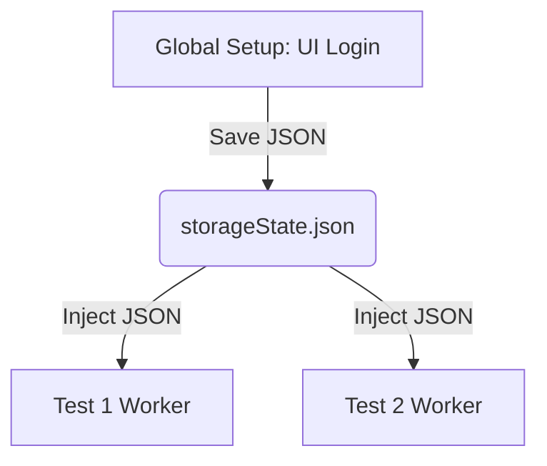

# 16.3: Hybrid Data Setup

## Learning Objectives

By the end of this lesson, you will be able to:
- Create data via API and verify via UI

## The Hybrid Pattern

The Hybrid pattern uses API calls to handle **setup and teardown**, while using the browser for **user experience verification**. This cuts test execution time by 60-80% on complex workflows.

```
Traditional E2E Test:  Login UI → Navigate UI → Create Document UI → Verify UI
Time: ~90 seconds

Hybrid Test:           API Login → API Create Document → Navigate UI → Verify UI  
Time: ~15 seconds
```

## Pattern 1: API Setup → UI Verification

```typescript
import { test, expect } from '@playwright/test';

test('approved documents display the Approved badge in the UI', async ({ request, page }) => {
  // SETUP via API (fast — no browser rendering)
  // Step 1: Authenticate
  const authRes = await request.post('/api/auth/login', {
    data: { email: process.env.ADMIN_USER, password: process.env.ADMIN_PASS }
  });
  const { token } = await authRes.json();
  const headers = { Authorization: `Bearer ${token}` };

  // Step 2: Create a document via API
  const createRes = await request.post('/api/documents', {
    data: { title: `Hybrid Test ${Date.now()}`, type: 'Protocol', department: 'QA' },
    headers
  });
  const { id: docId } = await createRes.json();

  // Step 3: Submit and approve via API
  await request.post(`/api/documents/${docId}/submit`, { headers });
  await request.post(`/api/documents/${docId}/approve`, {
    data: { reason: 'API test approval' },
    headers
  });

  // VERIFY via UI (because this is what the user sees)
  await page.goto('/documents?status=approved');
  
  const docRow = page.getByRole('row').filter({ hasText: `Hybrid Test` });
  await expect(docRow).toBeVisible();
  await expect(docRow.getByRole('status')).toContainText('Approved');
});
```

## Pattern 2: UI Action → API Verification

When you want to verify what the user does in the UI actually creates the correct data in the backend:

```typescript
import { test, expect } from '@playwright/test';

test('signing a document creates the correct API record', async ({ page, request, eSignPage }) => {
  const docId = 'DOC-TEST-HYBRID';
  
  // PERFORM the action via UI (because this is what you're testing)
  await eSignPage.openDocument(docId);
  await eSignPage.signDocument({
    reason: 'Approved for clinical distribution',
    password: process.env.REVIEWER_PASS!
  });

  // VERIFY via API (because we need to confirm the backend data is correct)
  const authRes = await request.post('/api/auth/login', {
    data: { email: process.env.ADMIN_USER, password: process.env.ADMIN_PASS }
  });
  const { token } = await authRes.json();
  
  const signaturesRes = await request.get(`/api/documents/${docId}/signatures`, {
    headers: { Authorization: `Bearer ${token}` }
  });
  
  const signatures = await signaturesRes.json();
  expect(signatures).toHaveLength(1);
  expect(signatures[0].reason).toBe('Approved for clinical distribution');
  expect(signatures[0].hash).toMatch(/^[a-f0-9]{64}$/);
  expect(new Date(signatures[0].timestamp)).toBeInstanceOf(Date);
});
```

## Pattern 3: API Mocking with `route`

Sometimes you want to test UI behavior when the API returns specific responses — without setting up the data in the real backend.

```typescript
import { test, expect } from '@playwright/test';

test('shows error message when API returns 500', async ({ page }) => {
  // Intercept the API call and force it to return an error
  await page.route('/api/documents', async route => {
    if (route.request().method() === 'POST') {
      await route.fulfill({
        status: 500,
        contentType: 'application/json',
        body: JSON.stringify({ error: 'Internal server error — storage unavailable' })
      });
    } else {
      await route.continue(); // Allow GET requests through normally
    }
  });
  
  await page.goto('/documents/new');
  await page.getByRole('button', { name: 'Submit' }).click();
  
  // Verify the UI shows a user-friendly error message
  await expect(page.getByRole('alert')).toContainText('Something went wrong');
  await expect(page.getByRole('alert')).toBeVisible();
});
```

## Pattern 4: Modifying Requests with `route.continue()`

Intercept and **modify** outgoing requests without blocking them:

```typescript
import { test, expect } from '@playwright/test';

test('requests include custom tracking header', async ({ page }) => {
  // Add a header to every outgoing API request
  await page.route('/api/**', async route => {
    await route.continue({
      headers: {
        ...route.request().headers(),
        'X-Test-Id': 'automated-test-run-42',
        'X-Environment': 'staging',
      },
    });
  });

  await page.goto('/documents');
  // All API calls now include the custom headers
});
```

You can also modify the URL, method, or POST data:

```typescript
// Redirect API calls to a mock server
await page.route('/api/**', async route => {
  const url = route.request().url().replace('api.production.com', 'api.staging.com');
  await route.continue({ url });
});
```

## Pattern 5: Modifying Responses

Intercept the real API response and modify it before the browser sees it:

```typescript
import { test, expect } from '@playwright/test';

test('handles edge case: document with 10000 signatures', async ({ page }) => {
  await page.route('/api/documents/DOC-001', async route => {
    // Fetch the real response first
    const response = await route.fetch();
    const json = await response.json();
    
    // Modify it to simulate an edge case
    json.signatureCount = 10000;
    json.signatures = Array.from({ length: 10000 }, (_, i) => ({
      id: `SIG-${i}`,
      signer: `user-${i}@example.com`,
      timestamp: new Date().toISOString(),
    }));
    
    await route.fulfill({ response, json });
  });

  await page.goto('/documents/DOC-001');
  await expect(page.getByTestId('signature-count')).toContainText('10,000');
});
```

## Pattern 6: Route Chaining with `route.fallback()`

When multiple route handlers match the same URL, use `fallback()` to chain them:

```typescript
// Handler 1: Add auth header to all requests
await page.route('/api/**', async route => {
  await route.fallback({
    headers: { ...route.request().headers(), Authorization: 'Bearer test-token' },
  });
});

// Handler 2: Mock a specific endpoint (runs FIRST, falls through to Handler 1 for others)
await page.route('/api/documents', async route => {
  if (route.request().method() === 'GET') {
    await route.fulfill({ json: [{ id: 'DOC-001', title: 'Mocked Document' }] });
  } else {
    await route.fallback();  // Let other handlers process this
  }
});
```

> [!IMPORTANT]
> `route.fallback()` passes to the **next** matching handler. `route.continue()` sends the request to the **network**. Use `fallback()` when chaining handlers, `continue()` when you're the last handler.

## Pattern 7: Aborting Requests (Offline Simulation)

```typescript
import { test, expect } from '@playwright/test';

test('app shows offline banner when network is unavailable', async ({ page }) => {
  await page.goto('/dashboard');
  
  // Block all API calls to simulate network failure
  await page.route('/api/**', route => route.abort('connectionrefused'));
  
  // Trigger an action that makes an API call
  await page.getByRole('button', { name: 'Refresh' }).click();
  
  await expect(page.getByText('You appear to be offline')).toBeVisible();
});
```

Abort reasons: `'aborted'`, `'accessdenied'`, `'connectionfailed'`, `'connectionrefused'`, `'timedout'`

## Pattern 8: HAR Recording & Playback

Record all network traffic to a HAR file, then replay it for **deterministic, fast tests**:

```typescript
import { test, expect } from '@playwright/test';

// Step 1: Record network traffic to a HAR file
test('record network traffic', async ({ page }) => {
  await page.routeFromHAR('tests/fixtures/document-list.har', {
    update: true,  // Record mode: save real responses
    url: '/api/**',
  });
  
  await page.goto('/documents');
  // Navigate the app... all API responses are saved to the HAR file
});

// Step 2: Replay recorded traffic (no real network calls!)
test('document list renders correctly', async ({ page }) => {
  await page.routeFromHAR('tests/fixtures/document-list.har', {
    url: '/api/**',
  });
  
  await page.goto('/documents');
  // API calls are served from the HAR file — fast & deterministic
  await expect(page.getByRole('row')).toHaveCount(25);
});
```

## Pattern 9: Testing Loading States

Delay API responses to test spinners and loading skeletons:

```typescript
import { test, expect } from '@playwright/test';

test('shows loading spinner while documents are fetching', async ({ page }) => {
  // Delay the API response by 3 seconds
  await page.route('/api/documents', async route => {
    await new Promise(resolve => setTimeout(resolve, 3000));
    await route.fulfill({
      json: [{ id: 'DOC-001', title: 'Test Document' }],
    });
  });

  await page.goto('/documents');
  
  // Spinner should be visible during the 3-second delay
  await expect(page.getByRole('progressbar')).toBeVisible();
  
  // After the response arrives, spinner should disappear
  await expect(page.getByRole('progressbar')).toBeHidden();
  await expect(page.getByRole('row').filter({ hasText: 'Test Document' })).toBeVisible();
});
```

## Network Request Assertions

Verify that the UI sends the correct API request:

```typescript
import { test, expect } from '@playwright/test';

test('clicking Delete sends the correct DELETE request', async ({ page }) => {
  // Track outgoing requests
  const deleteRequest = page.waitForRequest(
    req => req.url().includes('/api/documents/DOC-001') && req.method() === 'DELETE'
  );
  
  await page.goto('/documents');
  await page.getByRole('row').filter({ hasText: 'DOC-001' })
    .getByRole('button', { name: 'Delete' })
    .click();
  await page.getByRole('dialog').getByRole('button', { name: 'Confirm' }).click();
  
  // Verify the request was sent
  const request = await deleteRequest;
  expect(request.headers()['authorization']).toBeDefined();
});
```

## Passive Response Monitoring

Listen to responses without intercepting them:

```typescript
import { test, expect } from '@playwright/test';

test('all API calls return 2xx status codes', async ({ page }) => {
  const failedRequests: string[] = [];
  
  page.on('response', response => {
    if (response.url().includes('/api/') && response.status() >= 400) {
      failedRequests.push(`${response.status()} ${response.url()}`);
    }
  });
  
  await page.goto('/documents');
  await page.getByRole('button', { name: 'Load More' }).click();
  
  expect(failedRequests, `These API calls failed:\n${failedRequests.join('\n')}`).toHaveLength(0);
});
```

## Session Reuse Architecture



## `page.route()` vs `page.on('request')` — Key Differences

| Feature | `page.route()` | `page.on('request')` |
|---------|:--------------:|:--------------------:|
| Can modify requests | ✅ | ❌ (read-only) |
| Can mock responses | ✅ | ❌ |
| Can block/abort | ✅ | ❌ |
| Passive monitoring | ❌ (intercepts) | ✅ |
| Use case | Mocking, modifying | Logging, asserting |


> [!NOTE]
> **Retention Layer:**
> * **Key Idea:** Authentication tokens expire; therefore, storage state must be dynamically refreshed.
> * **Common Mistake:** Saving a hardcoded JWT to git or generating it once globally for a 6-hour suite.
> * **Enterprise Application:** Dynamically fetching and refreshing JWTs in CI pipelines via API fixtures.

<CodeEditor
  moduleId="79-api-hybrid"
  taskIndex={0}
  placeholder="// Task: Test a loading spinner by artificially delaying an API response.&#10;// Requirements:&#10;//   1. Intercept requests to /api/documents using page.route()&#10;//   2. Delay the response by 2 seconds&#10;//   3. Fulfill the route with an empty array&#10;//   4. Navigate to the documents page&#10;//   5. Assert that a loading indicator (progressbar) is visible&#10;//&#10;// Hint: Use setTimeout inside route handler for the delay"
/>

<details>
<summary>🔑 Reveal Solution (try first!)</summary>

```typescript
import { test, expect } from '@playwright/test';

await page.route('/api/documents', async route => {
  await new Promise(r => setTimeout(r, 2000));
  await route.fulfill({ json: [] });
});
await page.goto('/documents');
await expect(page.getByRole('progressbar')).toBeVisible();
```

</details>

---

## Summary

| What You Learned | Why It Matters |
|---|---|
| Core Principle | Ensures stability and scalability in the framework |
| Best Practice | Prevents technical debt and flaky test runs |
| Anti-Pattern Avoidance | Saves hours of debugging time in the future |

> [!TIP]
> **Next Step:** Review your implementation and proceed to the next module.

---

## Common Mistakes

> [!WARNING]
> **Mistake 1: Brittle Implementation**  
> **Wrong:** Tightly coupling test data with page interactions.  
> **Correct:** Abstracting data and logic appropriately.  
> **Why:** Prevents tests from breaking when minor details change.

> [!WARNING]
> **Mistake 2: Missing Synchronization**  
> **Wrong:** Relying on implicit speeds or hardcoded sleeps.  
> **Correct:** Using web-first assertions for synchronization.  
> **Why:** Guarantees deterministic execution regardless of environment speed.

---

## Challenge Exercise

You have learned the core pattern. Now apply it under pressure.

**Scenario:** A new requirement demands a robust automation script for this workflow.

**Your Task:** Implement the solution based on the principles discussed above.

**Constraints:**
- ❌ Do not use deprecated APIs
- ✅ Follow the architecture best practices
- ✅ All assertions must be web-first

<CodeEditor
  moduleId="79-api-hybrid"
  taskIndex={1}
  placeholder={`import { test, expect } from '@playwright/test';

test('api hybrid mocking', async ({ page }) => {
  // Challenge: Intercept and mock API requests to simulate heavy payload delay
  // Add a 2 second delay inside page.route() before completing the request.
  // Complete the interceptor below:
});`}
/>
<Quiz moduleId="api-hybrid" />

export const astRules = [
  {
    type: "ast_callee_any",
    values: ["request.get", "request.post", "request.put", "request.delete", "request.patch"],
    message: "You must use the Playwright APIRequestContext methods (e.g., request.post) alongside UI actions."
  }
];
