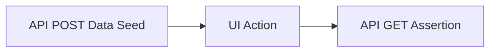

# 16.5: The API Controller Pattern

### The Hybrid Test Pattern


ntroller Pattern


## Learning Objectives

By the end of this lesson, you will be able to:
- Implement API abstractions

## The Problem with Direct API Calls in Tests

```typescript
import { test, expect } from '@playwright/test';

// ❌ Raw API calls in tests — duplicated, hard to maintain
test('document approval updates status', async ({ request }) => {
  const authRes = await request.post('/api/auth/login', { 
    data: { email: process.env.ADMIN_USER, password: process.env.ADMIN_PASS }
  });
  const { token } = await authRes.json();
  
  const response = await request.post(`/api/documents/${docId}/approve`, {
    data: { reason: 'Approved' },
    headers: { Authorization: `Bearer ${token}` }
  });
  // ... repeated in 15 other tests
```

The `fetch`, `json()`, and header management are duplicated across every test. When the API changes, you update 15 files.

## The API Controller Layer

```typescript
// utils/DocumentApiController.ts
import { APIRequestContext, expect } from '@playwright/test';

export class DocumentApiController {
  constructor(
    private readonly request: APIRequestContext,
    private readonly baseURL: string,
    private readonly token: string
  ) {}

  private get headers() {
    return {
      Authorization: `Bearer ${this.token}`,
      'Content-Type': 'application/json',
    };
  }

  async list(params?: { status?: string; page?: number; limit?: number }) {
    let response = await this.request.get(`${this.baseURL}/api/documents`, {
      params,
      headers: this.headers,
    });
    expect(response.status(), 'GET /api/documents should return 200').toBe(200);
    return response.json() as Promise<{ data: Document[]; pagination: any }>;
  }

  async create(payload: { title: string; type: string; department: string; version?: string }) {
    let response = await this.request.post(`${this.baseURL}/api/documents`, {
      data: { version: '1.0', ...payload },
      headers: this.headers,
    });
    expect(response.status(), 'POST /api/documents should return 201').toBe(201);
    return response.json() as Promise<Document>;
  }

  async get(id: string) {
    let response = await this.request.get(`${this.baseURL}/api/documents/${id}`, {
      headers: this.headers,
    });
    expect(response.status()).toBe(200);
    return response.json() as Promise<Document>;
  }

  async approve(id: string, reason: string) {
    let response = await this.request.post(`${this.baseURL}/api/documents/${id}/approve`, {
      data: { reason },
      headers: this.headers,
    });
    expect(response.status()).toBe(200);
    return response.json();
  }

  async reject(id: string, reason: string) {
    let response = await this.request.post(`${this.baseURL}/api/documents/${id}/reject`, {
      data: { reason },
      headers: this.headers,
    });
    expect(response.status()).toBe(200);
    return response.json();
  }

  async delete(id: string) {
    const response = await this.request.delete(`${this.baseURL}/api/documents/${id}`, {
      headers: this.headers,
    });
    expect(response.status()).toBe(204);
  }

  async createAndApprove(payload: { title: string; type: string; department: string }) {
    const doc = await this.create(payload);
    await this.approve(doc.id, 'Auto-approved in test setup');
    return doc;
  }
}
```

## The Auth Controller

```typescript
import { test, expect } from '@playwright/test';

// utils/AuthApiController.ts
export class AuthApiController {
  constructor(
    private readonly request: APIRequestContext,
    private readonly baseURL: string
  ) {}

  async login(email: string, password: string): Promise<{ token: string; refreshToken: string }> {
    const response = await this.request.post(`${this.baseURL}/api/auth/login`, {
      data: { email, password }
    });
    expect(response.status(), `Login for ${email} should succeed`).toBe(200);
    return response.json();
  }

  async loginAsAdmin() {
    return this.login(process.env.ADMIN_USER!, process.env.ADMIN_PASS!);
  }

  async loginAsReviewer() {
    return this.login(process.env.REVIEWER_USER!, process.env.REVIEWER_PASS!);
  }

  async logout(token: string) {
    await this.request.post(`${this.baseURL}/api/auth/logout`, {
      headers: { Authorization: `Bearer ${token}` }
    });
  }
}
```

## Using Controllers in Tests

```typescript
// tests/api/document-workflow.spec.ts
import { test, expect } from '@playwright/test';
import { AuthApiController } from '../../utils/AuthApiController';
import { DocumentApiController } from '../../utils/DocumentApiController';

test('full document approval workflow via API', async ({ request }) => {
  const auth = new AuthApiController(request, process.env.BASE_URL!);
  const { token } = await auth.loginAsAdmin();
  const docs = new DocumentApiController(request, process.env.BASE_URL!, token);

  // Create
  const doc = await docs.create({ 
    title: 'API Test Protocol', 
    type: 'Protocol', 
    department: 'QA' 
  });
  expect(doc.id).toBeDefined();
  expect(doc.status).toBe('Draft');

  // Approve
  await docs.approve(doc.id, 'Full test validation');
  
  // Verify
  const updated = await docs.get(doc.id);
  expect(updated.status).toBe('Approved');
  
  // Cleanup
  await docs.delete(doc.id);
});
```

## Wire Controllers into Fixtures

```typescript
// fixtures/baseTest.ts
docApi: async ({ request }, use) => {
  const auth = new AuthApiController(request, process.env.BASE_URL!);
  const { token } = await auth.loginAsAdmin();
  await use(new DocumentApiController(request, process.env.BASE_URL!, token));
},
```


> [!NOTE]
> **Retention Layer:**
> * **Key Idea:** API data seeding is orders of magnitude faster and more reliable than UI data seeding.
> * **Common Mistake:** Testing the login and checkout UI 50 times just to reach the final receipt page.
> * **Enterprise Application:** Utilizing Hybrid Test Architectures: API to prepare state, UI to assert outcome.

<CodeEditor
  moduleId="81-api-controller"
  taskIndex={0}
  placeholder="// Task: Write an API controller method that does TWO things in sequence:&#10;//   1. Creates a document via this.create(payload)&#10;//   2. Immediately approves it via this.approve(doc.id, reason)&#10;//   3. Returns the created document object&#10;//&#10;// This is a convenience method for test setup — create + approve in one call"
/>

<details>
<summary>🔑 Reveal Solution (try first!)</summary>

```typescript
async createAndApprove(payload) {
  const doc = await this.create(payload);
  await this.approve(doc.id, 'Auto-approved in test setup');
  return doc;
}
```

</details>

---

## Summary

| What You Learned | Why It Matters |
|---|---|
| Core Principle | Ensures stability and scalability in the framework |
| Best Practice | Prevents technical debt and flaky test runs |
| Anti-Pattern Avoidance | Saves hours of debugging time in the future |

> [!TIP]
> **Next Step:** Review your implementation and proceed to the next module.

---

## Common Mistakes

> [!WARNING]
> **Mistake 1: Brittle Implementation**  
> **Wrong:** Tightly coupling test data with page interactions.  
> **Correct:** Abstracting data and logic appropriately.  
> **Why:** Prevents tests from breaking when minor details change.

> [!WARNING]
> **Mistake 2: Missing Synchronization**  
> **Wrong:** Relying on implicit speeds or hardcoded sleeps.  
> **Correct:** Using web-first assertions for synchronization.  
> **Why:** Guarantees deterministic execution regardless of environment speed.

---

## Challenge Exercise

You have learned the core pattern. Now apply it under pressure.

**Scenario:** A new requirement demands a robust automation script for this workflow.

**Your Task:** Implement the solution based on the principles discussed above.

**Constraints:**
- ❌ Do not use deprecated APIs
- ✅ Follow the architecture best practices
- ✅ All assertions must be web-first

<CodeEditor
  moduleId="81-api-controller"
  taskIndex={1}
  placeholder={`import { test, expect } from '@playwright/test';

test('challenge exercise', async ({ page }) => {
  // Challenge: Refactor this code to follow industry best practices
  // 1. Avoid hardcoded sleeps (waitForTimeout)
  // 2. Use web-first assertions (expect().toBeVisible)
  // 3. Ensure all asynchronous calls are properly awaited
  
  page.goto('https://example.com');
  await page.waitForTimeout(2000);
  const element = page.locator('.submit-btn');
  element.click();
});`}
/>
<Quiz moduleId="api-controller" />

