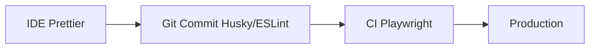

# 18.5: The Quality Gate Pattern

## Learning Objectives

By the end of this lesson, you will be able to:
- Master the 'Gatekeeper' architecture

## The Gate Architecture

The AST Quality Gate is the final checkpoint before code enters the `main` branch. No Pull Request can be merged unless the AST audit passes.

```
Developer writes code
      ?
git push ? GitHub PR opened
      ?
GitHub Actions triggers
      ?
+-------------------------------------+
¦  STEP 1: Lint (ESLint)              ¦
¦  STEP 2: Type Check (tsc)           ¦  
¦  STEP 3: AST Audit ? THE GATE      ¦
¦  STEP 4: Test Execution             ¦
¦  STEP 5: Visual Regression          ¦
+-------------------------------------+
      ?
All steps green? ? Merge allowed ?
Any step fails? ? Merge blocked ?
```

## The Rules Registry

To import all rules cleanly, we re-export them from a central index file:

```typescript
// rules/index.ts
import { noHardcodedSleepRule } from './noHardcodedSleepRule';
import { noHardcodedCredentialsRule } from './noHardcodedCredentialsRule';
import { noMissingAwaitRule } from './noMissingAwaitRule';
import { noLocatorsInSpecsRule } from './noLocatorsInSpecsRule';
import { requireDescribeBlockRule } from './requireDescribeBlockRule';

export {
  noHardcodedSleepRule,
  noHardcodedCredentialsRule,
  noMissingAwaitRule,
  noLocatorsInSpecsRule,
  requireDescribeBlockRule
};
```

## The Full AST Audit Script

```typescript
// scripts/ast-audit.ts
import { AstLinter } from '../utils/AstLinter';
import { 
  noHardcodedSleepRule,
  noHardcodedCredentialsRule,
  noMissingAwaitRule,
  noLocatorsInSpecsRule,
  requireDescribeBlockRule
} from '../rules';
import * as path from 'path';

async function main() {
  console.log('?? Running AST Audit...\n');
  
  const linter = new AstLinter()
    .addRule(noHardcodedSleepRule)
    .addRule(noHardcodedCredentialsRule)
    .addRule(noMissingAwaitRule)
    .addRule(noLocatorsInSpecsRule)
    .addRule(requireDescribeBlockRule);

  // Audit all spec files
  const violations = linter.lintDirectory('tests/**/*.spec.ts');
  
  if (violations.length === 0) {
    console.log('? AST Audit passed! All 5 gates cleared.\n');
    process.exit(0);
  } else {
    console.error(`\n? AST Audit FAILED: ${violations.length} violation(s) found.\n`);
    linter.report();
    process.exit(1);  // Non-zero exit code blocks the CI build
  }
}

main().catch(err => {
  console.error('AST Auditor crashed:', err);
  process.exit(1);
});
```

## The Shift-Left Pipeline



## Integrating into GitHub Actions

```yaml
# .github/workflows/ci.yml
name: CI Pipeline

on: [push, pull_request]

jobs:
  quality-gate:
    runs-on: ubuntu-latest
    
    steps:
      - uses: actions/checkout@v4
      - uses: actions/setup-node@v4
        with: { node-version: '20' }
      
      - name: Install dependencies
        run: npm ci
      
      - name: TypeScript type check
        run: npx tsc --noEmit
      
      # THE AST GATE — runs BEFORE tests
      - name: AST Quality Gate
        run: npx ts-node scripts/ast-audit.ts
      
      - name: Install Playwright browsers
        run: npx playwright install --with-deps
      
      - name: Run Tests
        run: npx playwright test
      
      - name: Upload test report
        uses: actions/upload-artifact@v4
        if: always()
        with:
          name: playwright-report
          path: playwright-report/
```

## Pre-Commit Hook (Local Enforcement)

Install `husky` to run the AST audit before every commit:

```bash
# Install husky
npm install --save-dev husky
npx husky install

# Create the pre-commit hook
echo 'npx ts-node scripts/ast-audit.ts' > .husky/pre-commit
chmod +x .husky/pre-commit
```

Now, if an engineer tries to commit code with a violation, git will refuse it:

```bash
git commit -m "Add login test"
# ?? Running AST Audit...
# ? AST Audit FAILED: 1 violation found.
# ? [no-hardcoded-sleep] tests/login.spec.ts:15 — waitForTimeout() is banned.
# 
# error: pre-commit hook failed
```

## Exit Codes Reference

```typescript
// The audit script uses exit codes to communicate status to CI:
process.exit(0);  // Success — all gates passed
process.exit(1);  // Failure — violations found, block the merge
process.exit(2);  // Error   — the auditor itself crashed
```


> [!NOTE]
> **Retention Layer:**
> * **Key Idea:** AST rules proactively block bad code (like hardcoded sleeps) before it merges.
> * **Common Mistake:** Relying purely on human code reviews to catch `.only` or `waitForTimeout` usages.
> * **Enterprise Application:** Automatically enforcing strict quality gates in shift-left PR pipelines.

<CodeEditor
  moduleId="91-ast-gate"
  taskIndex={0}
  placeholder="// Task: Write the CI pipeline step that runs the AST quality gate.&#10;// Requirements:&#10;//   1. Name the step 'AST Quality Gate'&#10;//   2. Run the AST audit script using ts-node&#10;//   3. The script should exit with code 1 if violations are found (blocking merge)&#10;//&#10;// Write this as a YAML CI step comment"
/>

<details>
<summary>?? Reveal Solution (try first!)</summary>

```yaml
# In your CI yaml:
# - name: AST Quality Gate
#   run: npx ts-node scripts/ast-audit.ts
#
# The script exits with code 1 if any violations are found, blocking the merge.
```

</details>

---

## Summary

| What You Learned | Why It Matters |
|---|---|
| Core Principle | Ensures stability and scalability in the framework |
| Best Practice | Prevents technical debt and flaky test runs |
| Anti-Pattern Avoidance | Saves hours of debugging time in the future |

> [!TIP]
> **Next Step:** Review your implementation and proceed to the next module.

---

## Common Mistakes

> [!WARNING]
> **Mistake 1: Brittle Implementation**  
> **Wrong:** Tightly coupling test data with page interactions.  
> **Correct:** Abstracting data and logic appropriately.  
> **Why:** Prevents tests from breaking when minor details change.

> [!WARNING]
> **Mistake 2: Missing Synchronization**  
> **Wrong:** Relying on implicit speeds or hardcoded sleeps.  
> **Correct:** Using web-first assertions for synchronization.  
> **Why:** Guarantees deterministic execution regardless of environment speed.

---

## Challenge Exercise

You have learned the core pattern. Now apply it under pressure.

**Scenario:** A new requirement demands a robust automation script for this workflow.

**Your Task:** Implement the solution based on the principles discussed above.

**Constraints:**
- ? Do not use deprecated APIs
- ? Follow the architecture best practices
- ? All assertions must be web-first

<CodeEditor
  moduleId="91-ast-gate"
  taskIndex={1}
  placeholder={`import { test, expect } from '@playwright/test';

test('challenge exercise', async ({ page }) => {
  // Challenge: Refactor this code to follow industry best practices
  // 1. Avoid hardcoded sleeps (waitForTimeout)
  // 2. Use web-first assertions (expect().toBeVisible)
  // 3. Ensure all asynchronous calls are properly awaited
  
  page.goto('https://example.com');
  await page.waitForTimeout(2000);
  const element = page.locator('.submit-btn');
  element.click();
});`}
/>
<Quiz moduleId="ast-gate" />

