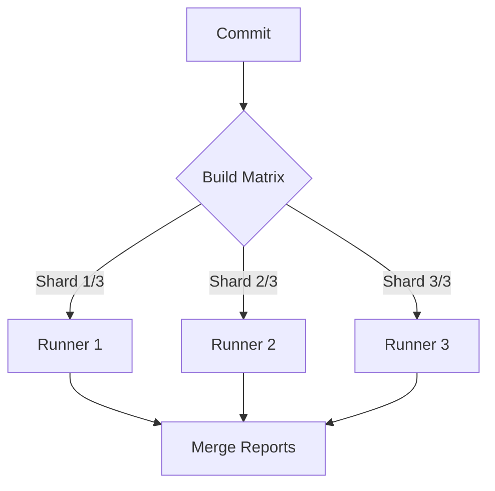

# 16.1: GitHub Actions CI

### Shard Matrix Pipeline


ns CI/CD


## Learning Objectives

By the end of this lesson, you will be able to:
- Configure GitHub Actions for Playwright

## Why CI/CD for Automation?

A test suite that only runs on one developer's machine is only partially useful. A CI/CD pipeline ensures tests run automatically on **every** Pull Request, on **every** push to `main`, and on a **nightly** schedule.

```
Developer pushes code
        ?
GitHub Actions triggered
        ?
Runs on a clean Ubuntu machine
        ?
Installs deps ? AST Audit ? Type Check ? Tests ? Report
        ?
Results visible on GitHub PR page
        ?
Merge allowed / blocked based on results
```

## Complete CI Workflow File

```yaml
# .github/workflows/playwright.yml
name: Playwright Test Suite

on:
  push:
    branches: [ main, develop ]
  pull_request:
    branches: [ main ]
  schedule:
    # Run the full regression suite every night at 2 AM UTC
    - cron: '0 2 * * *'
  workflow_dispatch:  # Allow manual triggers from GitHub UI

jobs:
  # -----------------------------------------
  # JOB 1: Quality Gate (fast, no browser)
  # -----------------------------------------
  quality-gate:
    name: AST Quality Gate
    runs-on: ubuntu-latest
    
    steps:
      - uses: actions/checkout@v4
      
      - uses: actions/setup-node@v4
        with:
          node-version: '20'
          cache: 'npm'
      
      - name: Install dependencies
        run: npm ci
      
      - name: TypeScript type check
        run: npx tsc --noEmit
      
      - name: ESLint
        run: npx eslint tests/ pages/ components/
      
      - name: AST Audit
        run: npx ts-node scripts/ast-audit.ts

  # -----------------------------------------
  # JOB 2: Test Suite (requires quality-gate to pass first)
  # -----------------------------------------
  test:
    name: Playwright Tests (${{ matrix.browser }})
    runs-on: ubuntu-latest
    needs: quality-gate  # Only runs if quality gate passes!
    
    strategy:
      # Run on multiple browsers in parallel
      matrix:
        browser: [chromium, firefox, webkit]
      # Don't cancel other browsers if one fails
      fail-fast: false
    
    steps:
      - uses: actions/checkout@v4
      
      - uses: actions/setup-node@v4
        with:
          node-version: '20'
          cache: 'npm'
      
      - name: Install dependencies
        run: npm ci
      
      - name: Install Playwright browsers
        run: npx playwright install ${{ matrix.browser }} --with-deps
      
      - name: Run Playwright tests
        run: npx playwright test --project=${{ matrix.browser }}
        env:
          BASE_URL: ${{ secrets.STAGING_BASE_URL }}
          ADMIN_USER: ${{ secrets.ADMIN_USER }}
          ADMIN_PASS: ${{ secrets.ADMIN_PASS }}
          REVIEWER_USER: ${{ secrets.REVIEWER_USER }}
          REVIEWER_PASS: ${{ secrets.REVIEWER_PASS }}
          CI: true
      
      - name: Upload test report
        uses: actions/upload-artifact@v4
        if: always()  # Upload even if tests fail
        with:
          name: playwright-report-${{ matrix.browser }}
          path: playwright-report/
          retention-days: 30
      
      - name: Upload traces (on failure)
        uses: actions/upload-artifact@v4
        if: failure()
        with:
          name: traces-${{ matrix.browser }}
          path: test-results/
          retention-days: 7
```

## Storing Secrets in GitHub

1. Go to your GitHub repo ? **Settings** ? **Secrets and variables** ? **Actions**
2. Click **New repository secret**
3. Add each secret: `STAGING_BASE_URL`, `ADMIN_USER`, `ADMIN_PASS`, etc.

```bash
# These are now available in your workflow as:
env:
  BASE_URL: ${{ secrets.STAGING_BASE_URL }}
```

**Never** put real credentials in your `.yml` file or `.env` file that gets committed to Git.

## Branch Protection Rules

Set up branch protection to enforce that CI passes before merging:

1. Go to repo **Settings** ? **Branches** ? **Add protection rule**
2. Branch name pattern: `main`
3. Check: ? **Require status checks to pass before merging**
4. Add status checks: `quality-gate`, `test (chromium)`, `test (firefox)`, `test (webkit)`
5. Check: ? **Require branches to be up to date before merging**

Now, **no one** can merge a PR that breaks the test suite � including yourself.

## Notification Setup

Get Slack notifications when CI fails:

```yaml
      - name: Notify Slack on failure
        uses: 8398a7/action-slack@v3
        if: failure()
        with:
          status: ${{ job.status }}
          fields: repo,message,commit,author,action,took
        env:
          SLACK_WEBHOOK_URL: ${{ secrets.SLACK_WEBHOOK_URL }}
```


> [!NOTE]
> **Retention Layer:**
> * **Key Idea:** Sharding distributes your test suite across multiple parallel CI runner machines.
> * **Common Mistake:** Running 1,000 Playwright tests sequentially on a single 2-core CI machine.
> * **Enterprise Application:** Reducing 60-minute build times down to 5 minutes by scaling horizontally.

## Challenge Exercise

**Business Context**:
Your organization is adopting trunk-based development and needs a robust gatekeeper before merging code.

**Mission**:
Build a GitHub Actions workflow that executes Playwright tests on every pull request.

**Constraints**:
- Parallel execution across 3 shards.
- Artifact retention for failure analysis.
- Slack failure notifications.

**Deliverables**:
- Complete Workflow YAML file.
- Documentation on how the shards are stitched back together.

**Success Criteria**:
- The pipeline correctly provisions the environment and installs browsers.
- The HTML report is uploaded correctly even if tests fail.

<CodeEditor
  moduleId="98-github-actions"
  taskIndex={0}
/>


