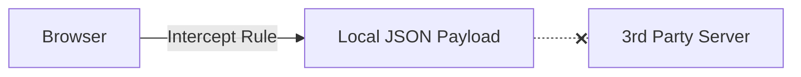

# 19.1: API Mocking & Virtualization

### Service Virtualization


ng & Service Virtualization


## Learning Objectives

By the end of this lesson, you will be able to:
- Understand the core architectural patterns
- Identify and avoid common anti-patterns
- Implement production-grade automation scripts

## The Problem with Staging Environments

In an Enterprise E2E Suite, the UI test should prove that the **Frontend** functions correctly. It should *not* fail because a 3rd-party dependency (like Salesforce, SAP, or a Payment Gateway) is down in the staging environment. 

Relying on external servers creates **unsolvable flakiness**. If the test fails, you don't know if the UI is broken, or if the API is just slow.

## The Solution: Service Virtualization

Playwright allows you to act as a **Man-in-the-Middle (MITM)** proxy. You can intercept network traffic *before* it leaves the browser, and instantly inject a fake, deterministic response.

### Basic Interception (`route.fulfill`)

Instead of hitting the real `/api/users` endpoint, we instantly return a hardcoded JSON string:

```typescript
// test.spec.ts
import { test, expect } from '@playwright/test';

test('Display successful payment checkout', async ({ page }) => {
  // 1. Setup the Interceptor BEFORE navigating
  await page.route('**/api/v1/payment/authorize', async route => {
    const mockData = { transactionId: 'TXN-9999', status: 'AUTHORIZED', fraudScore: 0.01 };
    await route.fulfill({
      status: 200,
      contentType: 'application/json',
      body: JSON.stringify(mockData)
    });
  });

  // 2. The browser makes the physical HTTP request, but Playwright hijacks it.
  await page.goto('/checkout');
  await page.click('#submit-payment');
  
  // 3. Assert the UI rendered the mocked data
  await expect(page.getByText('TXN-9999')).toBeVisible();
});
```

## Testing Impossible Edge Cases (Negative Testing)

How do you test the UI's behavior when the Payment Gateway throws a `500 Internal Server Error`? You cannot legally crash the real staging server. Mocking allows you to bend reality.

```typescript
import { test, expect } from '@playwright/test';

test('Graceful degradation on payment failure', async ({ page }) => {
  await page.route('**/api/checkout', route => {
    route.fulfill({
      status: 500,
      body: 'Stripe Gateway Timeout'
    });
  });

  await page.click('#pay-now');
  
  // Verify the UI handles the catastrophe elegantly
  await expect(page.locator('.error-toast'))
    .toHaveText('Payment service unavailable. Please try again later.');
});
```

## Aborting Unnecessary Traffic (`route.abort`)

Is your test flaky because a 3rd-party analytics tracker (`google-analytics.com`) occasionally hangs for 30 seconds? Surgically amputate it from the execution context.

```typescript
test.beforeEach(async ({ page }) => {
  // Block all traffic to analytics and font CDNs to maximize test speed
  await page.route('**/*analytics*', route => route.abort());
  await page.route('https://fonts.googleapis.com/**', route => route.abort());
});
```

## Response Mutation (Proxying)

Sometimes you want the real data, but you need to tweak one specific flag (e.g., forcing a user into an `isAdmin` state). You can let the request hit the real server, intercept the response on the way back, mutate the payload, and hand it to the UI.

```typescript
await page.route('**/api/profile', async route => {
  // 1. Fetch from the real backend
  const response = await route.fetch();
  const json = await response.json();
  
  // 2. Mutate the specific flag
  json.permissions.isAdmin = true;
  
  // 3. Fulfill the route with the hacked JSON
  await route.fulfill({ response, json });
});
```

> [!WARNING]
> **GraphQL Complexity**
> GraphQL requests all go to the exact same URL (`/graphql`). You cannot route by URL alone. You must parse the POST body (`route.request().postDataJSON()`) to inspect the `operationName` and dynamically decide whether to `fulfill()` or `continue()`.

## Using External Fixture Files

Hardcoding 10,000 lines of JSON into your test file is an anti-pattern. Use physical files.

```typescript
await page.route('**/api/products', route => {
  // Playwright streams the physical file directly into the browser's network tab
  route.fulfill({ path: 'fixtures/mockProducts.json' });
});
```


> [!NOTE]
> **Retention Layer:**
> * **Key Idea:** Mocking completely isolates your application from unstable, offline, or slow 3rd-party dependencies.
> * **Common Mistake:** Failing tests because a third-party server (like PayPal sandbox) is temporarily down.
> * **Enterprise Application:** Service virtualization to guarantee deterministic test execution in staging environments.

<CodeEditor
  moduleId="102-api-mocking"
  taskIndex={0}
  placeholder="// Task: Intercept a POST request to the login endpoint and force a 401 Unauthorized response.&#10;// Requirements:&#10;//   1. Use page.route() to match **/api/login&#10;//   2. Inside the handler, fulfill the route with status 401&#10;//   3. Add a JSON body with an error message&#10;//&#10;// Hint: Use route.fulfill() with status and body options"
/>

<details>
<summary>🔑 Reveal Solution (try first!)</summary>

```typescript
await page.route('**/api/login', route => {
  route.fulfill({
    status: 401,
    body: JSON.stringify({ error: 'Unauthorized' }),
  });
});
```

</details>

---

## Summary

| What You Learned | Why It Matters |
|---|---|
| Core Principle | Ensures stability and scalability in the framework |
| Best Practice | Prevents technical debt and flaky test runs |
| Anti-Pattern Avoidance | Saves hours of debugging time in the future |

> [!TIP]
> **Next Step:** Review your implementation and proceed to the next module.

---

## Common Mistakes

> [!WARNING]
> **Mistake 1: Brittle Implementation**  
> **Wrong:** Tightly coupling test data with page interactions.  
> **Correct:** Abstracting data and logic appropriately.  
> **Why:** Prevents tests from breaking when minor details change.

> [!WARNING]
> **Mistake 2: Missing Synchronization**  
> **Wrong:** Relying on implicit speeds or hardcoded sleeps.  
> **Correct:** Using web-first assertions for synchronization.  
> **Why:** Guarantees deterministic execution regardless of environment speed.

---

## Challenge Exercise

You have learned the core pattern. Now apply it under pressure.

**Scenario:** A new requirement demands a robust automation script for this workflow.

**Your Task:** Implement the solution based on the principles discussed above.

**Constraints:**
- ❌ Do not use deprecated APIs
- ✅ Follow the architecture best practices
- ✅ All assertions must be web-first

<CodeEditor
  moduleId="102-api-mocking"
  taskIndex={1}
  placeholder={`import { test, expect } from '@playwright/test';

test('api mocking challenge', async ({ page }) => {
  // Challenge: Intercept a POST to **/api/login and force a 401 Unauthorized status
  // Complete the route interceptor below:
});`}
/>
<Quiz moduleId="api-mocking" />

export const astRules = [
  {
    type: "ast_callee",
    value: "page.route",
    message: "You must use page.route to intercept and mock the network traffic."
  }
];
