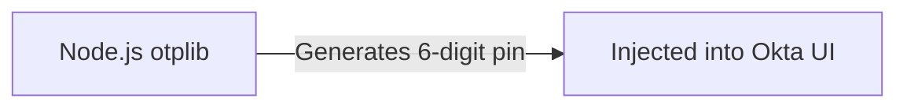

# 19.2: Advanced Authentication Strategies

### MFA TOTP Injection


nced Authentication Strategies


## Learning Objectives

By the end of this lesson, you will be able to:
- Understand the core architectural patterns
- Identify and avoid common anti-patterns
- Implement production-grade automation scripts

## The Flakiness of UI Authentication

If your test suite has 500 tests, and every single test physically clicks through an Okta/Azure AD login screen, your suite will be extremely slow and highly flaky. 

Authentication is a solved problem. The goal of a UI test is to verify the *application*, not the Identity Provider.

## Global Setup: The Storage State Blueprint

Playwright allows you to log in *once* at the beginning of the execution, save the physical session state (Cookies, LocalStorage) to a JSON file, and then inject that file into every worker thread.

```typescript
// global-setup.ts
import { chromium, FullConfig } from '@playwright/test';

async function globalSetup(config: FullConfig) {
  const browser = await chromium.launch();
  const page = await browser.newPage();
  
  await page.goto('https://staging.app.com/login');
  await page.fill('#user', process.env.ADMIN_USER!);
  await page.fill('#pass', process.env.ADMIN_PASS!);
  await page.click('#submit');
  
  // Wait for the dashboard to render, guaranteeing the cookies are set
  await page.waitForURL('**/dashboard');

  // Save the state to a physical file
  await page.context().storageState({ path: 'playwright/.auth/admin.json' });
  await browser.close();
}
export default globalSetup;
```

You then configure the `playwright.config.ts` to automatically inject this file into your tests:

```typescript
// playwright.config.ts
import { defineConfig } from '@playwright/test';

export default defineConfig({
  globalSetup: require.resolve('./global-setup'),
  use: {
    // Every test will instantly start fully authenticated
    storageState: 'playwright/.auth/admin.json',
  },
});
```

## Bypassing the UI Entirely (API Token Exchange)

What if the UI requires Multi-Factor Authentication (MFA) that you cannot automate? You must bypass the UI entirely using an API protocol like OAuth2 Client Credentials.

```typescript
// Inside a Custom Fixture or Global Setup
const response = await request.post('https://login.microsoftonline.com/oauth2/token', {
  form: {
    client_id: process.env.CLIENT_ID,
    client_secret: process.env.CLIENT_SECRET,
    grant_type: 'client_credentials'
  }
});

const jwt = (await response.json()).access_token;

// Manually inject the mathematical token into the browser context
await context.addCookies([{
  name: 'auth_session',
  value: jwt,
  domain: '.corp.com',
  path: '/',
  secure: true
}]);
```

> [!CAUTION]
> **Domain Matching is Critical**
> The browser engine is ruthless about security. If the `domain` property in your injected Cookie does not exactly match the URL you are navigating to, the V8 engine will silently drop the cookie as a Cross-Site Scripting violation.

## Dealing with SessionStorage and LocalStorage

Some React architectures (like SPAs using MSAL) do not use Cookies. They store the JWT inside the browser's `sessionStorage` or `localStorage`.

`storageState` can handle `localStorage`, but it cannot easily handle dynamic `sessionStorage` injections across contexts. You must inject raw JavaScript:

```typescript
// Inject the token into the V8 engine at the exact millisecond the DOM initializes
await page.addInitScript((token) => {
  window.sessionStorage.setItem('access_token', token);
}, jwtPayload);

// Now when the React app boots, it believes you are logged in
await page.goto('/dashboard');
```

## Multi-Role Testing (RBAC)

If you need to test as an Admin, an Editor, and a Viewer, `globalSetup` is too rigid. You must use Dependency Injection via Custom Fixtures.

```typescript
// fixtures.ts
export const test = base.extend<{ adminPage: Page, editorPage: Page }>({
  adminPage: async ({ browser }, use) => {
    let context = await browser.newContext({ storageState: 'admin.json' });
    let page = await context.newPage();
    await use(page);
    await context.close();
  },
  editorPage: async ({ browser }, use) => {
    const context = await browser.newContext({ storageState: 'editor.json' });
    const page = await context.newPage();
    await use(page);
    await context.close();
  }
});
```

Now the test signature is perfectly declarative:

```typescript
import { test, expect } from '@playwright/test';

test('Admin can delete, Editor cannot', async ({ adminPage, editorPage }) => {
  await adminPage.click('#delete-user'); // Works
  await expect(editorPage.locator('#delete-user')).not.toBeVisible(); // Works
});
```


> [!NOTE]
> **Retention Layer:**
> * **Key Idea:** Standard programmatic bypass strategies (like TOTP libraries) can automate MFA prompts.
> * **Common Mistake:** Disabling MFA entirely for staging environments or manually pausing to enter codes.
> * **Enterprise Application:** End-to-end testing highly regulated FinTech environments with strict security policies.

<CodeEditor
  moduleId="103-adv-auth"
  taskIndex={0}
  placeholder="// Task: Create a browser context with pre-loaded authentication state.&#10;// Requirements:&#10;//   1. Use browser.newContext() with a storageState option&#10;//   2. Point to a saved auth state JSON file&#10;//&#10;// This is how you skip login in every test"
/>

<details>
<summary>?? Reveal Solution (try first!)</summary>

```typescript
const context = await browser.newContext({
  storageState: '.auth/admin.json',
});
```

</details>

---

## Summary

| What You Learned | Why It Matters |
|---|---|
| Core Principle | Ensures stability and scalability in the framework |
| Best Practice | Prevents technical debt and flaky test runs |
| Anti-Pattern Avoidance | Saves hours of debugging time in the future |

> [!TIP]
> **Next Step:** Review your implementation and proceed to the next module.

---

## Common Mistakes

> [!WARNING]
> **Mistake 1: Brittle Implementation**  
> **Wrong:** Tightly coupling test data with page interactions.  
> **Correct:** Abstracting data and logic appropriately.  
> **Why:** Prevents tests from breaking when minor details change.

> [!WARNING]
> **Mistake 2: Missing Synchronization**  
> **Wrong:** Relying on implicit speeds or hardcoded sleeps.  
> **Correct:** Using web-first assertions for synchronization.  
> **Why:** Guarantees deterministic execution regardless of environment speed.

---

## Challenge Exercise

You have learned the core pattern. Now apply it under pressure.

**Scenario:** A new requirement demands a robust automation script for this workflow.

**Your Task:** Implement the solution based on the principles discussed above.

**Constraints:**
- ? Do not use deprecated APIs
- ? Follow the architecture best practices
- ? All assertions must be web-first

<CodeEditor
  moduleId="103-adv-auth"
  taskIndex={1}
  placeholder={`import { test, expect } from '@playwright/test';

// Challenge: Create a browser context that pre-loads authentication state from a JSON file
// Write the context creation call below:
`}
/>
<Quiz moduleId="adv-auth" />

