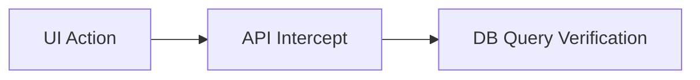

# 19.3: Database Validation & Audit Trails

### Full-Stack Assertion Flow


n & Audit Trails


## Learning Objectives

By the end of this lesson, you will be able to:
- Understand the core architectural patterns
- Identify and avoid common anti-patterns
- Implement production-grade automation scripts

## The Illusion of the UI

In an Enterprise context (especially FinTech or Healthcare), a UI test that clicks a button and verifies a green "Success" toast message is **fundamentally inadequate**. 

Why? Because the UI can lie. A frontend bug might render the toast message, but a backend Kafka queue failure might have silently dropped the `INSERT` statement. You must prove the database recorded the action.

## Playwright is Node.js

The greatest advantage of Playwright over legacy tools is that it runs natively in Node.js. You aren't restricted to browser APIs. You can import **any NPM package**, including native Database drivers (`pg`, `mysql2`, `mongoose`).

```typescript
// fixtures/db.ts
import { test as base } from '@playwright/test';
import { Client } from 'pg';

export const test = base.extend<{ db: Client }>({
  db: async ({}, use) => {
    const client = new Client({ connectionString: process.env.DB_URL });
    await client.connect();
    
    // Pass the active DB connection to the test
    await use(client);
    
    // Clean up the connection after the test
    await client.end();
  }
});
```

## Deep Validation (The Audit Trail)

If a scientist signs a batch in a Laboratory Information Management System (LIMS), FDA 21 CFR Part 11 requires a permanent audit log. Your E2E test must prove this log exists.

```typescript
import { test } from './fixtures/db';
import { expect } from '@playwright/test';

test('Approve batch creates audit log', async ({ page, db }) => {
  await page.click('#approve-batch');
  
  // 1. Wait for the UI to synchronize (Proof of UI intent)
  await expect(page.locator('.status')).toHaveText('Approved');
  
  // 2. Query the backend directly (Proof of physical reality)
  const res = await db.query(
    "SELECT * FROM audit_logs WHERE action = 'APPROVE_BATCH' ORDER BY id DESC LIMIT 1"
  );
  
  expect(res.rowCount).toBe(1);
  expect(res.rows[0].user_id).toBe(process.env.TEST_USER_ID);
});
```

> [!WARNING]
> **Race Conditions**
> Notice how we `await expect(page.locator...)` BEFORE we query the database. The backend is asynchronous. If you query the DB the exact millisecond after clicking the button, the data won't be there yet. You must use the UI state as an anchor to guarantee the backend transaction has completed.

## State Manipulation (Data Factories)

Instead of spending 5 minutes in a test clicking through forms to create a complex 'Order' state, just inject the state directly into the database before the test begins.

```typescript
import { test, expect } from '@playwright/test';

test.beforeEach(async ({ db }) => {
  // Teleport the application into the exact state we need
  await db.query(`
    INSERT INTO orders (id, status, total) 
    VALUES ('test-123', 'PENDING_PAYMENT', 500)
  `);
});

test('Process pending order', async ({ page }) => {
  // Navigate directly to the injected state
  await page.goto('/orders/test-123');
  await expect(page.locator('#total')).toHaveText('$500');
});
```

## Absolute Data Isolation (Transactions)

Parallel execution against a shared staging database leads to data collisions. If Test A deletes a user while Test B is asserting against that user, the pipeline implodes.

The ultimate solution is wrapping your test in a **SQL Transaction**.

```typescript
export const test = base.extend<{ db: Client }>({
  db: async ({}, use) => {
    const client = new Client();
    await client.connect();
    
    // 1. Start a transaction
    await client.query('BEGIN');
    
    await use(client);
    
    // 2. Rollback the transaction
    // This instantly vaporizes all data inserted during the test, 
    // ensuring the DB is perfectly pristine for the next run.
    await client.query('ROLLBACK');
    await client.end();
  }
});
```


> [!NOTE]
> **Retention Layer:**
> * **Key Idea:** UI success messages do not guarantee actual database writes. Assert against the source of truth.
> * **Common Mistake:** Trusting a green UI toast notification without verifying the data was actually committed.
> * **Enterprise Application:** Ensuring complete end-to-end data integrity in complex transactional systems.

<CodeEditor
  moduleId="104-db-validation"
  taskIndex={0}
  placeholder="// Task: Write a polling assertion that waits for a database record to exist.&#10;// Requirements:&#10;//   1. Use expect.poll() to retry a DB query&#10;//   2. Set a 5-second timeout&#10;//   3. Assert the result is true (record exists)&#10;//&#10;// Hint: The async callback inside expect.poll() runs your query"
/>

<details>
<summary>🔑 Reveal Solution (try first!)</summary>

```typescript
await expect.poll(async () => {
  // Your query here
  return recordExists;
}).toBe(true);
```

</details>

---

## Summary

| What You Learned | Why It Matters |
|---|---|
| Core Principle | Ensures stability and scalability in the framework |
| Best Practice | Prevents technical debt and flaky test runs |
| Anti-Pattern Avoidance | Saves hours of debugging time in the future |

> [!TIP]
> **Next Step:** Review your implementation and proceed to the next module.

---

## Common Mistakes

> [!WARNING]
> **Mistake 1: Brittle Implementation**  
> **Wrong:** Tightly coupling test data with page interactions.  
> **Correct:** Abstracting data and logic appropriately.  
> **Why:** Prevents tests from breaking when minor details change.

> [!WARNING]
> **Mistake 2: Missing Synchronization**  
> **Wrong:** Relying on implicit speeds or hardcoded sleeps.  
> **Correct:** Using web-first assertions for synchronization.  
> **Why:** Guarantees deterministic execution regardless of environment speed.

---

## Challenge Exercise

You have learned the core pattern. Now apply it under pressure.

**Scenario:** A new requirement demands a robust automation script for this workflow.

**Your Task:** Implement the solution based on the principles discussed above.

**Constraints:**
- ❌ Do not use deprecated APIs
- ✅ Follow the architecture best practices
- ✅ All assertions must be web-first

<CodeEditor
  moduleId="104-db-validation"
  taskIndex={1}
  placeholder={`import { test, expect } from '@playwright/test';

test('challenge exercise', async ({ page }) => {
  // Challenge: Refactor this code to follow industry best practices
  // 1. Avoid hardcoded sleeps (waitForTimeout)
  // 2. Use web-first assertions (expect().toBeVisible)
  // 3. Ensure all asynchronous calls are properly awaited
  
  page.goto('https://example.com');
  await page.waitForTimeout(2000);
  const element = page.locator('.submit-btn');
  element.click();
});`}
/>
<Quiz moduleId="db-validation" />

