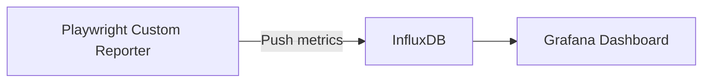

# 19.5: Observability & Monitoring

### Telemetry Pipeline




## Learning Objectives

By the end of this lesson, you will be able to:
- Understand the core architectural patterns
- Identify and avoid common anti-patterns
- Implement production-grade automation scripts

## Testing vs. Observability

* **Testing** asks: "Does the code work right now before we merge it?"
* **Observability** asks: "Is the system healthy in production right now, and why did it just crash for user #405?"

Senior Automation Architects don't just write CI tests. They build automated probes that feed data into the enterprise's central nervous system (Datadog, Splunk, Kibana).

## Distributed Tracing (Correlation IDs)

When a Playwright UI test fails because the backend returned a 500 error, finding that exact error in Splunk (which ingests 50,000 logs a second) is impossible.

You must mathematically link the UI test to the backend logs using a **Trace ID** or **Correlation ID**.

```typescript
import { test } from '@playwright/test';
import { v4 as uuidv4 } from 'uuid';

test.use({
  // Playwright will automatically inject these headers into EVERY outbound 
  // HTTP request made by the browser.
  extraHTTPHeaders: async () => ({
    'X-Correlation-ID': uuidv4(),
    'X-E2E-Test-Name': test.info().title
  })
});

test('Checkout process', async ({ page }) => {
  // If this test fails, SREs can open Splunk and search:
  // index=production "X-Correlation-ID=1234-abcd"
  // And instantly see the exact database query that crashed the backend.
  await page.click('#checkout'); 
});
```

## Synthetic Monitoring in Production

Playwright is not just for CI/CD. Because it uses a real browser engine, it is the ultimate tool for **Synthetic Monitoring**: running automated checks against the live production environment every 5 minutes to ensure uptime.

```typescript
// synthetic-probe.ts
import { chromium } from 'playwright';
import datadog from 'datadog-metrics';

(async () => {
  const browser = await chromium.launch();
  const page = await browser.newPage();
  
  const startTime = Date.now();
  await page.goto('https://production.app.com');
  await page.click('#login');
  
  const latency = Date.now() - startTime;
  
  // Push the UI load time metric to a Grafana/Datadog dashboard
  datadog.gauge('production.ui.login_latency_ms', latency);
  
  await browser.close();
})();
```

> [!CAUTION]
> **Production Safety**
> Synthetic probes run in Production. If your probe buys a real product using a real credit card every 5 minutes, you will drain the company bank account. You must implement extreme safety mechanisms, like using specific "Test Mode" credit cards that the backend Gateway (Stripe) knows to void, or implementing automated API teardowns (`DELETE /orders/:id`) immediately after the test.

## Out-of-Band Log Validation

Sometimes, the UI looks fine, but the backend is secretly hemorrhaging non-fatal errors. True E2E coverage verifies the backend logs *after* the UI interaction.

```typescript
import { test, expect } from '@playwright/test';

test('Action does not generate backend errors', async ({ page, splunkClient }) => {
  const traceId = 'test-trace-890';
  await page.route('**/*', route => {
    route.continue({ headers: { 'X-Trace': traceId } });
  });

  // 1. Perform the UI Action
  await page.click('#risky-action');
  await expect(page.locator('.success')).toBeVisible();

  // 2. Out-of-band validation: Query Splunk to ensure no hidden exceptions fired
  await expect.poll(async () => {
    const logs = await splunkClient.search(`trace_id=${traceId} level=ERROR`);
    return logs.length;
  }, { timeout: 15000 }).toBe(0);
});
```

## Protecting Production Analytics (RUM)

If you run 5,000 Playwright tests a day against Staging, you will pollute the marketing team's Google Analytics or Datadog Real User Monitoring (RUM) dashboards. They will think the app has 5,000 extremely fast, identical users.

You must surgically sever the telemetry in your test environments.

```typescript
test.beforeEach(async ({ page }) => {
  // Block Datadog RUM ingestion
  await page.route('https://browser-intake-datadoghq.com/**', route => route.abort());
  // Block Google Analytics
  await page.route('https://www.google-analytics.com/**', route => route.abort());
});
```


> [!NOTE]
> **Retention Layer:**
> * **Key Idea:** Test telemetry tracks suite health, execution time, and flakiness trends over long periods.
> * **Common Mistake:** Ignoring a test that slowly degraded from a 2-second execution to a 15-second execution.
> * **Enterprise Application:** Pushing Playwright metrics to observability platforms like Datadog or Prometheus.

<CodeEditor
  moduleId="106-observability"
  taskIndex={0}
  placeholder="// Task: Configure a global context setting to inject a custom header into ALL requests.&#10;// Requirements:&#10;//   1. Use test.use() to set extra HTTP headers&#10;//   2. Add an 'X-Automated-Test: true' header&#10;//   3. This helps backend teams identify test traffic in logs&#10;//&#10;// Hint: Use the extraHTTPHeaders option inside test.use()"
/>

<details>
<summary>?? Reveal Solution (try first!)</summary>

```typescript
test.use({
  extraHTTPHeaders: {
    'X-Automated-Test': 'true',
  },
});
```

</details>

---

## Summary

| What You Learned | Why It Matters |
|---|---|
| Core Principle | Ensures stability and scalability in the framework |
| Best Practice | Prevents technical debt and flaky test runs |
| Anti-Pattern Avoidance | Saves hours of debugging time in the future |

> [!TIP]
> **Next Step:** Review your implementation and proceed to the next module.

---

## Common Mistakes

> [!WARNING]
> **Mistake 1: Brittle Implementation**  
> **Wrong:** Tightly coupling test data with page interactions.  
> **Correct:** Abstracting data and logic appropriately.  
> **Why:** Prevents tests from breaking when minor details change.

> [!WARNING]
> **Mistake 2: Missing Synchronization**  
> **Wrong:** Relying on implicit speeds or hardcoded sleeps.  
> **Correct:** Using web-first assertions for synchronization.  
> **Why:** Guarantees deterministic execution regardless of environment speed.

---

## Challenge Exercise

You have learned the core pattern. Now apply it under pressure.

**Scenario:** A new requirement demands a robust automation script for this workflow.

**Your Task:** Implement the solution based on the principles discussed above.

**Constraints:**
- ? Do not use deprecated APIs
- ? Follow the architecture best practices
- ? All assertions must be web-first

<CodeEditor
  moduleId="106-observability"
  taskIndex={1}
  placeholder={`import { test, expect } from '@playwright/test';

test('challenge exercise', async ({ page }) => {
  // Challenge: Refactor this code to follow industry best practices
  // 1. Avoid hardcoded sleeps (waitForTimeout)
  // 2. Use web-first assertions (expect().toBeVisible)
  // 3. Ensure all asynchronous calls are properly awaited
  
  page.goto('https://example.com');
  await page.waitForTimeout(2000);
  const element = page.locator('.submit-btn');
  element.click();
});`}
/>
<Quiz moduleId="observability" />

