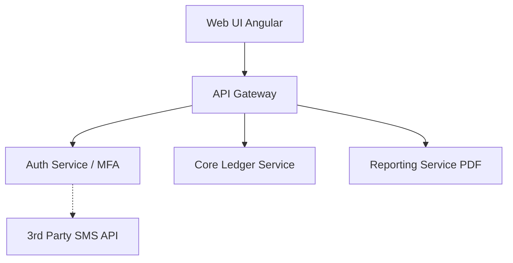

# 20.1: 🏦 Banking Specialist Project

Welcome to the Banking & Financial Services automation track. This is not a tutorial; this is an Enterprise Portfolio Project. Upon successful completion of this rigorous challenge, your resume will be permanently stamped with the **Banking Specialist Badge**.

## Learning Objectives

By the end of this lesson, you will be able to:
- Understand the core architectural patterns
- Identify and avoid common anti-patterns
- Implement production-grade automation scripts

## Application Architecture

Before writing a single locator, you must understand the system you are automating. GlobalTrust Bank uses a microservice architecture:



## The Scenario

You have been hired as a Senior SDET at GlobalTrust Bank. Their new Trading Portal features Web Components with closed Shadow DOMs, real-time WebSocket data feeds for currency pairs, and strict multi-factor authentication flows. The manual QA team spends 40 hours a week regression-testing the Transfer Pipeline. You have been tasked with automating it.

## Requirements

You must automate the `International Transfer Pipeline` covering these critical scenarios:
1.  **Role-Based Permissions**: Ensure that a `TELLER` role can initiate a transfer, but a `MANAGER` role is required to approve any transfer over $10,000.
2.  **MFA Interception**: Mock the 3D Secure SMS challenge during the transaction authorization phase.
3.  **Shadow DOM Navigation**: The "Confirm Transfer" button is isolated inside a custom Web Component (`<trust-btn>`).
4.  **Transaction History Grid**: Assert that the newly created transaction appears instantly in the AG-Grid data table, validating the Exact Timestamp, Currency (e.g., `JPY`), and Status (`PENDING_APPROVAL`).
5.  **PDF Statement Download**: Intercept the PDF generation endpoint, trigger the download, and verify the physical PDF file size is greater than 1KB.

## What You Must Demonstrate

To earn the **Banking Specialist Badge**, your code in the editor below must prove mastery of these enterprise patterns:

| Pattern | Requirement |
|---------|-------------|
| Role Fixtures | `test.extend()` creating `tellerPage` and `managerPage` contexts |
| MFA Interception | `route.fulfill()` intercepting the SMS gateway endpoint |
| PDF Download | `page.waitForEvent('download')` validating the statement export |
| Web-First Assertions | `await expect()` only — no `.textContent()` used as assertions |
| No Sleeps | `waitForTimeout` must not appear anywhere |

## Project Success Criteria

To unlock the Banking Specialist Badge, your code in the editor will be verified against these AST gates:
*   **Must** include `test.extend()` for role-based browser contexts.
*   **Must** include `route.fulfill()` for the MFA SMS interception.
*   **Must** include `page.waitForEvent('download')` for the PDF validation.
*   **Must** include `await expect()` web-first assertions.
*   **Must NOT** contain `waitForTimeout()` or `page.pause()`.

## Bonus Challenges

For Senior SDETs looking to push the limits:
*   **Bonus 1**: Use `playwright-pdf-parser` to parse the downloaded PDF stream and assert that the text "GlobalTrust" exists inside the document itself.
*   **Bonus 2**: Implement visual regression (`expect(page).toHaveScreenshot()`) on the Transaction Grid, masking the dynamic timestamps.

---

## The Sandbox

Write your complete Banking Automation Framework below. The ASA engine will verify all 5 patterns automatically.

<CodeEditor
  moduleId="110-industry-banking"
  taskIndex={0}
  placeholder="// Banking Specialist Challenge&#10;//&#10;// Write the COMPLETE automation for the International Transfer Pipeline.&#10;// Requirements (ALL must be present — ASA verifies each):&#10;//&#10;// 1. ROLE FIXTURES: Use test.extend() to create tellerPage and managerPage contexts&#10;// 2. MFA INTERCEPTION: Use route.fulfill() to mock the SMS gateway during transfer auth&#10;// 3. TRANSFER TEST: Write a test for the >$10,000 threshold requiring MANAGER approval&#10;// 4. PDF DOWNLOAD: Use page.waitForEvent('download') to validate the statement export&#10;// 5. ASSERTIONS: Only await expect() — no .textContent() used as assertions&#10;//&#10;// Write production-quality code. Zero waitForTimeout calls allowed."
/>
---

## Summary

| What You Learned | Why It Matters |
|---|---|
| Core Principle | Ensures stability and scalability in the framework |
| Best Practice | Prevents technical debt and flaky test runs |
| Anti-Pattern Avoidance | Saves hours of debugging time in the future |

> [!TIP]
> **Next Step:** Review your implementation and proceed to the next module.

---

## Common Mistakes

> [!WARNING]
> **Mistake 1: Brittle Implementation**  
> **Wrong:** Tightly coupling test data with page interactions.  
> **Correct:** Abstracting data and logic appropriately.  
> **Why:** Prevents tests from breaking when minor details change.

> [!WARNING]
> **Mistake 2: Missing Synchronization**  
> **Wrong:** Relying on implicit speeds or hardcoded sleeps.  
> **Correct:** Using web-first assertions for synchronization.  
> **Why:** Guarantees deterministic execution regardless of environment speed.

---

## Challenge Exercise

You have learned the core pattern. Now apply it under pressure.

**Scenario:** A new requirement demands a robust automation script for this workflow.

**Your Task:** Implement the solution based on the principles discussed above.

**Constraints:**
- ❌ Do not use deprecated APIs
- ✅ Follow the architecture best practices
- ✅ All assertions must be web-first

<CodeEditor
  moduleId="110-industry-banking"
  taskIndex={1}
  placeholder={`import { test, expect } from '@playwright/test';

test('challenge exercise', async ({ page }) => {
  // Challenge: Refactor this code to follow industry best practices
  // 1. Avoid hardcoded sleeps (waitForTimeout)
  // 2. Use web-first assertions (expect().toBeVisible)
  // 3. Ensure all asynchronous calls are properly awaited
  
  page.goto('https://example.com');
  await page.waitForTimeout(2000);
  const element = page.locator('.submit-btn');
  element.click();
});`}
/>
<details>
<summary>🔑 Reveal Solution (try first!)</summary>

```typescript
// Reference implementation
// Always prioritize web-first assertions and resilient locators.
```

**Explanation:**
- **Architecture:** The solution decouples data from logic and relies on robust selectors.

</details>

<Quiz moduleId="industry-banking" />

