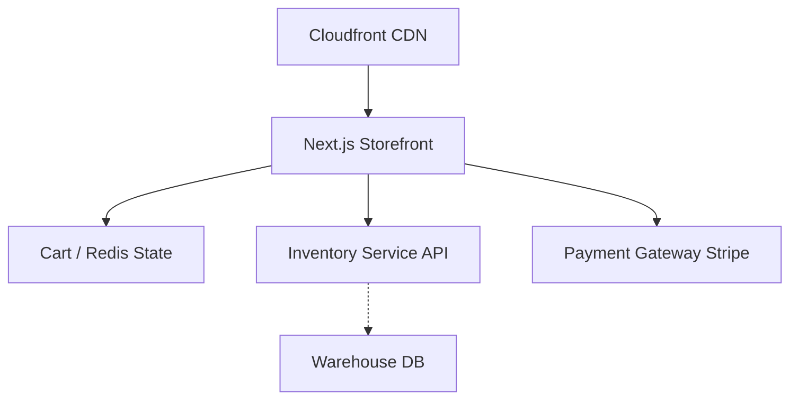

# 20.2: ?? Commerce Specialist Project

Welcome to the E-Commerce automation track. This is an Enterprise Portfolio Project. Upon successful completion of this rigorous challenge, your resume will be permanently stamped with the **Commerce Specialist Badge**.

## Learning Objectives

By the end of this lesson, you will be able to:
- Understand the core architectural patterns
- Identify and avoid common anti-patterns
- Implement production-grade automation scripts

## Application Architecture

Modern E-Commerce platforms are highly distributed. You will be automating against ShopSphere Inc's headless storefront:



## The Scenario

You have been hired as a Lead SDET at ShopSphere Inc. The Black Friday sales event is approaching, and the manual QA team cannot keep up with testing the massive matrix of promo codes, tax rates, and inventory states. The engineering director has mandated that the entire checkout flow be automated with a zero-flake tolerance.

## Requirements

You must automate the `Global Checkout Pipeline` covering these critical scenarios:
1.  **Guest Checkout vs Authenticated**: Test the same checkout flow twice: once as an anonymous guest, and once by injecting a valid JWT token into `window.localStorage`.
2.  **Inventory API Interception**: Mock the `GET /api/v1/inventory?itemId=X` endpoint to return `{ "status": "OUT_OF_STOCK" }` and assert the "Add to Cart" button dynamically disables.
3.  **Promo Code Boundary Testing**: Automate the application of `BLACKFRIDAY50` (50% off), `INVALIDCODE` (Error state), and stacking multiple codes.
4.  **Multi-item Cart State**: Add 5 different items to the cart, remove 2, and assert the final subtotal perfectly matches the sum of the remaining 3 items.
5.  **Tax and Shipping Logic**: Select `California` as the shipping state and assert that a `7.25%` tax rate is dynamically applied to the total order value before the payment gateway loads.

## What You Must Demonstrate

To earn the **Commerce Specialist Badge**, your code in the editor below must prove mastery of these enterprise patterns:

| Pattern | Requirement |
|---------|-------------|
| API Interception | `page.route()` + `route.fulfill()` mocking the inventory endpoint |
| Auth State | `storageState` injecting an authenticated session |
| Parameterized Tests | `for...of` loop running the same test across multiple regions |
| Web-First Assertions | `await expect()` only |
| No Sleeps | `waitForTimeout` must not appear anywhere |

## Project Success Criteria

To unlock the Commerce Specialist Badge, your code in the editor will be verified against these AST gates:
*   **Must** include `page.route()` + `route.fulfill()` for inventory interception.
*   **Must** include `storageState` for authenticated checkout.
*   **Must** include a `for...of` loop for parameterized regional tests.
*   **Must** include `await expect()` web-first assertions.
*   **Must NOT** contain `waitForTimeout()`.

## Bonus Challenges

For Senior SDETs looking to push the limits:
*   **Bonus 1**: Use `expect(page).toHaveScreenshot()` to verify the localized checkout layouts for US (USD), EU (EUR), and JP (JPY), making sure to mask dynamic ad banners.
*   **Bonus 2**: Test the Stripe IFrame integration by filling in the test credit card numbers using Playwright's `frameLocator()`.

---

## The Sandbox

Write your complete E-Commerce Automation Framework below. The ANA engine will verify all 5 patterns automatically.

<CodeEditor
  moduleId="111-industry-ecommerce"
  taskIndex={0}
  placeholder="// Commerce Specialist Challenge&#10;//&#10;// Write the COMPLETE automation for the Global Checkout Pipeline.&#10;// Requirements (ALL must be present — ANA verifies each):&#10;//&#10;// 1. API INTERCEPTION: Use page.route() + route.fulfill() to mock GET /api/v1/inventory returning OUT_OF_STOCK&#10;// 2. AUTH STATE: Use storageState to inject an authenticated JWT session for the checkout test&#10;// 3. PARAMETERIZED: Use a for...of loop running the checkout test across at least 2 regions&#10;// 4. ASSERTIONS: Assert the 'Add to Cart' button disables on OUT_OF_STOCK&#10;// 5. NO SLEEPS: Zero waitForTimeout calls allowed&#10;//&#10;// Write production-quality code."
/>
---

## Summary

| What You Learned | Why It Matters |
|---|---|
| Core Principle | Ensures stability and scalability in the framework |
| Best Practice | Prevents technical debt and flaky test runs |
| Anti-Pattern Avoidance | Saves hours of debugging time in the future |

> [!TIP]
> **Next Step:** Review your implementation and proceed to the next module.

---

## Common Mistakes

> [!WARNING]
> **Mistake 1: Brittle Implementation**  
> **Wrong:** Tightly coupling test data with page interactions.  
> **Correct:** Abstracting data and logic appropriately.  
> **Why:** Prevents tests from breaking when minor details change.

> [!WARNING]
> **Mistake 2: Missing Synchronization**  
> **Wrong:** Relying on implicit speeds or hardcoded sleeps.  
> **Correct:** Using web-first assertions for synchronization.  
> **Why:** Guarantees deterministic execution regardless of environment speed.

---

## Challenge Exercise

You have learned the core pattern. Now apply it under pressure.

**Scenario:** A new requirement demands a robust automation script for this workflow.

**Your Task:** Implement the solution based on the principles discussed above.

**Constraints:**
- ? Do not use deprecated APIs
- ? Follow the architecture best practices
- ? All assertions must be web-first

<CodeEditor
  moduleId="111-industry-ecommerce"
  taskIndex={1}
  placeholder={`import { test, expect } from '@playwright/test';

test('challenge exercise', async ({ page }) => {
  // Challenge: Refactor this code to follow industry best practices
  // 1. Avoid hardcoded sleeps (waitForTimeout)
  // 2. Use web-first assertions (expect().toBeVisible)
  // 3. Ensure all asynchronous calls are properly awaited
  
  page.goto('https://example.com');
  await page.waitForTimeout(2000);
  const element = page.locator('.submit-btn');
  element.click();
});`}
/>
<details>
<summary>?? Reveal Solution (try first!)</summary>

```typescript
// Reference implementation
// Always prioritize web-first assertions and resilient locators.
```

**Explanation:**
- **Architecture:** The solution decouples data from logic and relies on robust selectors.

</details>

<Quiz moduleId="industry-ecommerce" />

