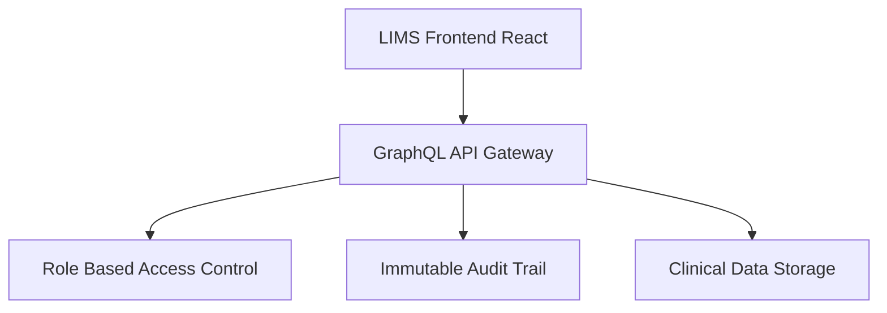

# 20.3: ?? Pharma Specialist Project

Welcome to the Pharma automation track. This is an Enterprise Portfolio Project. Upon successful completion of this rigorous challenge, your resume will be permanently stamped with the **Pharma Specialist Badge**. Medical and Laboratory software is heavily regulated; a false positive in a test suite here can delay critical, life-saving software deployments.

## Learning Objectives

By the end of this lesson, you will be able to:
- Understand the core architectural patterns
- Identify and avoid common anti-patterns
- Implement production-grade automation scripts

## Application Architecture

You will be automating against MediLife Systems' Laboratory Information Management System (LIMS), which strictly enforces 21 CFR Part 11 compliance:



## The Scenario

You are the Lead QA Automation Engineer for MediLife Systems. The FDA is auditing your latest release of the Electronic Health Record (EHR) and LIMS module. Your automation framework must prove that Sample Approvals, Change Control Workflows, and Electronic Signatures are functioning perfectly and securely. Absolute precision is required.

## Requirements

You must automate the `GxP Release Pipeline` covering these critical scenarios:
1.  **LIMS Sample Approval**: Log in as a `LAB_TECHNICIAN` and submit a blood sample for review. Log out, log in as a `LAB_DIRECTOR`, and approve the sample.
2.  **Audit Trail Verification**: After the sample is approved, navigate to the System Audit Logs. Assert that an immutable entry was created capturing the exact User ID, Timestamp, and action (`SAMPLE_APPROVED`).
3.  **Electronic Records & Signatures (21 CFR Part 11)**: Automate the electronic signature pad canvas. You must use `page.mouse.move()` and `page.mouse.down()` to draw a physical signature on the HTML5 Canvas element to authorize a deviation report.
4.  **PHI Redaction**: Intercept the GraphQL query `GetPatientDetails`. Assert that the UI correctly masks the patient's SSN (`***-**-1234`) even when the raw API response contains the full 9-digit number.
5.  **Change Control Workflow**: Test the state machine. Try to push a record from `DRAFT` directly to `APPROVED` and assert the system forces a hard error requiring the `IN_REVIEW` state first.

## What You Must Demonstrate

To earn the **Pharma Specialist Badge**, your code in the editor below must prove mastery of these GxP patterns:

| Pattern | Requirement |
|---------|-------------|
| Role Fixtures | `test.extend()` creating multi-role contexts (tech/director) |
| GraphQL Interception | `page.route()` + `route.fulfill()` intercepting the GraphQL query |
| Canvas Automation | `page.mouse.move()` + `page.mouse.down()` for the signature canvas |
| Web-First Assertions | `await expect()` only |
| No Sleeps | `waitForTimeout` must not appear anywhere |

## Project Success Criteria

To unlock the Pharma Specialist Badge, your code in the editor will be verified against these AST gates:
*   **Must** include `test.extend()` for multi-role fixtures.
*   **Must** include `page.route()` + `route.fulfill()` for GraphQL PHI interception.
*   **Must** include `page.mouse` for canvas-based electronic signature.
*   **Must** include `await expect()` web-first assertions.
*   **Must NOT** contain `waitForTimeout()`.

## Bonus Challenges

For Senior SDETs looking to push the limits:
*   **Bonus 1**: Inject the `axe-core` library using Playwright and scan the Deviation Review modal to assert there are `0` critical violations for visually impaired users.
*   **Bonus 2**: Test the automatic timeout feature. Use `page.clock.fastForward('15:00')` to simulate 15 minutes of inactivity and assert the user is securely logged out.

---

## The Sandbox

Write your complete GxP Automation Framework below. The ANA engine will verify all 5 patterns automatically.

<CodeEditor
  moduleId="112-industry-healthcare"
  taskIndex={0}
  placeholder="// Pharma Specialist Challenge&#10;//&#10;// Write the COMPLETE GxP automation for the LIMS system.&#10;// Requirements (ALL must be present — ANA verifies each):&#10;//&#10;// 1. ROLE FIXTURES: Use test.extend() to create directorPage and techPage contexts&#10;// 2. GRAPHQL INTERCEPTION: Use page.route() + route.fulfill() to mock GetPatientDetails and assert PHI masking&#10;// 3. CANVAS SIGNATURE: Use page.mouse.move() and page.mouse.down() to draw on the HTML5 Canvas&#10;// 4. ASSERTIONS: Only await expect() — no raw .textContent() as assertions&#10;// 5. NO SLEEPS: Zero waitForTimeout calls allowed&#10;//&#10;// Write production-quality code."
/>
---

## Summary

| What You Learned | Why It Matters |
|---|---|
| Core Principle | Ensures stability and scalability in the framework |
| Best Practice | Prevents technical debt and flaky test runs |
| Anti-Pattern Avoidance | Saves hours of debugging time in the future |

> [!TIP]
> **Next Step:** Review your implementation and proceed to the next module.

---

## Common Mistakes

> [!WARNING]
> **Mistake 1: Brittle Implementation**  
> **Wrong:** Tightly coupling test data with page interactions.  
> **Correct:** Abstracting data and logic appropriately.  
> **Why:** Prevents tests from breaking when minor details change.

> [!WARNING]
> **Mistake 2: Missing Synchronization**  
> **Wrong:** Relying on implicit speeds or hardcoded sleeps.  
> **Correct:** Using web-first assertions for synchronization.  
> **Why:** Guarantees deterministic execution regardless of environment speed.

---

## Challenge Exercise

You have learned the core pattern. Now apply it under pressure.

**Scenario:** A new requirement demands a robust automation script for this workflow.

**Your Task:** Implement the solution based on the principles discussed above.

**Constraints:**
- ? Do not use deprecated APIs
- ? Follow the architecture best practices
- ? All assertions must be web-first

<CodeEditor
  moduleId="112-industry-healthcare"
  taskIndex={1}
  placeholder={`import { test, expect } from '@playwright/test';

test('challenge exercise', async ({ page }) => {
  // Challenge: Refactor this code to follow industry best practices
  // 1. Avoid hardcoded sleeps (waitForTimeout)
  // 2. Use web-first assertions (expect().toBeVisible)
  // 3. Ensure all asynchronous calls are properly awaited
  
  page.goto('https://example.com');
  await page.waitForTimeout(2000);
  const element = page.locator('.submit-btn');
  element.click();
});`}
/>
<details>
<summary>?? Reveal Solution (try first!)</summary>

```typescript
// Reference implementation
// Always prioritize web-first assertions and resilient locators.
```

**Explanation:**
- **Architecture:** The solution decouples data from logic and relies on robust selectors.

</details>

<Quiz moduleId="industry-healthcare" />

